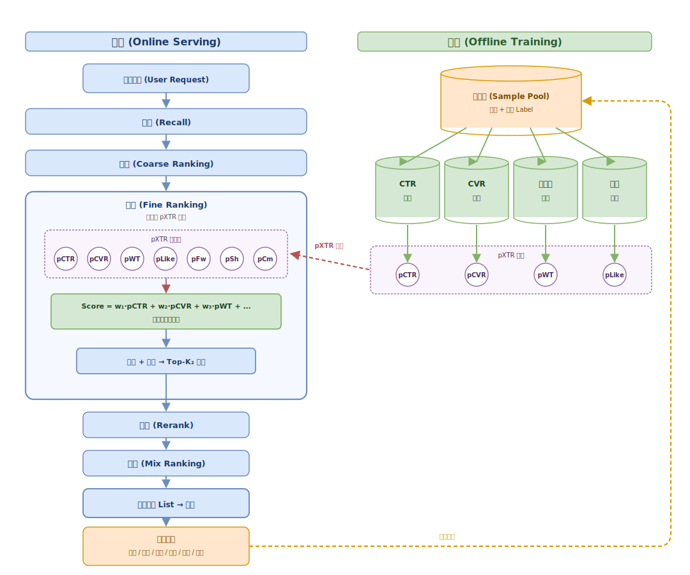
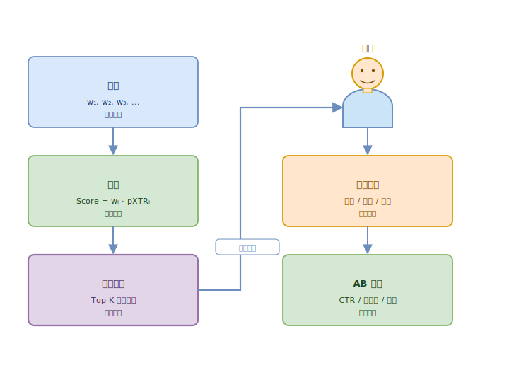
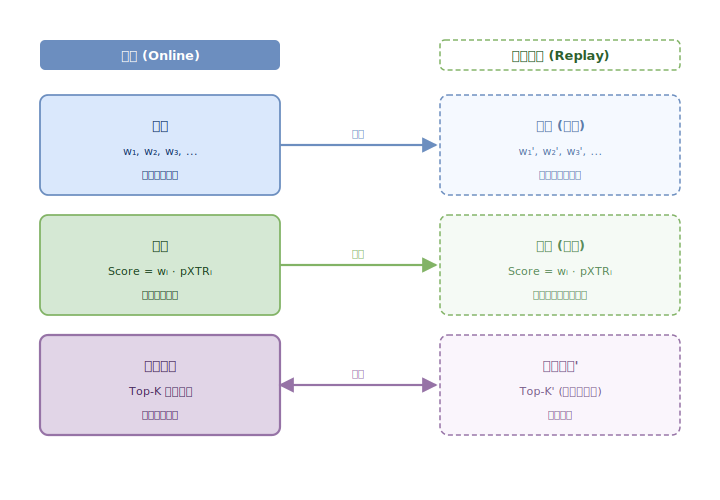
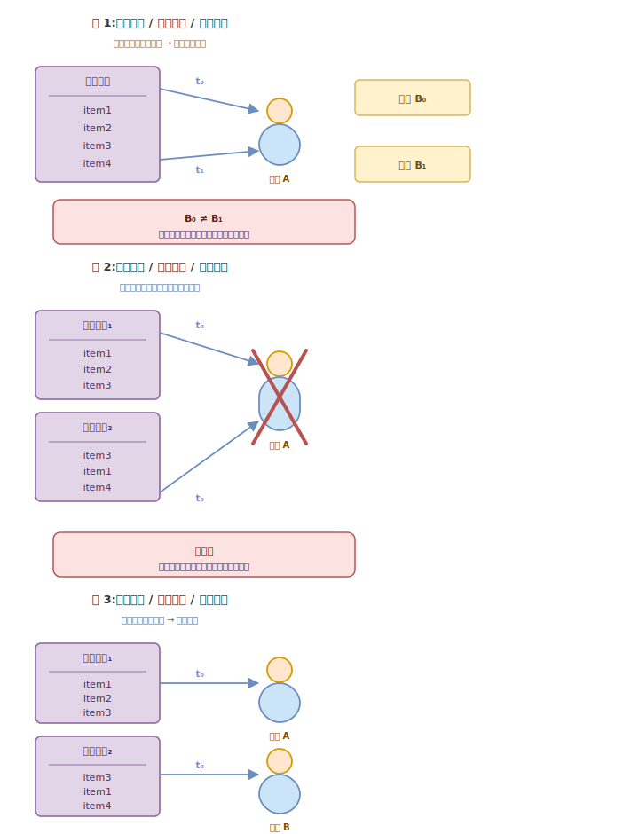
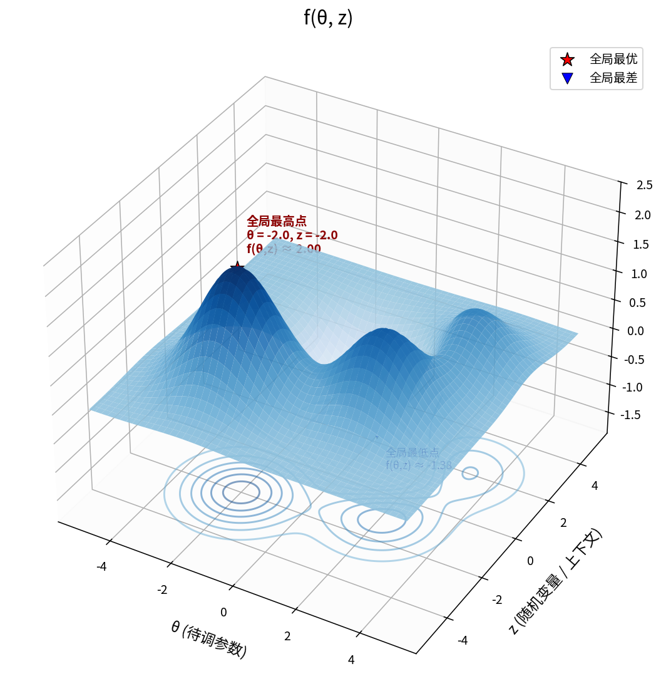
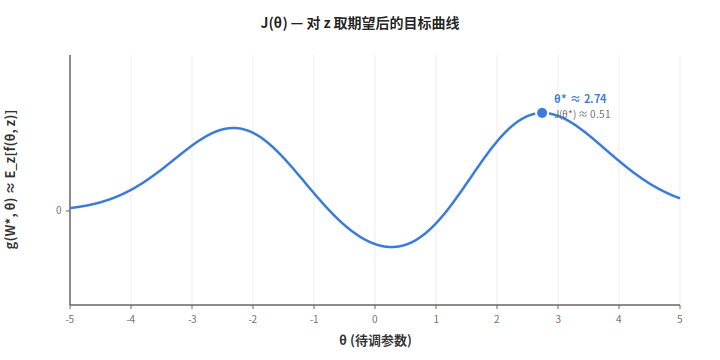
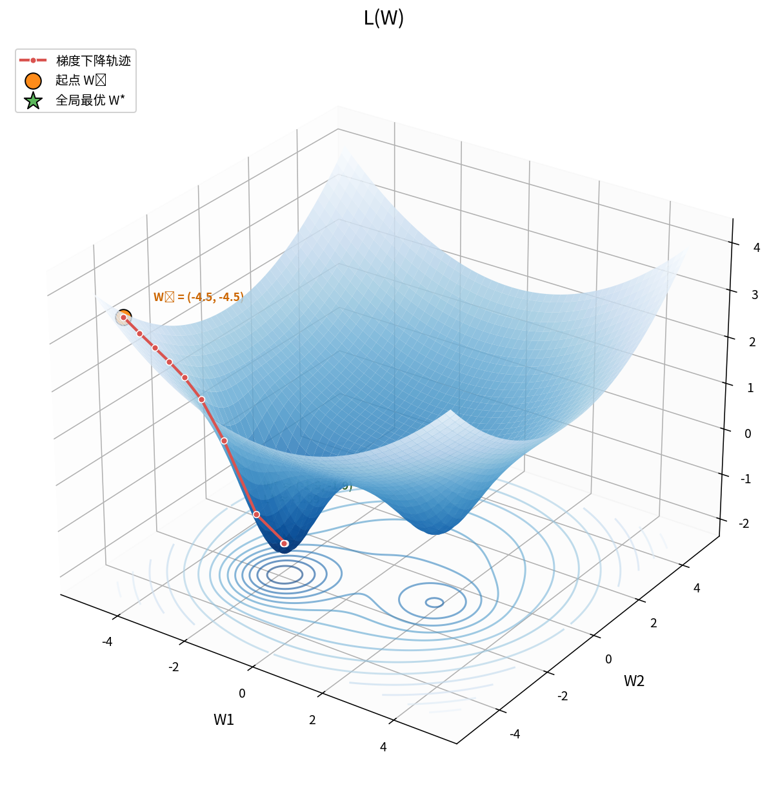
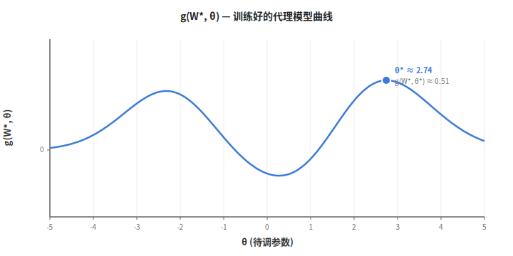
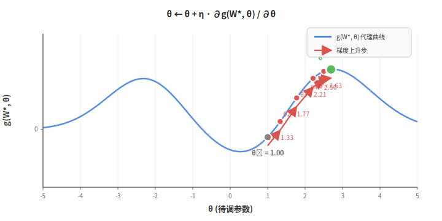
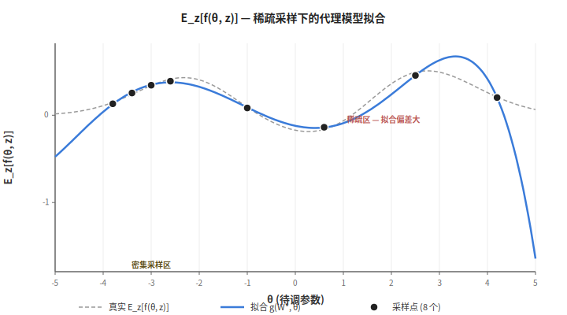

# 自动调参原理探究

## 全局视角



如图，是推荐系统框架示意图。  
在线从召回到混排有多个环节，每个环节都是在融合多个信号，之后做排序截断。
具体以精排为例，虽然整个精排过程代码很多，但可以统一抽象成一个由十几万行代码组成的大公式，目的也是从各种维度去给item打分，融合后排序，截断。  
而调参，其实就是调公式中的参数，来影响排序结果，从而影响最终输出给用户的结果。  
  
## 调参问题难点

一次调参过程的作用链路可以分为两个阶段：  
阶段一：参数->公式->排序结果  
阶段二：排序结果->用户行为->ab指标  
这两个阶段各有特点。  
阶段一中，调整参数之后看排序结果，中间的执行代码是固定的。可以不断调整参数，试无数次，获取各种参数下的排序结果。  
比如现在的近线系统，分数上报+算子复用之后，可以在离线不断回放，获取参数变化对排序结果的影响。  
  
  
阶段二中，从排序结果到用户行为这一步，一个是没有任何确定的模型，比如某个排序一定好某个排序一定不好，只能给用户之后看数据；一个是无法通过回放来探究参数和用户行为之间的关系。  
因为时间在流逝，用户的状态在发生变化。同一个排序结果，在不同时间给用户，得到的行为数据不同。不同的排序结果，也无法在同一时间给同一个用户获取两个行为数据。因此，这一阶段只能做线上实验，且是近似实验：两组类似用户用不同参数做对比。这大大限制了样本采集的效率。  

  
《强化学习的数学原理》中介绍蒙特卡洛法等无模型算法时，说过一句话：The philosophy is simple: If we do not have a model, we must have some data. If we do not have data, we must have a model. If we have neither, then we are not able to find optimal policies.  
从model和data的视角看，阶段一属于有模型（代码）数据易得（不断回放）。  
阶段二属于没有模型（排序结果和用户行为的映射关系），数据也稀疏（无法回放采集数据）。  
  

>捎带想到一个，以上说的两个参数无法同时应用给同一个用户，是事实factual，冷启里搞多策略队列，让两个参数可以在一个请求里生效，试图通过近似观测两个策略在同一时刻针对同一用户的效果，这就是反事实counter factual，CF框架  

  
这里对比区分一下，调参问题和各种pxtr模型训练不太一样的点。pxtr模型试图建立的，是user和item之间的某种联系，可以收集海量user和历史item的交互数据，来建立模型。而调参问题，是试图建立参数和ab指标之间的某种联系，这个获取数据的上限来自于ab平台并行实验的能力，因此数据更稀疏。  
综上，做自动调参的难点就在这，既没有模型，也无法大规模收集数据。  

所以自动调参工作围绕两个方向展开：  
- 如何建立更精准的代理模型  
- 如何更高效的利用极度稀疏的样本  
  
下面通过几种方法来感受。
  
## 神经网络拟合  
首先，训练神经网络需要足够的样本，而上面已经说了，调参样本很稀疏。所以这条路其实一上来就走不通。但是还是可以假设来探讨一下。  
  
### step1 假设
不管是一阶段还是二阶段，可以统一合并起来，假设是一个十分复杂的函数$f$，输入是参数$\theta$和环境$z$，输出是用户行为指标$a$，推荐过程可以简化为公式：  
$`a = f(\theta,z)+\epsilon`$  
在这个假设下，一次实验，就得到一条观测数据:  
$a_i = f(\theta_i,z_i)+\epsilon_i$  
这公式相当简化，因为用户行为受多种因素影响，比如此时的天气（晴天看啥都感兴趣）、刚发的工资(工资低看啥都烦)等等，且随着时间推移在变动，每个特征都是一个复杂函数，而要调整的参数只是其中一个。这里为了示意，简化掉其他因素的影响，环境统一用$z$表示。而观测噪声用$\epsilon$表示。  
可以纯想象一下，假设黑盒函数是这样的：

我们主要想看的是策略$\theta$对ab指标的影响，所以假定短时间内环境是不变化的，消掉环境$z$的影响，对$z$取期望，则：  
$J(\theta) = \mathbb{E}_{z}[f(\theta,z)+\epsilon]$  
相当于在上面三维图上找个了$z$期望处的切面：

我们想得到的是：  
$\theta^* = \mathrm{argmax}_{\theta}J(\theta)= \mathrm{argmax}_{\theta}\mathbb{E}_{z}[f(\theta, z)+\epsilon]$  
即在这个切面下，让目标$J(\theta)$最大的$\theta$是多少。

  
### step2 训练
以上两个图都是臆想的示意图，实际上，我们不知道函数$f$具体是什么，以及$f$可能是无法求梯度的，也就无法用梯度上升找最大值点。那就可以用各种假设函数来代替，其中一种是神经网络，神经网络能拟合各种复杂函数，且可微。  
忽略神经网络的具体结构，假设神经网络为：  
$y=g(W,\theta)$  
其中$W$是神经网络的权重参数,$\theta$是神经网络输入，要调的参数。  
可以设置$g(W,\theta)\approx \mathbb{E}_z[f(\theta,z)]$，为代理模型。  
第一步是收集样本，可以在线上不断调整$\theta$，收集指标$a$，得到n个样本对：  
$D_n=\{\theta_1,a_1\},\{\theta_2,a_2\}...\{\theta_n,a_n\}=\{\theta_i, a_i\}_{i=1}^n$  
用神经网络估计值和采集样本的均方误差为损失函数：  
$L(W)=\frac{1}{n}\sum_1^n|y_i-a_i|^2 = \frac{1}{n}\sum_1^n|g(W,\theta_i) - a_i|^2$  
求：  
$W^*=\argmin_W L(W)$  
也就是对L进行梯度下降，  
$W_{i+1} = W_i - \eta_i \nabla L(W_i)$  

得到让$L(W)$最小的权重参数$W^*$。  
此时就可以得到一个神经网络：  
$y = g(W^*, \theta)$  

输入任意$\theta_i$，可以得到估计ab指标$y$。  
这是第一步，通过神经网络+反向传播找到了代理函数。  

### step3 找最优
我们最终要找的是  
$\theta^* = \mathrm{argmax}_{\theta}J(\theta)= \mathrm{argmax}_{\theta}\mathbb{E}_{z}[f(\theta, z)+\epsilon]\approx \mathrm{argmax}_{\theta}g(W^*, \theta)$  
，因此还要对训练好的$y=g(W^*,\theta)$求解能让y最大的$\theta$。  
这时候让$\theta$成为变量，进行梯度上升:  
$\theta_{i+1} = \theta_i + \eta_i \nabla_{\theta}g(W^*, \theta)$  

就能找到能使y最大的参数$\theta^*$。  
  
### step4 验证最优参数
以上方法，找到的最优参数$\theta^*$，再上到线上进行验证，看指标是否符合预期。  
这时候会再生成一条新的样本$\{\theta_{n+1}, a_{n+1}\}$  
和之前的样本集$D_n$放一起，形成新的样本集$D_{n+1}$，再次回到step2进行训练。  
所以，整个过程是个循环，不是一锤子买卖，一次训练之后就结束了。  

### 问题

当前方法，有2个问题：  
- 由于本身样本量少，样本相当于只在一个复杂函数的局部进行了采样，拟合出来的网络只在样本点密集的局部估计准确，其他地方估计偏差会很大
- $\theta$的初始值设定，会影响梯度上升能获取到局部最优解。  

解法：  
- 梯度上升进行多次，每次用不同的初始随机值，试图找到多个局部最优解。  
- 选择下一次尝试的参数时，不完全选择上一次梯度上升得到的最优参数$\theta$，而是故意选择数据稀疏区的$\theta$，来提升各个区间样本估计的准确度。  
  
后者是一种利用加主动探索的思想。

  
经过这个建模，可以意识到，建模其实是不难，难就难在样本数据采集上。样本必须量大且均匀分布在$\theta$值域上，才能更好的做估计，但这要求大量样本，和实验成本高的事实违背。当样本少的时候，如果太集中，就会导致样本密集的地方估计准，其他地方估计不准。所以，最理想的情况是，样本刚好落在最可能是全局最优解的附近。  

## 贝叶斯优化  
优化以上神经网络有一种方法。  
既然当前的最优值估计，都是在已经试过的样本点附近。那我是不是可以故意去哪些没有试过的点里试试，来提升附近估计的准确度？  
这就涉及，没试过的点那么多，我该从哪个开始试？理论上说，应该从我当前觉得最有可能获得最优值的那个点开始试。但神经网络并没有告诉我哪个点获得收益的概率。那我只好随机但尽量均匀的试了。  
这种方法虽然有所提升，但随机试，想覆盖好整个值域，成本高。  
  
所以就需要一种方法，能直接给出$\theta$的概率分布，表示哪些区间获得高收益的概率高，哪些低。然后我们尽量去尝试没有试过的点、收益概率高的点。  
  
贝叶斯优化和神经网络拟合的不同是，贝叶斯是给出参数$\theta$的概率分布为先验，然后输入样本对$\{\theta_i, a_i\}$，得到$\theta$的后验分布。  
高斯分布先验下的后验长这样：  
```math
f(\theta_*) \mid D \sim \mathcal{N}\left(\mu_*=k_*^\top (K + \sigma_n^2 I)^{-1} \mathbf{r}, \sigma_*^2=\ k_{**} - k_*^\top (K + \sigma_n^2 I)^{-1} k_*\right)
```
比较复杂，总之，输入是样本对，输出是最优值$\theta_*$的概率分布。  


  
## RL
但这不是一个RL问题，只是一个黑盒函数优化。
但LLM如何调参数，是一个RL的问题。

## 离线加速寻参，挖掘已有数据潜力  
不管是神经网络拟合还是贝叶斯优化，以上解决的都是从参数到排序结果的问题，特点是完全可以在离线进行回放来获取样本数据。比如用近线回放。  
而我们真正要解的问题还多了从排序结果到用户行为这一层。这一层必须要用户参与，而用户的状态是在不断变化的，除非有平行时空，不然就无法收集到某参数不同取值下用户的行为。也就无法通过以上的黑盒函数优化方法得到最优参数。  

既然无法精确的知道，一个参数在平行时空下不同取值的用户行为，那可不可以退而求其次，用已有的用户行为结合针对排序结果的假设，估计出来新参数的用户行为呢？
这就是paramDance的思想。  
  
但，离线有一个问题，当调整参数之后，虽然得到新的排序结果，但得不到调整后的用户行为数据。  
这时候就需要通过已有的用户数据进行假设拟合。  
  
参数调整->已有用户数据+目标公式，产生大量样本，再用贝叶斯优化进行寻参。

## LLM的思路  
由于离线寻参包含了假设，假设可能不准，也就导致离线训的参数在线可能不生效。这时候就需要调整假设。  
这就是sortify的思想。用Agent充当离在线的粘合剂。  

## 我们的自动调参Agent现状  
LLM充当神经网络+离在线差异的拟合器。全靠输入context做推理。主要模仿的是人。  


## 其他观察
- 自动调参不是一个"垄断"业务。人人都可以做，人人都有不同思路，人人都可能拿到收益。