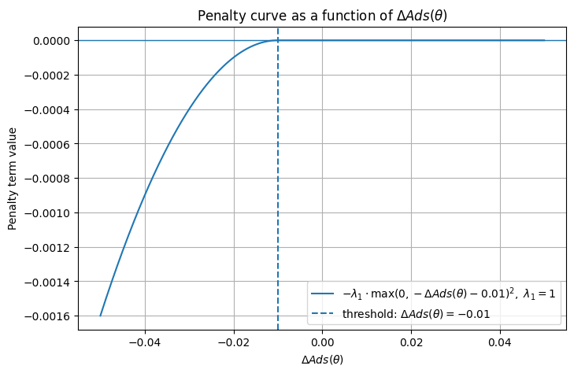

有这么一个用LLM调参的想法：  
- 在线系统中有一个通过多个超参$\theta$控制的公式。公式影响排序结果。  
- 开一个ab实验，让这个公式生效，并可以观察到ab指标。  
- 将公式的含义等相关信息，历史调参方式及ab指标结果，导入到LLM中。  
- LLM做出调参决策$\triangle \theta$，并调整参数。  
- 等待一段时间，获取ab指标，append进历史调参及ab指标list，让LLM分析  

问：这种方法属于RL吗？  
### MDP  
RL建立在MDP的假设上，首先对MDP建模。  
  
state: 历史调参及ab指标list，当前超参数$\theta_t$  
action: 调参$\triangle \theta$  
reward: $\theta_{t+1}$影响排序影响用户行为影响ab指标，$R(r|s,a)$实际等于$R(\theta_{t+1})$，也就是个函数，直接和当前的$\theta_{t+1}$相关  
transition: 历史调参及ab指标list + {$\theta_{t+1}$,ab指标}  
horizon: 单次实验  
  
agent: LLM，决定策略$\pi(\triangle\theta|s_t)$，即当前state下该怎么action  
环境：state + reward + transition
  
MDP的约束，$P(s_{t+1}|s_t,a_t)$  
- 当前state包含所有历史状态信息.
- 其次未来状态转移只依赖当前状态。  

以上都满足要求。所以，满足MDP的约束。  


### RL  
以上例子中，$s_t=\mathrm{history}$，做出action即调参后，状态转移到$s_{t+1} = \mathrm{history} + \{\theta_{t+1}, {ab}_{t+1}\}$，不是由环境决定的，而是agent做出action之后立即就决定了，也就是状态转移完全受agent的action控制：  
```math
p(s_{t+1}|s_t,a_t)=1
```
且，优化目标定义为：$\mathbb{E}[R_t]$，也就是单步奖励，不是累积折扣奖励。  
因此，这是一个状态转移概率固定、折扣$\gamma=0$的简化版的RL。  
  
还有问题：  
RL是，在MDP下，通过优化策略$\pi$获取最大累计折扣奖励$\mathbb{E}[G_t=r_t+\gamma G_{t+1}]$
而这里：  
- 没有策略提升  
LLM通过历史状态输出决策，可以认为是一个策略模型，但没有收集样本(s,a,r)来做策略提升。  
- 最终目标不是优化策略  
RL最终目标是优化行动策略，可以让agent按照策略行动，来获取最高回报。但我们这个实验的目标是得到一组最优参数，而不是策略。策略是调参方式，但我们不会让agent一直采用这个策略去调参。  

所以，如果把找最优参数这个任务当做RL来分解的话，应该自己训练策略模型，且长期应用到线上，使其可以应用策略来自动调参。

### 函数逼近法  
从另一个角度看这个问题，由于环境不影响状态转移，参数$\theta_t$几乎直接决定了单次奖励。作用的路径是，参数$\theta_t$->排序结果->用户行为->ab指标，是一个映射。可以用要给函数f来表示这层映射关系，$\epsilon \sim \mathcal{N}(0, \sigma^2)$表示噪声。于是：  
```math
r(\theta_t) = f(\theta_t)+\epsilon
```
经过k次实验，得到一个序列对：  
```math
\{\theta_1, r(\theta_1)\},\{\theta_2, r(\theta_2)\}...\{\theta_k, r(\theta_k)\}
```
  
现在问题变成了，我们通过多次实验，得到一个序列对，序列对之间有f的映射关系，但不清楚函数f是什么形式。  
一种方法是，可以假设一个f，然后通过训练参数$w$来拟合f。拟合出f后再求f上的最大值点，找到最优参数。  
假设用Linear和sigmoid构造一个模型，来拟合f，公式就是：  
```math
y_i = \mathrm{sigmoid}(W_0\theta_i+b_0)
```
损失函数：  
```math
loss = \sum_{i=1}^k|y_i - r(\theta_i)|^2
```
将多次实验得到的样本对进行训练，可以得到一个让loss最小的参数$W^*$和$b^*$，这样就得到一个让损失最小的f:  
```math
y_t = \mathrm{sigmoid}(W^*\theta_t+b^*)
```
将超参$\theta_t$输入函数，就可以得到估计的ab指标（收益）。  
  
然后是找能$\max y_t$的$\theta_t$，方法是做梯度上升。  
让$loss$最小是做梯度下降：  
$W_{i+1} = W_{i} - \eta \nabla loss_i$  
这就是向loss降低的方向调整参数。  
要找让$y_t$最大的$\theta_t$，等价于对$-y_t$做梯度下降，即：  
$\theta_{i+1} = \theta_i - \eta \nabla (-f(\theta_i)) = \theta_i + \eta \nabla f(\theta_i)$  
两种写法是一回事——梯度下降和梯度上升只是描述角度不同，本质都是沿梯度方向更新。  
实际操作时，先初始化一个$\theta_0$，代入拟合好的函数$f$求$f(\theta_0)$，然后对$f$关于$\theta$求梯度，得到方向$\eta \nabla f(\theta_0)$，最后更新参数$\theta_1 = \theta_0 + \eta \nabla f(\theta_0)$，向让$y$更大的方向移动。  
  
通过以上方法，就可以得到一个让ab指标y最大的超参$\theta$。
  
说说这种方法的问题。  
对数据点比较密集的区域，拟合函数拟合的会更好更准。那就涉及样本是从哪来的。初期的样本探索就比较重要，最好均匀一些，防止在部分点样本多、过拟合，部分点样本少、欠拟合。  
在做梯度上升时，初始值的选取也比较重要。曲线有多个波峰，初始值的选取决定最终得到的是局部的最优解，还是全局的最优解。
还有一个重要问题是，这种方法需要大量样本做训练才能估的准。而每次ab实验的成本是比较高的。

### Bayesian Optimization  
以上函数逼近法的问题是，实验成本比较高，攒够样本需要足够长时间，动用资源比较多，线上不能频繁调整实验。  
所以问题变为，如何用更少的尝试次数，最大可能的逼近$f$。
当实验的次数比较少的时候，每次实验就必须评估可信度。这时候贝叶斯就上场了。  
贝叶斯的哲学，先假设一个分布，然后用数据来修正分布。贝叶斯不假设f的形式，而是假设f的输出服从某个概率分布。通过收集的样本，来修正对f输出的信念分布。  
  
#### 先验分布假设
现在有一系列超参，作为f的输入：  
```math
\theta_1, \theta_2, \theta_3...
```
通过定义kernel，可以衡量输入之间的相似性，kernel选RBF：  
```math
k(\theta_i, \theta_j) = \exp(-\frac{||\theta_i-\theta_j||^2}{2l^2})
```
定义输出$f(\theta_i)$的相似性和输入相关：  
```math
\mathrm{Cov}(f(\theta_i),f(\theta_j)) = k(\theta_i, \theta_j)
```
假设，f输出服从多元高斯分布：  
```math
f(\theta_1),f(\theta_2),f(\theta_3)... \sim \mathcal{N}(\mathrm{m}, \mathrm{K})
```
假设m=0,  
```math
K = \begin{bmatrix}
  k(\theta_{1},\theta_{1})  &  k(\theta_{1},\theta_{2}) &  \cdots &  k(\theta_{1},\theta_{k})\\
  k(\theta_{2},\theta_{1})  &  k(\theta_{2},\theta_{2}) &  \cdots &  k(\theta_{2},\theta_{k})\\
  \vdots &  \vdots &  \ddots &  \vdots \\
  k(\theta_{k},\theta_{1})  &  k(\theta_{k},\theta_{2}) &  \cdots &  k(\theta_{k},\theta_{k})
\end{bmatrix}
```
也就是
```math
f(\theta_1),f(\theta_2),f(\theta_3)... \sim \mathcal{N}(\mathrm{0}, \mathrm{K})
```
这定义了函数在任意有限点集合上的联合分布，因此构成了高斯过程先验。  
  
每次实验，对于一个输入$\theta_i$，经过f的输出$f(\theta_i)$是一个随机变量，
现在我们通过实验得到了带噪声的真实的输出：$r(\theta_1),r(\theta_2),r(\theta_3)...$  其中：  
```math
r(\theta_t) = f(\theta_t)+\epsilon, \epsilon \sim \mathcal{N}(0, \sigma_n^2)
```
  
根据前面对$f(\theta_i)$的假设和$\epsilon$的假设，可以得出输出$r(\theta_i)$的假设：  
```math
\mathbf{r}\sim \mathcal{N}(0,K+\sigma_n^2I)
```
因为两个独立高斯随机向量相加，结果仍然是高斯；均值相加，协方差相加。  

#### 数据收集
然后，我们做k次实验，得到k组数据：  
```math
D=\{\theta_1, r(\theta_1)\},\{\theta_2, r(\theta_2)\}...\{\theta_k, r(\theta_k)\}
```

在已有数据$D$条件下，求新点函数值的后验分布。

#### 后验更新
现在有了对输出$r$的分布假设：  
```math
\mathbf{r}\sim \mathcal{N}(0,K+\sigma_n^2I)
```
，有了真实的数据：  
```math
\{\theta_1, r(\theta_1)\},\{\theta_2, r(\theta_2)\}...\{\theta_k, r(\theta_k)\}
```
可以通过这些已收集到的数据对新的点$\theta_*$进行估计了。  
所谓估计就是，评估$p(f(\theta_*)|\{\theta_1, r(\theta_1)\},\{\theta_2, r(\theta_2)\}...\{\theta_k, r(\theta_k)\})$的概率。  
先看只有一个数据点
```math
\{\theta_1, r(\theta_1)\}
```
的推导。也就是求$p(f(\theta_*)|r(\theta_1))$。  
根据假设，$f(\theta_*)$和$r(\theta_1)$的联合分布为：  
```math
\begin{bmatrix}
 r(\theta_1) \\
f(\theta_*)
\end{bmatrix}
\sim
\mathcal{N}\left(
\begin{bmatrix}
0 \\
0
\end{bmatrix},
\begin{bmatrix}
k_{11} + \sigma_n^2 & k_{1*} \\
k_{*1} & k_{**}
\end{bmatrix}
\right)
```
其中：  
$k_{11}=k(\theta_1, \theta_1)$  
$k_{1*}=k(\theta_1, \theta_*)$  
$k_{**}=k(\theta_*, \theta_*)$  
又根据二维高斯条件分布公式：  
如果：
```math
\begin{bmatrix}
x \\
y
\end{bmatrix}
\sim
\mathcal{N}\left(
\begin{bmatrix}
0 \\
0
\end{bmatrix},
\begin{bmatrix}
A & C \\
C & B
\end{bmatrix}
\right)
```

那么：
```math
y \mid x \sim \mathcal{N}\left( \frac{C}{A}x, \ B - \frac{C^{2}}{A} \right)
```
所以：  
```math
f(\theta_*)|r(\theta_1)\sim \mathcal{N}(\mu_* = \frac{k_{1*}}{k_{11} + \sigma_n^2} \cdot r_1, \sigma_*^2 = k_{**} - \frac{k_{1*}^2}{k_{11} + \sigma_n^2})
```

这就是由已知的一个样本点估计新点的概率分布公式。  
推广到k个点：  
```math
D=\{\theta_1, r(\theta_1)\},\{\theta_2, r(\theta_2)\}...\{\theta_k, r(\theta_k)\}
```
```math
f(\theta_*) \mid D \sim \mathcal{N}\left(\mu_*=k_*^\top (K + \sigma_n^2 I)^{-1} \mathbf{r}, \sigma_*^2=\ k_{**} - k_*^\top (K + \sigma_n^2 I)^{-1} k_*\right)
```
这样就可以根据数据得到任意候选点的后验均值和方差，进而通过 acquisition function 选择下一次实验的点。  

#### 找最优值点  
到目前为止，我们通过假设和数据建了模，可以输入新值获取输出的估计值和可信度。  
我们的目标是找一个最优点，让输出最大。  
上面的$f(\theta_*)|D$可以理解，是给定已知数据下，模型的后验分布，由这个分布可以得到预测的最优点：  
```math
\theta_*=\mathrm{argmax}\mu(\theta)
```
但这个点，也有对应的不确定性：$\sigma_*^2$。  
这是贝叶斯方法和前面函数逼近法不一样的一点。函数逼近法只做拟合，但无法评估最大值点的不确定性。比如输入的$\theta$序列是0.1,0.2,0.3，拟合出函数后，发现最大值点是$\theta_*=100$，这时候函数逼近法无法确定这个100是不是靠谱。而贝叶斯方法可以通过$\sigma$评估这个点的不确定性。  
所以，虽然可以通过以上公式找到预测的最有点，但数据量有限时，这个最优点的可信度可能不高，还是需要做实验，来提升可信度。因此，贝叶斯方法不直接输出这个值作为最有点，而是找下一步值得尝试的点。  
什么是值得尝试的点？既要靠近当前预测的最优值点，又要有低可信度。因为这种点可能藏着尚未发现的最有点，才值得一试。
所以优化的函数必须包含两者：  
```math
a(\theta) = \mu(\theta)+\beta^{1/2}\sigma(\theta)
```
这是要优化的目标函数，也是UCB算法，平衡了最优值和探索。  
可以通过对$a(\theta)$梯度上升或其他数值优化方法，来找到一个$a(\theta)$值较高的点，作为下一次实验点。

### LLM 调超参
#### sortify
https://arxiv.org/pdf/2603.27765  
https://github.com/yinsn/sortify-tech-report  
跟GPT聊了很多，总结下思路。  
Sortify的前身是ParaDance，可以先从ParaDance入手了解。  
https://github.com/yinsn/ParaDance  
ParaDance其实是对算法平时搜参过程的一个封装，所以问题转为，算法平时怎么搜参？  
要想了解ParaDance，要先了解算法平时怎么搜参？  
##### 在线上报分数。  
排序的过程看着很复杂，召回出来一群item之后，经过粗排精排等几个环节排序截断。每个环节都是从几个维度对item进行打分评估，最后通过某种公式汇总到一起，做融合，排序，最后截断。算法做分析，就是想看下当前这些排序融合的因子对排序结果的影响，从而可以调整因子的权重等参数，去影响排序结果，达到业务目标。所以，分析的第一步，就是把影响排序的因子的分数以及融合的参数等，上报到离线做分析。  
为啥不能在线分析？因为在线只能出一个结果，推送出去，没法用不同参数跑多个结果。要跑也不是不能实现，只是会消耗线上资源。所以分析往往都是放到离线进行。离线可以用同一批数据的结合不同的参数做反复回放，推演可能的更优参数组合。但离线由于只有一组结果是用户真实看过的，所以回放出来的结果和真实结果的比较，只能是通过某种建模近似，所以得出的结论也只能是猜测，需要放到线上去获取真实反馈。  
##### 离线校验上报  
离线拿到了在线上报的数据，需要重新复现在线的计算逻辑，拿到结果，然后和在线计算出来的结果做比较。理论上这两个结果应该是一致的，这样才能保证，上报链路正常，离在线计算逻辑一致。这时候再去做回放调整参数，结果才更置信。  
说个具体例子。比如在线融合公式是：$score=w_1 * x_1+ w_2 * x_2$，就需要上报$score,w_1,x_2,w_2,x_2$到离线。离线需要重建公式，用$w_1,x_2,w_2,x_2$计算出$score'$，再比较$score'$和$score$，基本一致。  
##### 效果评估  
排序过程只是输出了一个排序结果，这个结果的效果怎么样？比如用户时长如何，点击如何，广告如何，GMV如何，等等，这些效果指标是ab平台收集用户真实行为数据得来的。  
这中间的过程可以总结为：  
$因子\to score(排序) \to 用户行为数据 \to 线上指标$  
其中，唯一黑盒的是从score到用户行为数据这一步。一个视频排第一和排第二，用户是不是会少看？不做线上实验是看不出来的。  
而其他阶段，包括从用户行为数据到线上指标这步，都是明确的。  
所以，改变策略重排之后，要重算线上指标，就需要解决从排序到用户行为这层黑盒。  
一般是用真实收集的用户行为数据，根据假设，进行重算。比如，认为视频的位置很重要，第一个视频的观看时间会更长。那线上输出的三个视频：A，B，C，观看时长是10,8,5，重排之后结果为B,C,A，估计时长要根据位置权重打折，假设权重为1.0,0.5,0.2，则新的估计的观察时长为：B=8/0.5\*1.0=16.0，C=5/0.2\*0.5=12.5，A=10/1.0\*0.2=2。这个假设的值可能不太严谨，但大概是这个原理。
解决这层黑盒之后，就可以根据估计的用户行为数据，算出真实的线上指标了。  
##### 目标设定
线上指标有很多，不可能全部拿来做评估。所以必须圈定一部分关注的指标。  
在这部分关注的指标里，按照论文中影响力分解的理论，指标之间其实是兑换关系。某指标涨，就意味着其他指标可能会跌。寻参要做的，就是在参数空间里找一个解，目标指标涨，并约束其他指标跌幅在一定范围内。  
为了在多次重排评估中，有一个统一的指标来衡量效果，需要有一个目标函数，来设定要提升的主目标和要约束的目标。  
大概结构是：  
$$J(\theta) = 主目标 - 约束惩罚$$  
比如，要提升时长，但广告和GMV不能跌的超过1%，于是设定目标：  
$$J(\theta) = \triangle WT(\theta) - \lambda_1\dot \max(0, -\triangle Ads(\theta) - 0.01)^2 - \lambda_2\max(0, -\triangle GMV-0.01)^2 $$
其中,$\triangle X$指的是变化率：  
$$\triangle X(\theta) = \frac{X_{new}(\theta) - X_{old}}{X_{old}}$$  
也就是涨跌幅百分比。  
主要提升的是时长，所以$\triangle WT(\theta)$是正的、越大越好。  
再看第二项，画个曲线图：  

当变化率是正的时候，第二项是0，没有奖励，也没有惩罚。  
当变化率是负的时候，跌的越多，第二项负的就越多，且由于是二次函数，惩罚的力度会逐渐加大。  
第三项也一样。  
所以，设定这个目标函数之后，就可以不断寻参，找一个能让目标函数最优的参数了。  


