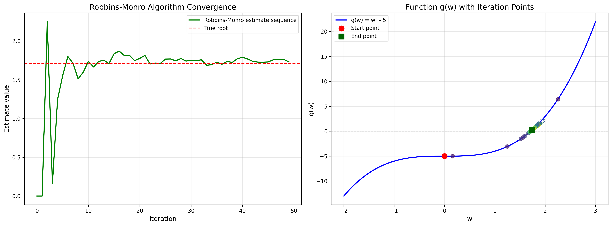
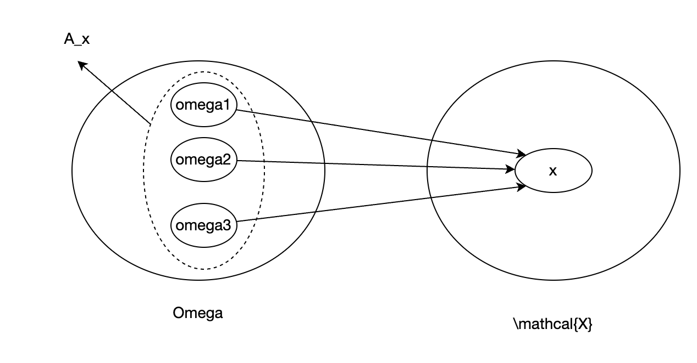
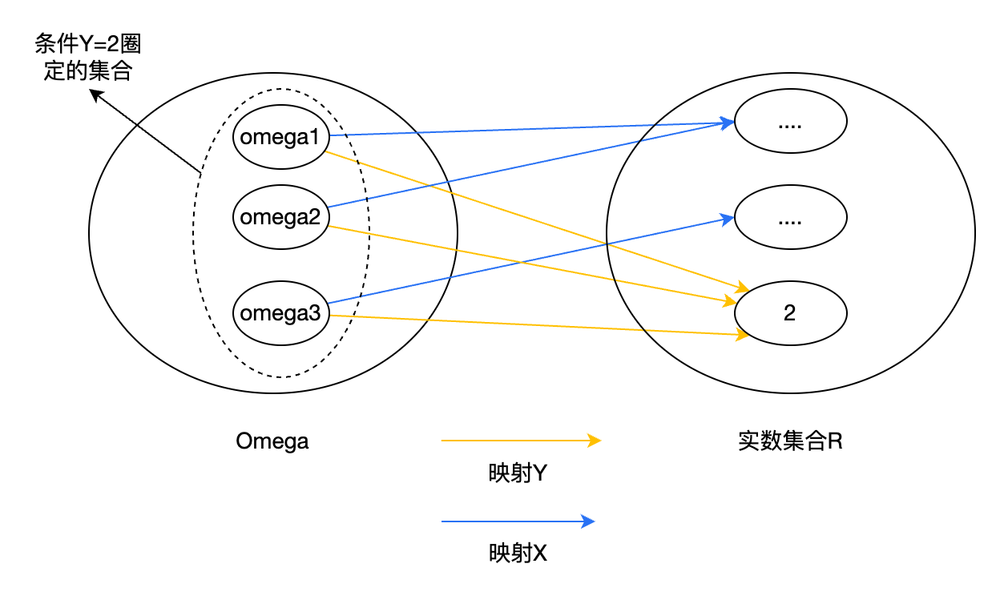

# 强化学习的数学原理 笔记

#### 先说一个idea
没有一个好用的、给pdf做笔记的软件。
有很多pdf编辑软件，但编辑的都是本地文件，需要一直保存这个文件才行。或者说，构建的是笔记-pdf文件的关系。一旦文件丢失，笔记也丢失。  
读书软件，如微信读书，pdf不能编辑、做笔记。pdf可以自动转成电子书的格式，可以做笔记了，但是转换过来之后排版还是不好，更不用说有的公式会丢失、错误了。这个排版问题可能很难完美解决，再怎么转都不如pdf原生的排版好。这种的笔记属于托管到平台了，平台保证笔记和书的对应关系。  
希望有这么一个软件：  
1. 可以对pdf做笔记，划线写想法那种，类似微信读书。  
2. 构建的是内容块和笔记的关系。也就是说，这个笔记锚住的是内容块——即使这个pdf丢了，我又从网上下载了一个，只要上传，依然可以把保存的笔记和内容对应上。  

谁来做个这样的app，我就不用在另外一个地方记笔记了。  

#### 2.1
回报可以评估整个回合所使用的策略（没有概率分布哦，全是已固定的策略）的好坏。  
剧透：每个状态都有个策略概率分布，所有状态的策略概率分布合一起，就是策略模型，后边用神经网络来保存策略，并通过梯度下降找到最优策略。  
回报是真实的折扣奖励加和得出的值，不存在任何概率分布。文中举例$`return_3`$通过概率分布计算了回报，这实际是$`s_1`$的状态价值，而不是回报。回报的策略一定是固定的。只有状态价值是期望，包含了概率分布。

#### 2.2引出自举、贝尔曼方程
这节挺有意思。通过一个简单示例，引出了不同状态回报之间的关系，通过自举，很清楚的构建起了各状态回报的方程，展示了贝尔曼方程的要义。

举的例子比较特殊，形成了一个循环，所以能很清楚的写出一个线性方程组。  
比较复杂的真实场景下，虽然不是这么直接一个循环，但状态一定在这些状态间转移（建模时候应该必须保证不会跳到其他状态，至少也得跳到一个unknown状态），所以一定可以写出一个线性方程组。但，是否所有写出的线性方程组都有解呢？  

>线代小课堂

解方程：  
```math
v = r + \gamma P v\\
v - \gamma P v = r
```
引入单位矩阵，单位矩阵就是线代界类似标量界的1，单位矩阵乘以任何矩阵，都等于矩阵本身。  
单位矩阵是对称矩阵，shape一定是(n,n)的，n>0。对于shape是(m,n)的矩阵：
```math
I_mv = v\\
vI_n = v
```
在矩阵左边和矩阵右边的单位矩阵shape是不一样的。  
因此：
```math
v - \gamma P v = r\\
Iv - \gamma P v = r \\
(I - \gamma P) v = r
```
这里，v的shape是(state_size, 1),P的shape是(state_size, state_size)，I的shape也是(state_size, state_size)，因此可以做减法。  
引入逆矩阵：
一个矩阵和逆矩阵乘结果是单位矩阵：
```math
AA^{-1}=I
```
因此：
```math
(I - \gamma P)^{-1}(I - \gamma P) v = (I - \gamma P)^{-1}r\\
v = (I - \gamma P)^{-1}r
```
并非任何矩阵都有逆矩阵，所以是否存在满足上式的逆矩阵，就意味着贝尔曼方程是否可解。  


#### 2.3节开头提到，回报不适合评估随机系统，为什么？
随机系统在某个状态下选择的动作是随机的，导致相同状态下获取到的回报不同。  
回报是整个回合的累计奖励，是从回合的视角来评估的，通过比较回报，可以知道这个回合的轨迹更好、那个回合的轨迹差一些。  
但在实际运行过程中，是基于某个状态来选动作的，如果用回报来指导某个状态该如何选择动作，会发现一个状态对应了很多个回报，且由于随机性，这些回报的方差很大，这就很难决策在当前状态下到底哪个动作是最好的了。  
根本原因是，随机系统中，回报只能显示整个轨迹的好坏，且带有很大随机性，导致难找到规律。又无法把这个规律反馈到轨迹中的某一步中去优化决策。

#### 回报和状态价值有什么区别？
回报是整条轨迹的折扣奖励累积：  
``` math
return = R_0 + \gamma R_1 + \gamma^2 R_2 ....
```
而状态价值是某状态之后（t时刻起）折扣奖励累积——的期望：  
```math
v_\pi(s) = E[G_t|S_t=s]
```
```math
  G_t = R_{t+1} + \gamma R_{t+2} + \gamma^2 R_{t+3}....
```
有两点不同：
- 状态价值是状态的函数，只和状态之后的奖励相关
- 状态价值是期望

书中也说了，如果策略$`\pi`$是随机的，那获取的奖励就是随机变量，根据大数定律，随机变量会趋于期望。所以用期望评估策略要比随机变量的累加值（回报）更准些。  
个人理解，强化学习就是把问题抽象成一个随机过程，研究如果捕捉到随机过程中的规律，来获取更好的结果。
  
补充：  
- 状态奖励是期望，期望的value是从当前状态开始到回合结束的折扣奖励
- 回报是单回合从头到尾的折扣奖励，不涉及多回合

#### 2.4 为什么贝尔曼方程即时奖励期望和未来奖励期望两部分得到的$`p(?|s,a)`$一个是按$`s'`$展开一个是按r展开？

有这个疑问是因为这里的展开方式和《深度学习入门4：强化学习》的展开方式不同。那本书里把奖励看做一个以$`s、a、s'`$为输入的函数：
```math
r(s,a,s')
```
并没有概率分布。但是本书引入了针对$r$的的概率分布：
```math
p(r|s,a)
```
所以仔细看公式，两本书的推导是不同的。  

仔细看贝尔曼方程的两部分。  
即时奖励部分，由于只涉及当前状态、动作，和奖励的分布，所以公式是通过奖励分布展开。  
而未来奖励部分，由于涉及了未来状态的转移，所以必须引入状态转移概率分布：$`p(s'|s,a)`$.  
最终推导完，两部分各自出现了$`p(r|s,a)`$和$`p(s'|s,a)`$。通过联合概率与边缘概率的关系公式：  
```math
p(s'|s,a) = \sum_{r \in \mathcal{R}} p(s', r | s, a)
```
```math
p(r|s,a) = \sum_{s' \in \mathcal{S}} p(s', r | s, a)
```
统一了两个概率分布到公共部分。  

这个问题描述的不清楚，有点模糊，可能还缺少一些推导。  

#### 公式展开疑问
```math
\mathbb{E}[G_{t+1}|S_{t}=s]=\sum_{s^{\prime}\in\mathcal{S}}\mathbb{E}[G_{t+1}|S_{t}=s,S_{t+1}=s^{\prime}]p(s^{\prime}|s)
```
这里推导依赖的是条件期望的全期望定律。有点没绕过来，mark一下。  

#### 推导下贝尔曼方程
talk is cheap，不推导一下后续变换的时候总是不能快速反应过来。  

```math
v_\pi(s) = \mathbb{E}[G_t|S_t=s]

```
```math
\begin{align}
G_t = R_{t+1} + \gamma R_{t+2} + \gamma^2 R_{t+3}....\\
G_{t+1} = R_{t+2} + \gamma R_{t+3} + \gamma^2 R_{t+4}...
\end{align}
```
so
```math
G_t = R_{t+1}+\gamma G_{t+1}
```
>为什么要搞这个变形呢？公式看多了，就发现，这种变形实际上是为了“对问题做分解”，分解成两部分分开处理，可以让概念更清晰或者更易处理等等。这里已经开始将折扣奖励分开成即时奖励和未来奖励了。即时奖励只和本状态有关，未来奖励和未来的状态有关，分开处理。

so
```math
v_\pi(s) = \mathbb{E}[R_{t+1}+\gamma G_{t+1}|S_t=s]
```
由于期望是线性的，于是分成两部分：
```math
v_{\pi}(s) = \mathbb{E}[R_{t+1}|S_t=s] + \gamma \mathbb{E}[G_{t+1}|S_t=s]
```
前半部分是即时奖励期望，后半部分是未来奖励期望。先看即时奖励：
```math
\begin{align}
\mathbb{E}[R_{t+1}|S_t=s]
&=\sum_{a\in\mathcal{A}}\pi(a|s)\mathbb{E}[r|S_t=s,A_t=a]\\
&=\sum_{a\in\mathcal{A}}\pi(a|s)\sum_{r\in\mathcal{R}}p(r|S_t=s,A_t=a)r
\end{align}
```

>*推导过程中发现一个错误写法，把书中的$`S_t=s`$写成了$`s=S_t`$，混淆了概念。$`S_t`$是t时刻的随机变量，而s是随机变量的取值。反过来可就大错特错了*  

>再仔细看下这个公式：$`v_\pi(s) = \mathbb{E}[G_t|S_t=s]`$，$`G_t`$和$`S_t`$都是随机变量，$`s`$是一个具体状态值。所以$`v_\pi(s)`$确实是一个状态的函数。和$`\pi`$相关，时间t无关。这点得用心体会。有的公式你以为你会推导了，实际上是在照葫芦画瓢，对于其中的细节没有深入的理解。  

再看未来奖励。
```math
\mathbb{E}[G_{t+1}|S_t=s]
```
是当状态为s时，下一个状态之后的累计奖励的期望。
引入$`S_{t+1}`$，即下一个状态：
```math
\mathbb{E}[G_{t+1}|S_t=s] = \sum_{s'\in\mathcal{S}}\mathbb{E}[G_{t+1}|S_t=s,S_{t+1}=s']p(S_{t+1}=s'|S_t=s)
```
尝试推导了一下上式，但卡住了，最后问了下deepseek，推导过程很详细，直接贴过来了：
```math
\begin{align*}
\mathbb{E}[G_{t+1} \mid S_t = s] 
&= \sum_{g} g \cdot p(G_{t+1} = g \mid S_t = s) & \text{(条件期望定义)} \\
&= \sum_{g} g \cdot \left[ \sum_{s' \in \mathcal{S}} p(G_{t+1} = g, S_{t+1} = s' \mid S_t = s) \right] & \text{(全概率公式)} \\
&= \sum_{g} g \cdot \left[ \sum_{s' \in \mathcal{S}} p(G_{t+1} = g \mid S_t = s, S_{t+1} = s') \cdot p(S_{t+1} = s' \mid S_t = s) \right] & \text{(条件概率分解)} \\
&= \sum_{s' \in \mathcal{S}} \sum_{g} g \cdot p(G_{t+1} = g \mid S_t = s, S_{t+1} = s') \cdot p(S_{t+1} = s' \mid S_t = s) & \text{(交换求和顺序)} \\
&= \sum_{s' \in \mathcal{S}} \left[ \sum_{g} g \cdot p(G_{t+1} = g \mid S_t = s, S_{t+1} = s') \right] \cdot p(S_{t+1} = s' \mid S_t = s) & \text{(提取公因子)} \\
&= \sum_{s' \in \mathcal{S}} \mathbb{E}[G_{t+1} \mid S_t = s, S_{t+1} = s'] \cdot p(S_{t+1} = s' \mid S_t = s) & \text{(条件期望定义)}
\end{align*}
```
>这么直接看答案可能不太好，容易以为懂了，但是自己推还是不会  

以上公式中“条件概率分解”步骤的推导（这回不是deepseek了，自己推的）：
```math
\begin{align}
p(x,y,z) &= p(x|y,z)p(y,z)\\
&= p(x|y,z)p(y|z)p(z)
\end{align}
```
另一种分解法：
```math
p(x,y,z)=p(x,y|z)p(z)
```
消掉$`p(z)`$:
```math
p(x|y,z)p(y|z)=p(x,y|z)
```
  
回到未来奖励，继续：
```math
\begin{align}
\mathbb{E}[G_{t+1}|S_t=s] &= \sum_{s'\in\mathcal{S}}\mathbb{E}[G_{t+1}|S_t=s,S_{t+1}=s']p(S_{t+1}=s'|S_t=s)\\
&=\sum_{s'\in\mathcal{S}}\mathbb{E}[G_{t+1}|S_{t+1}=s']p(S_{t+1}=s'|S_t=s)
\end{align}
```
这里成立是因为马尔科夫过程：
```math
p(s_{t+1} \mid s_t, a_t, s_{t-1}, a_{t-1}, \ldots, s_0, a_0) = p(s_{t+1} \mid s_t, a_t)
```
```math
p(r_{t+1} \mid s_t, a_t, s_{t-1}, a_{t-1}, \ldots, s_0, a_0) = p(r_{t+1} \mid s_t, a_t)
```
$`G_{t+1}`$是状态$`S_{t+1}`$之后获取的累计奖励，和状态$`S_t`$无关，也就是独立。  
继续：
```math
\begin{align}
\mathbb{E}[G_{t+1}|S_t=s] &= \sum_{s'\in\mathcal{S}}\mathbb{E}[G_{t+1}|S_t=s,S_{t+1}=s']p(S_{t+1}=s'|S_t=s)\\
&=\sum_{s'\in\mathcal{S}}\mathbb{E}[G_{t+1}|S_{t+1}=s']p(S_{t+1}=s'|S_t=s)\\
&=\sum_{s'\in\mathcal{S}}v_{\pi}(s')p(S_{t+1}=s'|S_t=s)
\end{align}
```
由于：
```math
\begin{align}
p(S_{t+1}=s'|S_t=s) = \sum_{a\in\mathcal{A}}p(S_{t+1}=s'|S_t=s,A_t=a)\pi(A_t=a|S_t=s)
\end{align}
```
代入后：
```math
\begin{align}
\mathbb{E}[G_{t+1}|S_t=s] &= \sum_{s'\in\mathcal{S}}\mathbb{E}[G_{t+1}|S_t=s,S_{t+1}=s']p(S_{t+1}=s'|S_t=s)\\
&=\sum_{s'\in\mathcal{S}}\mathbb{E}[G_{t+1}|S_{t+1}=s']p(S_{t+1}=s'|S_t=s)\\
&=\sum_{s'\in\mathcal{S}}v_{\pi}(s')p(S_{t+1}=s'|S_t=s)\\
&=\sum_{s'\in\mathcal{S}}v_{\pi}(s')\sum_{a\in\mathcal{A}}p(S_{t+1}=s'|S_t=s,A_t=a)\pi(A_t=a|S_t=s)
\end{align}
```
以上就是未来奖励了。实际上这里推导的核心目标就是引出$`v_\pi(s')`$，也就下一个状态的价值。这样才能组成一个可解的贝尔曼方程。  
将即时奖励和未来奖励放到一起： 
```math
\begin{align}
v_{\pi}(s) &= \mathbb{E}[R_{t+1}|S_t=s] + \gamma \mathbb{E}[G_{t+1}|S_t=s]\\
&=\sum_{a\in\mathcal{A}}\pi(A_t=a|S_t=s)\sum_{r\in\mathcal{R}}p(r|S_t=s,A_t=a)r + \gamma\sum_{s'\in\mathcal{S}}v_{\pi}(s')\sum_{a\in\mathcal{A}}p(S_{t+1}=s'|S_t=s,A_t=a)\pi(A_t=a|S_t=s)\\
&=\sum_{a\in\mathcal{A}}\pi(A_t=a|S_t=s)[\sum_{r\in\mathcal{R}}p(r|S_t=s,A_t=a)r+\gamma\sum_{s'\in\mathcal{S}}v_{\pi}(s')p(S_{t+1}=s'|S_t=s,A_t=a)]
\end{align}
```
以上尽量把所有简写都展开了，忘了展开r，r其实是$`R_t=r`$。其中$`p(r|S_t=s,A_t=a)`$和$`p(S_{t+1}=s'|S_t=s,A_t=a)`$是$`p(S_{t+1}=s',R_t=r|S_t=s,A_t=a)`$的边缘概率：
```math
p(R_t=r|S_t=s,A_t=a)=\sum_{s'\in\mathcal{S}}p(R_t=r,S_{t+1}=s'|S_t=s,A_t=a)
```
```math
p(S_{t+1}=s'|S_t=s,A_t=a)=\sum_{r\in\mathcal{R}}p(R_t=r,S_{t+1}=s'|S_t=s,A_t=a)
```
因此：
```math
\begin{align}
v_{\pi}(s)
&=\sum_{a\in\mathcal{A}}\pi(A_t=a|S_t=s)[\sum_{r\in\mathcal{R}}p(r|S_t=s,A_t=a)r+\gamma\sum_{s'\in\mathcal{S}}v_{\pi}(s')p(S_{t+1}=s'|S_t=s,A_t=a)]\\
&=\sum_{a\in\mathcal{A}}\pi(A_t=a|S_t=s)[\sum_{r\in\mathcal{R}}\sum_{s'\in\mathcal{S}}p(R_t=r,S_{t+1}=s'|S_t=s,A_t=a)r + \gamma\sum_{s'\in\mathcal{S}}v_{\pi}(s')\sum_{r\in\mathcal{R}}p(R_t=r,S_{t+1}=s'|S_t=s,A_t=a)\\
&=\sum_{a\in\mathcal{A}}\pi(A_t=a|S_t=s)\sum_{r\in\mathcal{R}}\sum_{s'\in\mathcal{S}}p(R_t=r,S_{t+1}=s'|S_t=s,A_t=a)[r+\gamma v_\pi(s')]
\end{align}
```
以上就是贝尔曼方程。  
《深度学习入门4：强化学习》中，将奖励看做$`s`$的函数。《数学原理》里也提到了这种做法。这种可以对方程进行简化，r只和$`S_{t+1}`$有关：
```math
\begin{align}
v_{\pi}(s)
&=\sum_{a\in\mathcal{A}}\pi(A_t=a|S_t=s)\sum_{s'\in\mathcal{S}}p(S_{t+1}=s'|S_t=s,A_t=a)[r(s')+\gamma v_\pi(s')]
\end{align}
```

整体推导思路梳理：  
- 展开为即时奖励和未来奖励两部分
- 未来奖励主要引出$`v_\pi(s')`$，从而建立起$`v_\pi(s)`$和$`v_\pi(s')`$的联系
    - 引入$`S_{t+1}`$
    - 通过马尔科夫过程消掉多余的$`S_t`$
- 通过将边缘概率转换为联合概率，整合公式公共项

#### 矩阵化
之前推导出的贝尔曼方程：
```math
\begin{align}
v_{\pi}(s)
&=\sum_{a\in\mathcal{A}}\pi(A_t=a|S_t=s)\sum_{s'\in\mathcal{S}}p(S_{t+1}=s'|S_t=s,A_t=a)[r(s')+\gamma v_\pi(s')]
\end{align}
```
拆分成即时奖励和未来奖励：
```math
\begin{align}
v_{\pi}(s)
&=\sum_{a\in\mathcal{A}}\pi(A_t=a|S_t=s)\sum_{s'\in\mathcal{S}}p(S_{t+1}=s'|S_t=s,A_t=a)r(s')+\gamma \sum_{a\in\mathcal{A}}\pi(A_t=a|S_t=s)\sum_{s'\in\mathcal{S}}p(S_{t+1}=s'|S_t=s,A_t=a)v_\pi(s')
\end{align}
```
书里对公式做了简化，以更清晰的表示矩阵。  
```math
\begin{align}
r_\pi(s)
&=\sum_{a\in\mathcal{A}}\pi(A_t=a|S_t=s)\sum_{s'\in\mathcal{S}}p(S_{t+1}=s'|S_t=s,A_t=a)r(s')
\end{align}
```
```math
\begin{align}
p_{\pi}(s'|s)
&=\sum_{a\in\mathcal{A}}\pi(A_t=a|S_t=s)p(S_{t+1}=s'|S_t=s,A_t=a)
\end{align}
```
简化为：
```math
\begin{align}
v_{\pi}(s)
&=r_\pi(s)+\gamma \sum_{s'\in\mathcal{S}}p_{\pi}(s'|s)v_\pi(s')
\end{align}
```
为啥要这么简化？公式的每一次简化/拆分，都是想突出重点。  
公式中的即时奖励部分，想想，其实当前状态$`s`$确定了，即时奖励也就能计算出来了，所以它是一个向量，每个状态一个值。未来奖励部分，输入是当前状态$`s`$，输出是下一个可能的状态$`s'`$，所以针对每个$`s,s'`$对，都有一个系数，所以是个矩阵。而$`v_\pi(s)`$和$`v_\pi(s')`$，都是向量，长度是状态个数。  
把不同的状态通过i,j表示出来，就是：
```math
\begin{align}
v_{\pi}(s_i)
&=r_\pi(s_i)+\gamma P_{\pi}(s_j|s_i)v_\pi(s_j)
\end{align}
```
其中$`P_{\pi}(s_j|s_i)=\sum_{s_j\in\mathcal{S}}p_{\pi}(s_j|s_i)`$  
这么一简化状态之间的关系就很清楚了。  

$`P_\pi`$的性质挺有意思，满足概率的性质，即大于等于0，且合为1.

#### 贝尔曼方程有解的证明
搞不懂了，还用到了盖尔圆定理，查了下，超出了线性代数基础教材的范畴，属于高等工程数学。  
先跳过。2.7.1节。

#### 迭代法
就是鱼书中的DP法。  
```math
v_{k+1}=r_\pi + \gamma P_\pi(s'|s)v_{k}\ \ \ (k=0,1,2...\infty)
```
注意，这里是$`v_{k+1}`$，不是$`v_\pi(s)`$，不是个函数了，而是个向量。本身这是个未知量，Closed-form solution中使用线性代数的方法解未知量。这里使用了迭代法逐步更新解未知量。k代表迭代次数，趋于无穷。  
需要证明当$`k->\infty`$时$`v_k->v_\pi`$，$`v_\pi`$是贝尔曼方程的解，也是个向量。  
设：
```math
\delta_k=v_\pi - v_k
```
等价于证明$`\delta_k->0`$

```math
\begin{align}
\delta_{k+1} &= v_\pi - v_{k+1}\\
&=v_\pi - (r_\pi + \gamma P_\pi(s'|s)v_k)\\
&=v_\pi - r_\pi - \gamma P_\pi(s'|s)v_k \\
&=v_\pi - r_\pi - \gamma P_\pi(s'|s)(v_\pi - \delta_k)\\
&=v_\pi - r_\pi - \gamma P_\pi(s'|s)v_\pi +  \gamma P_\pi(s'|s)\delta_k \\
&=\gamma P_\pi(s'|s)\delta_k + v_\pi - (r_\pi + \gamma P_\pi(s'|s)v_\pi)
\end{align}
```
由于
```math
v_\pi = r_\pi + \gamma P_\pi(s'|s)v_\pi
```
因此：
```math
\delta_{k+1} = \gamma P_\pi(s'|s)\delta_k
```
是个递归结构，又已知$`\gamma`$和$`P_\pi(s'|s)`$都小于1大于0，所以当$`k->\infty`$时$`\delta_{k+1}->0`$

>感觉这个证明是一种套路，问了下deepseek这里证明的方法是什么方法，deepseek:"证明本质是应用巴拿赫不动点定理:若一个算子 T 在完备度量空间上是压缩映射​（即存在 $`\gamma<1`$ 满足$`||T(v)−T(w)||≤\gamma||v−w||）`$，则其不动点存在唯一，且任意初始值迭代$`v_{k+1}=T(v_k)`$ 均收敛到该不动点。"不太理解，先记下了。

#### 2.8行动价值
这个看鱼书时候比较懵逼，但是代码上比较清晰：状态价值state当key，行为价值拿(state,action)当key，这是我能理解到的。但是缺乏一种感性上的和状态价值的连接，总觉得引出它比较突兀。  
>越发感觉，虽然数学都是推导，但是有时候“理解了”却是一种“感觉”。只有捕捉到那种“哦，这样啊”的感觉的时候，这个疑问才彻底终止，否则总是觉得像有根刺没拔下来，后续的推理也都模糊。  

状态价值和行动价值之间的关系：
```math
\begin{align}
v_\pi(s) &= \sum_{a\in\mathcal{A}}\mathbb{E}[S_{t+1}=s'|S_t=s,A_t=a]\pi(A_t=a|S_t=s)\\
&= \sum_{a\in\mathcal{A}}q_\pi(A_t=a,S_t=s)\pi(A_t=a|S_t=s)
\end{align}
```
```math
q_\pi(a|s) = \sum_{r\in\mathcal{R}}p(R_t=r|A_t=a,S_t=s)r + \gamma \sum_{s'\in\mathcal{S}}p(S_{t+1}=s'|S_t=s,A_t=a)v_\pi(s')
```
对比行动价值和状态价值的公式，只是少了抽出来的公共项$`\sum_{a\in\mathcal{A}}\pi(a|s)`$。严重怀疑，这个行动价值的定义就是为了把外边这层去掉。  

#### 2.8.1不能因为策略中不执行某个action就不计算这个action的行为价值
区分一下，是策略中不执行这个action，而不是环境限制了不能执行这个action。  
如果是环境限制了不能执行这个action，是不用计算行为价值的。  
如果是策略显示这个action的概率是0，可能只是策略不够好，有可能随着迭代，这个action变成了最优action。  
策略本身是要迭代优化的对象，所以不能根据策略来做剪枝。  

#### 2.8.2 矩阵形式的行动价值
```math
q_{\pi}(s,a)=\sum_{r\in\mathcal{R}}p(r|s,a)r+\gamma\sum_{s^{\prime}\in\mathcal{S}}p(s^{\prime}|s,a)\sum_{a^{\prime}\in\mathcal{A}(s^{\prime})}\pi(a^{\prime}|s^{\prime})q_{\pi}(s^{\prime},a^{\prime})
```
更深刻的意识到公式和矩阵的联系了。  
你看$`p(s'|s,a)`$，s,a下s'的概率，用矩阵就是(状态，行动)组合数个行、状态数个列的矩阵。这个矩阵要通过((状态，行动)，状态)来定位到转移的概率。  
再看$`\pi(a'|s')`$，就是行是状态数，列是行动数的矩阵。  
这两个矩阵相乘，shape也对得上。结果是行是(状态，行动)列是行动的矩阵，表明从(s,a)转移到a'的概率。  
所以解贝尔曼方程就是解这个线性变换有没有最优解。  

#### 3.1 优化策略
意识到，之前的例子都是一个策略，通过策略和环境模型可以通过贝尔曼方程解出状态价值或者行动价值，然后通过价值评估策略好坏。只有评估，没有改进。这里的一句"improve policies"点醒了我。不但要有方法评估，还要有方法改进。  
动态规划法是解决解贝尔曼方程计算量大的问题。
后面蒙特卡洛法是解决环境模型不可知的问题。  

#### 3.3 理解了为什么有最优方程
鱼书的时候这里比较懵逼，最优不就是取行动价值最大那个行动吗，这里搞个方程在说什么。  
数学原理这里点出来了。之前的贝尔曼方程只有一个未知变量状态价值，策略是不变的，所以都是常数，要解这个方程求出状态价值。  
现在为了找“最优策略”，策略本身也成了一个变量，要解方程找一个最优的变量。所以是一个方程解两个变量。  

#### 柯西序列$`||x_m−x_n||<ε, m,n>N.`$和$`x_{n+1}−x_n →0`$有什么区别？

注意，柯西序列中，m,n是>N的任意m,n，并不是相邻的。意味着存在一个N，从超过N的n开始到正无穷，$`x_n`$也就增长了不到$`ε`$。这是真正的收敛，这个函数的增长有尽头。  
而$`x_{n+1}`$和$`x_n`$是相邻项。相邻项的增长很小，但如果每个相邻项都增长很小的一点，累积起来还是会超过ε。  
只有前者这种增长有尽头的，才会找到一个“不动点”。

#### 如何理解max算子？
$`\pi`$可以认为是所有状态可执行的行动的概率分布的集合。可以用一个状态数行行动数列的矩阵表示。矩阵中每一项都是大于0的浮点数，且每行的合为1。$`\pi`$表示的是这个矩阵所有可能取值的集合。  
而max算子，就是取这个集合中的一个。也就是通过max算子后，$`\pi`$矩阵固定下来了。这个矩阵是让每个状态价值最大的矩阵。  
最优方程的求解过程，就是从$`\pi`$的所有可能取值集合中找到那个让状态价值最优的取值。所以这时候$`\pi`$是个变量。  

这时候就引入了两个变量，$`\pi`$和$`s`$。3.3.1在介绍如何解这种两个变量的方程：先定住$`s`$求$`max(\pi)`$，然后再求$`s`$。然后又证明了，$`max(\pi)`$就是让行动价值最大的行动概率为1。  
这里状态价值和行动价值来回穿插，搞得有点乱。  

以上的理解，实际上是以将贝尔曼方程分解为$`\pi`$和$`q(s,a)`$的形式理解的，这种比较好理解。  
后面证明压缩映射换回了状态价值的贝尔曼方程:
```math
v=\mathrm{max}_{\pi\in\Pi}(r_{\pi}+\gamma P_{\pi}v)
```
这时候$`\pi`$隐藏在了$`r_\pi`$和$`P\pi`$里，就不是那么能get到max算子的含义了。$`\pi`$明明是方程里一个变量，但是公式里你又看不到这个变量，所以捉急。  
但为了证明贝尔曼方程是个压缩映射，这种方式更清晰些。  

#### 范数
"将数学对象（如数值、向量、函数）映射到非负实数的函数".对于标量来说就是取绝对值，对于向量来说，有几种可选。压缩映射对所有类型的范数都应该是有效的。  

#### 第三章行文思路
3.1 先给了具体例子，首先设定一个固定的策略，求不同状态的价值，然后根据求出的各状态状态价值，求出了一个状态不同行动的行动价值，并且能看出来，有一个行动的行动价值最高，从而选出了这个状态的最优策略。这其实就是后续寻找最优策略的方法：先给随机策略，然后计算状态价值，然后得出最佳行动策略，然后再计算状态价值，以此循环，最终得出最优策略。能得出最优策略的理论依据是压缩映射。  
3.2 给出最优状态价值和最优策略的定义，引出后续的证明。  
3.3 结合贝尔曼方程和3.2定义给出贝尔曼最优方程公式。3.3.1给出示例，怎么解有两个变量的方程，导出如何解贝尔曼最优方程。3.3.2 

#### 解贝尔曼最优方程
两种形式的贝尔曼方程：
```math
\begin{align}
v_(s)
&=r_\pi(s)+\gamma \sum_{s'\in\mathcal{S}}p_{\pi}(s'|s)v_\pi(s')
\end{align}
```
```math
\begin{align}
v_(s) 
&= \sum_{a\in\mathcal{A}}\pi(a|s)q_\pi(a,s)\\
&= \sum_{a\in\mathcal{A}}\pi(a|s)[\sum_{r\in\mathcal{R}}p(r|s,a)r + \gamma \sum_{s'\in\mathcal{S}}p(s'|s,a)v(s')]
\end{align}
```
一种是状态价值形式的，一种是行动价值形式的，后者在有的场景下更有利于理解。这里就是用的行动价值形式的贝尔曼方程。  
贝尔曼最优方程就是选择让状态价值最大的策略，也就是：
```math
\begin{align}
v_(s) 
&= \mathrm{max}_{\pi(s)\in \mathcal{\Pi(s)}}\sum_{a\in\mathcal{A}}\pi(a|s)[\sum_{r\in\mathcal{R}}p(r|s,a)r + \gamma \sum_{s'\in\mathcal{S}}p(s'|s,a)v(s')]
\end{align}
```
s和s'是同一个向量的不同取值，是个要求解的变量。$`\Pi(s)`$是个集合，max算子要从集合中选出可以让状态价值最大的，也是个要求解的变量。  
等于是要求两个变量的方程。理论上应该是解不出来的，不过由于其中一个是max，有方法能解开。  
  
比如这个方程：
```math
x = \mathrm{max}_{y\in \mathcal{R}}(2x-1-y^2)
```
先忽略x求右边的y什么时候最大，对y求导，导数等于0，可解y=0时2x-1-y^2最大。  
此时：
```math
x = 2x -1\\
x = 1
```
因此，方程的解为x=1,y=0.  

对贝尔曼最优方程也是一样的方法。  
```math
\begin{align}
v_(s) 
&= \mathrm{max}_{\pi(s)\in \mathcal{\Pi(s)}}\sum_{a\in\mathcal{A}}\pi(a|s)q_\pi(a,s)
\end{align}
```
先解max。$`\pi(s)`$等于多少的时候$`v(s)`$最大？这个问题等同于问：
```math
\sum_{i=1}^{3}c_iq_i = c_1q_1 + c_2q_2 + c_3q_3
```
且$`\sum_{i=1}^{3}c_i=1`$，在$`c_i`$取值为多少时值最大。  
假设$`q_3=\mathrm{max}(q_1,q_2,q_3)`$，则$`c_3=1,c_1=0,c_2=0`$是解。  
因为：
```math
\begin{align}
q_3 - (c_1q_1 + c_2q_2 + c_3q_3) &= (c_1+c_2+c_3)q_3 - (c_1q_1 + c_2q_2 + c_3q_3)\\
&= c_1q_3+c_2q_3+c_3q_3 - c_1q_1 - c_2q_2 - c_3q_3 \\
&= c_1(q_3-q_1)+c2(q_3 - q_2)+c3(q_3-q_3)\\
&\ge 0
\end{align}
```
在c1,c2,c3取任何大于等于0的值时，等式都大于0，因此$`c_3=1,c_1=0,c_2=0`$是解。  
再转回贝尔曼最优方程，解为让$`q_\pi(a,s)`$最大的行动的概率为1，其他行动概率为0。
```math
\begin{align}
v_(s) 
&= \max_{a\in\mathcal{A}} \sum_{a\in\mathcal{A}}\pi(a|s)q_\pi(a,s)\\
&= \max_{a\in\mathcal{A}} q_\pi(a,s)\\
&= \max_{a\in\mathcal{A}} [\sum_{r\in\mathcal{R}}p(r|s,a)r + \gamma \sum_{s'\in\mathcal{S}}p(s'|s,a)v(s')]
\end{align}
```
$`\pi(a|s)`$为什么不见了？因为之前是概率分布，找到解之后是具体值了，代入具体值之后也就不见了。
```math
\pi(a|s) = 
\begin{cases}
1, a = \argmax_a q(s,a)\\
0, a \ne \argmax_a q(s,a)
\end{cases}
```
至此，我们解出了贝尔曼最优方程两个变量之一的$`\pi(s)`$。
>这段不知道是干什么用的，确实理解了max算子，但是也没有解出来整个方程

#### 压缩映射
又叫不动点理论。  
不动点说的是：
假如有一个$`x\in R^d`$（注意可以是标量，也可以是向量）,一个$`f,R^d->R^d`$（是相同维度的映射），存在一个点$`x^*`$使得：  
```math
f(x^*) = x^*
```
这个点$`x^*`$叫不动点。也就是经过映射后的输出等于输入。  
什么样的$`f`$会存在不动点呢？  
如果存在一个$`\gamma \in (0,1)`$，满足任意的$`x_0,x_1\in R^d`$：$`||f(x_0) - f(x_1)|| \le \gamma||x_0 - x_1||`$，则$`f`$称为压缩映射，一定会存在一个不动点。  
一旦证明一个$`f`$是压缩映射，就可以得出以下结论：  
存在性：一定存在一个不动点  
唯一性：不动点唯一  
获取不动点的算法：  
```math
x_{k+1} = f(x_k)
```
$`k=0,1,2...`$，当$`k \to \infty`$时，$`x_k \to x^*`$，可以得到不动点，$`x_0`$可以是任意值。且收敛速度是指数级的。  
##### 举几个例子：  
$`f(x)=0.5x, x\in R`$  
可以直接看出来$`x=0`$是不动点。可以按照公式推导下。  
```math
\begin{align}
||f(x_0) - f(x_1)|| \le \gamma||x_0 - x_1||\\
||0.5x_0 - 0.5x_1 || \le \gamma ||x_0 - x_1||\\
||0.5(x_0 - x_1) || \le \gamma ||x_0 - x_1||
\end{align}
```
当$`\gamma \in (0.5,1)`$时，不等式成立。因此这是一个压缩映射。  
$`0.5x`$是一条穿过原点的直线，且斜率不为1，所以很容易得出不动点存在和唯一的结论。  
然后是算法。假设$`x_0=2`$，看下能否收敛到不动点：
```math
x_1 = 0.5 * 2 = 1\\
x_2 = 0.5 * 1 = 0.5 \\
x_3 = 0.5 * 0.5 = 0.25 \\
x_4 = 0.5 * 0.25 = 0.125\\
....
```
可以看出来数值会一直降低，直到0。其实这么写比较蠢，可以通过公式很容易看出来：
```math
x_{k} = 0.5x_{k-1}\\
x_{k} = 0.5^2x_{k-2}\\
....\\
x_{k} = 0.5^kx_0 = 0.5^k*2
```
当$`k\to\infty`$时，$`x_{k}`$必然等于0。  
##### 再来一个例子：  
$`f(x)=0.5\sin(x),x\in R`$  
先看满不满足压缩映射：  
```math
\begin{align}
||f(x_0) - f(x_1)|| &\le \gamma||x_0 - x_1||\\
||0.5\sin(x_0)-0.5\sin(x_1)|| &\le \gamma ||x_0 - x_1||\\
\frac{||0.5\sin(x_0)-0.5\sin(x_1)||}{||x_0 - x_1||} <\le \gamma \\
\end{align}
```
根据拉格朗日中值定理：
```math
f'(c) = \frac{f(b)-f(a)}{b-a}
```
可得：  
```math
\frac{||0.5\sin(x_0)-0.5\sin(x_1)||}{||x_0 - x_1||}=0.5\cos(x_2) \leq 0.5
```
也就是当$`\gamma \in (0,0.5)`$时，不等式成立。函数满足压缩映射条件。  
不动点的求解，就不能像上一个例子那样求了，有几种方法，这不再赘述。x=0是不动点。  
通过算法：
```math
x_k = 0.5\sin(x_{k-1})
```
最终会收敛到不动点。  

#### 证明压缩映射一定会收敛
首先证明，压缩映射矩阵是收敛的。  
柯西序列是收敛的，因此证明压缩映射函数($`{x_k}_{k=0}^{\infty}`$,$`x_k=f(x_{k-1})`$)是柯西序列，因此会收敛。  
柯西序列：  
对$`x_0,x_1,x_2,x_3...x_k`$，存在任意$`m,n>N`$和$`\epsilon > 0`$使得$`||x_m - x_n||<\epsilon`$。  
根据：  
```math
x_{k} = f(x_{k-1})
```
```math
||f(x_0)-f(x_1)|| \le \gamma ||x_0 - x_1||
```
可得：
```math
||x_k - x_{k-1}|| = ||f(x_{k-1})-f(x_{k-2})|| \le \gamma ||x_{k-1} - x_{k-2}||
```
继续套用：
```math
\begin{align}
||x_k - x_{k-1}|| &\le \gamma ||x_{k-1} - x_{k-2}|| \\
&\le \gamma^2 ||x_{k-2} - x_{k-3}|| \\
&.....\\
&\le \gamma^{k-1} ||x_{1} - x_{0}||
\end{align}
```
由于$`\gamma<1`$，因此，当$`k \to \infty`$时，$`||x_k - x_{k-1}|| \to 0`$。  
但柯西序列说的是任意大于某个数N的m,n，而不是相邻元素。因此：  
```math
\begin{align}
||x_m - x_n|| &= ||x_{m} + (x_{m-1} - x_{m-1}) ... +(x_{n+1}-x_{n+1})-x_n|| \\
&= ||x_{m}- x_{m-1} + x_{m-1}  ... -x_{n+1}+x_{n+1}-x_n||\\
&\le ||x_{m}- x_{m-1}|| + ||x_{m-1} - x_{m}|| ... ||x_{n+2}-x_{n+1}||+||x_{n+1}-x_n||\\
&\le \gamma^{m-1} ||x_{1} - x_{0}|| + \gamma^{m-2} ||x_{1} - x_{0}||+...\gamma^{n} ||x_{1} - x_{0}||\\
&=(\gamma^{m-1} + \gamma^{m-2} + ... + \gamma^{n})||x_{1} - x_{0}||\\
&=\gamma^n(\gamma^{m-n-1}+\gamma^{m-n-2} + ...+1)||x_{1} - x_{0}||\\
&=\gamma^n \frac{1-\gamma^{m-n-1}}{1-\gamma}||x_{1} - x_{0}||\\
&\le \frac{\gamma^n}{1-\gamma}||x_{1} - x_{0}||
\end{align}
```
由于$`\frac{\gamma^n}{1-\gamma}||x_{1} - x_{0}||`$随着n的增加一定会减小，所以一定小于$`||x_{1} - x_{0}||`$。也就满足了柯西序列的要求，一定存在一个N，当m,n>N时，$`||x_{m} - x_{n}||<\epsilon`$。  

##### 证明一定有不动点
刚已经证明了：
```math
\begin{align}
||x_k - x_{k-1}|| = ||f(x_{k-1}) - x_{k-2}||
&\le \gamma^{k-1} ||x_{1} - x_{0}||
\end{align}
```
当$`k\to\infty`$时，$`\gamma^{k-1} ||x_{1} - x_{0}||\to0`$,$`f(x_{k-1}) = x_{k-2}`$，也就是$`f(x^*) = x^*`$。  

##### 证明不动点唯一
假设还有一个不动点$`x'`$，满足$`x'=f(x')`$,则：
```math
||x' - x^*|| = ||f(x')-f(x^*)|| \le \gamma||x'-x^*||
```
对于：
```math
||x' - x^*|| \le \gamma||x'-x^*||
```
$`\gamma \in (0,1)`$，只有$`x'=x^*`$时不等式才成立。因此不动点唯一。  

##### 收敛速度指数级
上边已经证明了：
```math
||x_m - x_n|| \le \frac{\gamma^n}{1-\gamma}||x_{1} - x_{0}||
```
m,n是任意值，也包括不动点$`x^*`$。  
因此，
```math
||x^* - x_n|| \le \frac{\gamma^n}{1-\gamma}||x_{1} - x_{0}||
```
>没get到，累了，先看后面的。  

#### 证明贝尔曼最优方程是压缩映射
贝尔曼最优方程：
```math
\begin{align}
v_(s) 
&= \max_{a\in\mathcal{A}} [\sum_{r\in\mathcal{R}}p(r|s,a)r + \gamma \sum_{s'\in\mathcal{S}}p(s'|s,a)v(s')]
\end{align}
```
向量形式的贝尔曼最优方程：
```math
v=\max_\pi (r_\pi + \gamma Pv)
```
左侧和右侧的v都是同一个变量：状态价值。可以简写为：
```math
v=f(v)
```
如果能证明$`f`$是压缩映射，即存在$`v_1,v_2\in R^\mathcal{|S|}`$,在$`\gamma \in (0,1)`$时：
```math
||f(v_1)-f(v_2)||_{\infty}\le \gamma||v_1-v_2||_{\infty}
```
那贝尔曼最优方程就满足压缩映射的性质，即存在唯一不动点，且可以通过算法计算出不动点。  
$`|| ... ||_\infty`$是对每个元素取绝对值之后取最大值，叫max范数。  

>实在扛不住，先跳过了，晚点再来看

#### 解贝尔曼最优方程
根据压缩映射定理中的算法，价值迭代法，可以求解贝尔曼最优方程。得到的解是最优状态价值，是唯一的。  
根据最优状态价值，至少可以得到一个确定的最优策略（这里确定的意思是没有概率分布），就是选行动价值最大的行动 的策略：
```math
\pi^{*}(a \mid s) = 
\begin{cases} 
1, & a = a^{*}(s), \\
0, & a \neq a^{*}(s),
\end{cases}
```
而最优策略不是唯一的，还可能存在随机性的策略可以让状态价值最大。  

>现在确实更理解“最优方程”的含义了。看着只是加了个max算子，但方程解法完全不同。之前的贝尔曼方程只需简单变换就能解，但最优方程需要这么多定理、算法才能解。  

#### 折扣对最优策略的影响
这强化学习还挺富有人生哲理。3.5的这个例子，折扣奖励是0.9的时候，面对障碍的负奖励，策略也坚定不移的通过。折扣奖励0.5的时候，策略绕着障碍走。到折扣0的时候，永远也到不了目标。只有目标附近的点能到达目标，因为太近了，只需要即时奖励就能找到目标。  
这跟人好像啊，有的人落地就在目标附近，有的人落地远离目标。短视的人，到不了终点，除非你天生就在终点附近。  

#### 奖励对最优策略的影响
单独调整某个状态的奖励，会对策略产生影响，比如例子中，降低障碍的奖励，策略会绕开障碍。  
但如果是整体对奖励进行放缩或加减常量，最优策略不变，状态价值会同等放缩。  
求解下。
针对任意策略中某个状态$`s`$的奖励$`r_{\pi}(s)`$（奖励向量中的一项）有:
```math
r_{\pi}(s) = \sum_{a\in \mathcal{A}} p(a|s)\sum_{r\in \mathcal{R}}p(r|s,a)r
```
将单个奖励进行放缩：$`r'_{\pi}(s) = \alpha r_{\pi}(s) + \beta`$，同理将奖励向量进行放缩：$`r'_{\pi} = \alpha r_{\pi} + \beta1`$，其中1是个向量，行数=状态数。  
贝尔曼最优方程（已经解出来的）：  
```math
v^* = \max_{\pi \in \Pi}(r_{\pi^*}+\gamma P v^*)
```
放缩后的奖励代入贝尔曼最优方程（还没解出来）：
```math
v' = \max_{\pi \in \Pi}(\alpha r_{\pi} + \beta1+\gamma P v')
```
后面的思路，我估计是这样的。对奖励不是做了个放射变换吗？然后认为最终对状态价值也是做了个放射变换，只是不知道放射变换的系数是多少。所以，先假定一个系数，建立等式，然后求解这个系数。  
因此，假定新的不动点：$`v'=\alpha v^* +c1`$，则：  
```math
\begin{align}
v' = \alpha v^* + c1 &= \max_{\pi \in \Pi}(\alpha r_{\pi} + \beta1+\gamma P (\alpha v^* + c1))\\
&= \max_{\pi \in \Pi}(\alpha r_{\pi} + \beta1+\gamma P \alpha v^* +\gamma P c1)\\
&= \max_{\pi \in \Pi}(\alpha r_{\pi} + \beta1+\gamma P \alpha v^* +\gamma c1)
\end{align}
```
最优一项去掉了P,因为P是个概率矩阵，每行的和都等于1，所以跟1相乘等于1，比如：
```math
\begin{bmatrix}
    0.3 & 0.7 \\
    0.6 & 0.4
\end{bmatrix}
\begin{bmatrix}
    1 \\
    1
\end{bmatrix}
= \begin{bmatrix}
    0.3 \times 1 + 0.7 \times 1 \\
    0.6 \times 1 + 0.4 \times 1
\end{bmatrix}
= \begin{bmatrix}
    1.0 \\
    1.0
\end{bmatrix}
```
继续：
```math
\begin{align}
v' = \alpha v^* + c1 
&= \max_{\pi \in \Pi}(\alpha r_{\pi} +\gamma P \alpha v^* + \beta1+\gamma c1)\\
&=\max_{\pi \in \Pi}(\alpha r_{\pi} +\gamma P \alpha v^*) + \beta1+\gamma c1
\end{align}
```
```math
\begin{align}
\alpha v^*
&=\max_{\pi \in \Pi}(\alpha r_{\pi} +\gamma P \alpha v^*) + \beta1+\gamma c1 - c1\\
v^* &= \max_{\pi \in \Pi}( r_{\pi} +\gamma P v^*) + \frac{\beta1+\gamma c1 - c1}{\alpha}
\end{align}
```
max算子是满足：$`\alpha \max(x) = \max(\alpha x)`$的，因此上边除以$`\alpha`$能成立。  
根据贝尔曼最优方程，可以知道：
```math
\frac{\beta1+\gamma c1 - c1}{\alpha} = 0
```
也就是
```math
\begin{align}
\beta1+\gamma c1 - c1 = 0\\
\beta1+c(\gamma 1 - 1)=0\\
c=\frac{\beta1}{1-\gamma1}\\
c=\frac{\beta}{1-\gamma}1
\end{align}
```
也就证明了$`v'=\alpha v^*+c1=\alpha v^* + \frac{\beta}{1-\gamma}1`$  

#### 非障碍非目标的普通状态奖励设置为0，是否会导致最优策略绕路？
答案是不会，因为折扣的存在，到达目标的步骤越多，对应的折扣阶数越大，导致最终回报越低。所以步骤少的，回报越高，会是最优策略。  
是否能通过把普通状态的奖励设置成负的，来加速策略走更短的路径？  
答案还不能，这里不能直接套用上面仿射变换的结论。但是可以想到，如果普通状态奖励都降低相同数，那不同策略的相对优势并没有改变。如果降到比障碍的奖励还低，那策略会直接取走障碍了。  
这可以理解到，策略评估的其实是“相对优势”，因为贝尔曼方程里是$`\max`$算子。同等降低提升，对max算子来说透明。

#### 为什么说$`v_{k+1}=r_{\pi_{k+1}}+\gamma P_{\pi_{k+1}} v_k`$中的$`v_k`$不是状态价值？
首先，为什么公式里是$`\pi_{k+1}`$呢？因为在计算状态价值之前，先要计算上一状态$`v_k`$下的最优策略，这个最优策略是$`\pi_{k+1}`$。  
然后，为什么不是状态价值。  
看贝尔曼方程：
```math
v_\pi = r_\pi + \gamma P_\pi v_\pi
```
注意这个是贝尔曼方程，不是贝尔曼最优方程，所以策略是固定的，要求解的变量只有一个，就是$`v_\pi`$。$`v_\pi`$的解就是“状态价值”。这个解完全满足贝尔曼方程等式。  
而在$`v_{k+1}=r_{\pi_{k+1}}+\gamma P_{\pi_{k+1}} v_k`$迭代过程中，先是得到了一个最优策略$`\pi_{k+1}`$，如果想得到当前这个最优策略的状态价值，需要求解贝尔曼方程才行。但在算法中并没有去求解贝尔曼方程，而是用这个策略计算了$`v_{k+1}`$，这个$`v_{k+1}`$并不是这个策略$`\pi_{k+1}`$的贝尔曼方程解，所以也不是策略$`\pi_{k+1}`$的状态价值。  
我的混淆点在于，没有get到，只有贝尔曼方程的解才是状态价值。错误的认为，单步计算出来的，就是状态价值。状态价值是随机变量的期望$`v_\pi(s) = E[G_t|S_t=s]`$，依赖变量，也就意味着必须得通过方程解出来变量才能得到状态价值。  
我可能把“确定策略”下的“the return obtained starting from a state ”当成了状态价值。状态价值不是确定策略，而是随机策略，所以才是随机变量的函数，所以才需要解方程得到。  

#### 策略迭代法
>幸亏理解了上面$`v_k`$不是状态价值的问题，这里才比较顺利的理解策略迭代法和价值迭代法的区别

价值迭代法使用$`v_{k+1}=r_{\pi_{k+1}}+\gamma P_{\pi_{k+1}} v_k`$迭代，其中的$`v_k`$不是状态价值，因为它没有在策略$`\pi_{k+1}`$下完全解出状态价值，只是套用公式走了一小步。  
策略迭代法是在得出当前最优策略$`\pi_{k+1}`$后，解出状态价值，相当于走了一大步，然后循环这个过程。  
>才理解2.7.2里的迭代法，和后面的价值迭代法，是有区别的。前者是策略不变，求状态价值。后者是策略和状态价值一起迭代，找最优策略和最优状态价值。

##### 怎么解状态价值
2.7.2里介绍的迭代法。就是策略固定，通过不断计算状态价值，最终收敛到解。  
##### 为什么这样迭代出来的$`\pi_{k+1}`$好
在解出状态价值之后，每个step的状态价值满足：
```math
v_{\pi_{k}} = r_{\pi_{k}}+\gamma P_{\pi_{k}}v_{\pi_{k}}
```
```math
v_{\pi_{k+1}} = r_{\pi_{k+1}}+\gamma P_{\pi_{k+1}}v_{\pi_{k+1}}
```
由于根据策略迭代法：
```math
\pi_{k+1} = \max_{a \in \mathcal{A}}(r_{\pi_{k}}+\gamma P_{\pi_{k}}v_{\pi_{k}} )
```
策略$`\pi_{k+1}`$是在状态价值是$`v_{\pi_{k}}`$的情况下，取最大状态价值获取到的。根据前面“如何解最优方程中max策略”的讨论，可知，在取完max策略后：
```math
\begin{align}
v_{\pi_{k}} &\le r_{\pi_{k+1}}+\gamma P_{\pi_{k+1}}v_{\pi_{k}}\\
r_{\pi_{k}}+\gamma P_{\pi_{k}}v_{\pi_{k}} &\le r_{\pi_{k+1}}+\gamma P_{\pi_{k+1}}v_{\pi_{k}}
\end{align}
```
也就是，在状态价值是$`v_{\pi_{k}}`$时，通过$`\pi_{k+1}`$求得的状态价值，一定大于等于原状态价值$`v_{\pi_k}`$。  
这里是要证明策略$`\pi_{k+1}`$比策略$`\pi_{k}`$好，策略好就是状态价值更高，所以证明手法就是两个状态价值做差，证明差和0的关系。  
因此，令$`v_{\pi_k}-v_{\pi_{k+1}}`$:
```math
\begin{align}
v_{\pi_k}-v_{\pi_{k+1}} &= r_{\pi_{k}}+\gamma P_{\pi_{k}}v_{\pi_{k}} - r_{\pi_{k+1}}-\gamma P_{\pi_{k+1}}v_{\pi_{k+1}}\\
&\le r_{\pi_{k+1}}+\gamma P_{\pi_{k+1}}v_{\pi_{k}}- r_{\pi_{k+1}}-\gamma P_{\pi_{k+1}}v_{\pi_{k+1}}\\
&= \gamma P_{\pi_{k+1}}v_{\pi_{k}} - \gamma P_{\pi_{k+1}}v_{\pi_{k+1}}\\
&= \gamma P_{\pi_{k+1}}(v_{\pi_{k}}-v_{\pi_{k+1}})
\end{align}
```
出现了这种自循环结构，且$`\gamma`$和$`P_{\pi_{k+1}}`$都是$`\in (0,1)`$的，因此不断套用不等式，最终必然小于0：
```math
\begin{align}
v_{\pi_k}-v_{\pi_{k+1}}&\le \gamma P_{\pi_{k+1}}(v_{\pi_{k}}-v_{\pi_{k+1}})\\
&\le \gamma^2 P_{\pi_{k+1}}^2(v_{\pi_{k}}-v_{\pi_{k+1}})\\
&\le \gamma^3 P_{\pi_{k+1}}^3(v_{\pi_{k}}-v_{\pi_{k+1}})\\
&....\\
&\le 0
\end{align}
```
所以$`v_{\pi_k} \le v_{\pi_{k+1}}`$，策略$`\pi_{k+1}`$优于策略$`\pi_k`$。  

虽然证明了，但怎么从感性上理解呢？  

##### 证明策略迭代法会收敛到最优策略，且比价值迭代法更快
这里是用归纳法证明的。  
首先认为，策略迭代法会产生一个状态价值序列：$`{v_{\pi_k}}_{k=0}^\infty`$，价值迭代法也会产生一个序列（上边说了，这个序列不叫状态价值）$`{v_{k}}_{k=0}^\infty`$  
这里用符号：$`v_{\pi_k}`$表示策略迭代法中某策略$`\pi_k`$下公式$`v_{\pi_k} = r_{\pi_k}+\gamma P_{\pi_k} v_{\pi_k}`$解出的状态价值。用符号$`v_k`$表示在价值迭代法中某一步用公式：$`v_{k} = \max_\pi (r_{\pi}+\gamma P_{\pi} v_{k-1`})`$得出来的中间值。  
现在要证明，对于任意的k，$`v_k \le v_{\pi_k} \le v^*`$。  
当k=0时，由于$`v_{\pi_0}`$是根据随机初始策略$`\pi_0`$解出来的，$`v_{0}`$是随机初始值，因此可以找到一个足够小的$`v_0`$小于$`v_{\pi_{0}}`$。  
假设$`v_k \le v_{\pi_k}`$。  
当k+1时，让$`v_{\pi_{k+1}}- v_{k+1}`$：
```math
\begin{align}
v_{\pi_{k+1}}- v_{k+1} &= (r_{\pi_{k+1}}+\gamma P_{\pi_{k+1}} v_{\pi_{k+1}})-\max_\pi (r_{\pi}+\gamma P_{\pi} v_{k})\\
&\ge (r_{\pi_{k+1}}+\gamma P_{\pi_{k+1}} v_{\pi_{k}})-\max_\pi (r_{\pi}+\gamma P_{\pi} v_{k}) \\
& 因为\pi_{k+1}的策略比\pi_{k}好，v_{\pi_{k+1}}>v_{\pi_k} \\
& 假设 \pi_k' = \max_\pi (r_{\pi}+\gamma P_{\pi} v_{k})\\
&= (r_{\pi_{k+1}}+\gamma P_{\pi_{k+1}} v_{\pi_{k}})- (r_{\pi_k'}+\gamma P_{\pi_k'} v_{k}) \\
&\ge (r_{\pi_{k}'}+\gamma P_{\pi_{k}'} v_{\pi_{k}})- (r_{\pi_k'}+\gamma P_{\pi_k'} v_{k}) \\
& 策略\pi_{k+1} = \max_a(r_{\pi_k} + \gamma P_{\pi_k} v_{\pi_k})是在状态v_{\pi_k}下求得的最优策略，\\
&因此，其他任何策略得到的状态价值都会更小\\
&= \gamma P_{\pi_{k}'} (v_{\pi_{k}}-v_{k})
\end{align}
```
由于$`v_{\pi_{k}} \ge v_{k}`$,$`\gamma, P_{\pi_{k}'} \in (0,1)`$，因此$`v_{\pi_{k+1}}- v_{k+1} \ge 0`$也就是$`v_{\pi_{k+1}} \ge v_{k+1}`$  
由于$`v_k`$最终会收敛到$`v^*`$，而对每个k有$`v_{\pi_{k}} \ge v_{k}`$，因此$`v_{\pi_{k}}`$也会收敛到$`v^*`$。  

#### 价值迭代法对应鱼书实现
https://github.com/YoungAndSure/RlZero/blob/main/utest.py#L44

#### 策略迭代法对应鱼书实现
https://github.com/YoungAndSure/RlZero/blob/main/utest.py#L27

#### 策略迭代法复杂示例
- 为什么某个状态的策略不是附近状态价值最大的那个点？因为一个点B的状态价值是从它开始向其他点行动的价值期望。而A到B的行动价值，需要即时奖励加这个状态价值折扣，然后比较才能确定是否是B。也许B的状态价值确实高，但是个禁区，即使奖励很低，也不能选B。
- 书里说，有个现象是靠近target的先找到最优策略。这个算法就像蚁群一样。先是target附近的状态先发现target，将这个信息加到自己的状态价值里。然后其他相邻的状态会依赖，信息于是传递到了相邻状态点。信息就这么不断扩散到所有状态。由于折扣存在，越远的点状态价值越小，结合max算子，就迫使策略尽量选步数更少的到达target的路。也就是书里的第二点，越靠近target的点状态价值越大。  
- $`\gamma`$的存在就是为了迫使策略选择更短的路径。如果$`\gamma`$是1，意味着路径长短完全没关系，也就不会收敛到一个最短路径。
- 感受到贝尔曼最优方程的神奇

#### table 4.6中第四步为什么$`v_{\pi_1} ≥ v_1, since, v_{\pi_1} ≥ v_{\pi_0}`$?
之前已经有证明，这里想感性认识下。  
首先，同在策略迭代法下，$`v_{\pi_1} \ge v_{\pi_0}`$，这个是策略迭代法中证明的，$`\pi_1`$一定优于$`\pi_0`$。  
~~$`v_{\pi_0}`$这个状态价值，在策略$`\pi_0`$下是最大的状态价值，因为它是根据贝尔曼方程解出来的。而$`v_1=r_{\pi_1}+\gamma P_{\pi_1} v_{0}`$，$`v_{0}=v_{\pi_{0}}`$，也就是说$`v_1`$是用$`v_{\pi_0}`$状态下用策略$`\pi_1`$计算出来的，那结果肯定不如策略$`\pi_0`$计算出来的高。所以$`v_{\pi_0} \ge v_{1}`$。因此$`v_{\pi_1} ≥ v_1`$。  
听起来在价值迭代法里，策略提升之后，状态价值是会下降的。因为没有收敛到当前策略下的解。~~  
以上解释后来发现有问题。  
$`v_{\pi_1} ≥ v_1`$是因为$`v_{\pi_1} \ge v_{\pi_0}`$,而$`v_1`$是$`v_{\pi_0}`$经过策略$`\pi_1`$一次迭代得到的，$`v_{\pi_1}`$是$`v_{\pi_0}`$经过策略$`v_{\pi_1}`$多次迭代得到的(贝尔曼方程的解)。后面Box4.3会证明，这个多次迭代的过程，是单调递增的，所以$`v_{\pi_1} ≥ v_1`$。  
  
至于单调关系，在策略迭代中，状态价值是单调递增的。因为：  
Box2.1只证明了迭代法解贝尔曼方程时，随着迭代，会越来越接近固定策略下真实的状态价值。但没有证明迭代过程中状态价值的真实单调性。Box4.3证明了其单调性。  
以及，在策略提升时，策略是取当前状态价值下的最优策略，按照最优策略计算新的状态价值，状态价值还是会提升（之前如何解两个变量方程的证明）。  
因此，在策略迭代的整个过程中，状态价值都是单调递增的。  
>也不能严格这么说，因为毕竟最开始的初始值是随机的，如果随机值很大，那收敛过程中必然是在下降的。所以书中的证明都是在一次收敛之后，是单调递增的，而不是从一开始就是单调递增的。  

#### 为什么之前看鱼书，后边一直在保证期望不变的情况下降方差？
《数学原理》5.1上来就说明了，为什么要关注均值估计？因为状态价值或行动价值都是期望，而根据大数定律，~~均值趋近于期望~~样本均值的期望等于真实期望。  
同样的，无模型后，实际是在用采样数据的均值来逼近期望，所以对采样数据的处理就很重要了，包括降噪降方差等等。  

#### 大数定律
是"样本均值的期望"等于通过全量数据根据已知概率分布计算出来的理论期望值。  
对于独立同分布，期望是个固定值，可以根据概率分布计算出来的。比如掷筛子，每个面就是1/6，期望就是(1+2+3+4+5+6)/6。这个1/6是上来就知道的概率分布。  
而样本均值，是并不知道概率分布，只是不断做实验采集数据。对多组实验，每组算均值，就得到了多个样本均值。大数定律是说，这个样本均值的期望，等于上面的期望。所以才导出，只需要做实验采集数据，不需要概率分布，就可以得到真实的期望了。  
公式证明了为什么相等:  
$`\mathbb{E}[\bar{x}] = \mathbb{E}[\frac{1}{n}\sum_{i=1}^n x_i]=\frac{1}{n}\sum_{i=1}^n \mathbb{E}[x_i]=\mathbb{E}[X]`$  
其中的$`\mathbb{E}[x_i]`$在同分布下是一个固定值。$`x_i`$是个随机变量，在真正采样之前并不知道它的值，所以是随机采样。在不知道概率分布的情况下，是我们想要获取的值。~~而$`\mathbb{E}[\bar{x}]`$是随着实验采样变化的值，是在不知道概率分布情况下，根据样本计算出来的值。~~ $`\mathbb{E}[\bar{x}]`$也是个理论固定值，只不过其中的$`\bar{x}`$是通过采样取平均值得到的。
>这里至今没搞明白。这里证明明明是$`\bar{x}`$的期望等于理论期望值$`\mathbb{E}[X]`$,但是后面却直接$`q_{\pi_{k}}(s,a) = \mathbb{E}[G_{t} \mid S_{t}=s, A_{t}=a] \approx \frac{1}{n}\sum_{i=1}^{n}g_{\pi_{k}}^{(i)}(s,a)`$，也就是用采样的平均值代替了理论期望值。这在我看来就等同于$`\frac{1}{n}\sum_{i=1}^n \bar{x_i}\approx\mathbb{E}[X]`$。但是$`\frac{1}{n}\sum_{i=1}^n \bar{x_i}=\mathbb{E}[\bar{x}]`$吗？$`\bar{x_i}`$的概率分布如何，又不知道，怎么就用平均值代替了呢？这块可能有概念混淆，但我没搞清楚到底是哪一个点理解的有问题。

公式证明了，即使不知道概率分布，通过不断采样、计算均值的期望，也可以获取到根据概率分布计算出来的期望。  
  
证明：  
$`\mathrm{val}[\bar{x}]=\frac{1}{n}\mathrm{val}[X]`$  
首先:
$`\mathrm{val}[X]=\mathbb{E}[(X-\mathbb{E}[X])^2]`$  
对于$`aX`$:  
```math
\begin{align}
\mathrm{val}[aX]&=\mathbb{E}[(aX-\mathbb{E}[aX])^2]\\
&=\mathbb{E}[(aX-a\mathbb{E}[X])^2]\\
&=\mathbb{E}[a^2(X-\mathbb{E}[X])^2]\\
&=a^2\mathbb{E}[(X-\mathbb{E}[X])^2]\\
&=a^2\mathrm{val}[X]
\end{align}
```
对于$`X+Y`$:
```math
\begin{align}
\mathrm{val}[X+Y]&=\mathbb{E}[((X+Y)-\mathbb{E}[X+Y])^2]\\
&=\mathbb{E}[((X+Y)-\mathbb{E}[X]-\mathbb{E}[Y])^2]\\
&=\mathbb{E}[(X-\mathbb{E}[X] + Y -\mathbb{E}[Y])^2]\\
&=\mathbb{E}[(X-\mathbb{E}[X])^2+(Y -\mathbb{E}[Y])^2+2(X-\mathbb{E}[X])(Y -\mathbb{E}[Y])]\\
&=\mathbb{E}[(X-\mathbb{E}[X])^2]+\mathbb{E}[(Y -\mathbb{E}[Y])^2]+\mathbb{E}[2XY-2X\mathbb{E}[Y]-2Y\mathbb{E}[X]+2\mathbb{E}[X]\mathbb{E}[Y]]\\
&=\mathrm{val}[X]+\mathrm{val}[Y] + \mathbb{E}[2XY]-\mathbb{E}[2X\mathbb{E}[Y]]-\mathbb{E}[2Y\mathbb{E}[X]]+\mathbb{E}[2\mathbb{E}[X]\mathbb{E}[Y]]\\
&\mathbb{E}[X],\mathbb{E}[Y]是常数，所以\mathbb{E}[2Y\mathbb{E}[X]]=2\mathbb{E}[Y]\mathbb{E}[X]\\
&= \mathrm{val}[X]+\mathrm{val}[Y] + 2\mathbb{E}[XY]-2\mathbb{E}[X]\mathbb{E}[Y]-2\mathbb{E}[Y]\mathbb{E}[X]+2\mathbb{E}[X]\mathbb{E}[Y]\\
&= \mathrm{val}[X]+\mathrm{val}[Y] + 2\mathbb{E}[XY]-2\mathbb{E}[X]\mathbb{E}[Y]-2\mathbb{E}[Y]\mathbb{E}[X]+2\mathbb{E}[X]\mathbb{E}[Y]\\
&= \mathrm{val}[X]+\mathrm{val}[Y] + 2\mathbb{E}[XY]-2\mathbb{E}[X]\mathbb{E}[Y]\\
& 如果X,Y是独立的,\mathbb{E}[XY]=\mathbb{E}[X]\mathbb{E}[Y]\\
&= \mathrm{val}[X]+\mathrm{val}[Y]
\end{align}
```
因此：  
```math
\begin{align}
\mathrm{val}[\bar{x}]&=\mathrm{val}[\frac{1}{n}\sum_{i=1}^nx_i]\\
&=\frac{1}{n^2}\mathrm{val}[\sum_{i=1}^nx_i]\\
&=\frac{1}{n^2}\sum_{i=1}^n\mathrm{val}[x_i]\\
&=\frac{1}{n^2}n\mathrm{val}[X]\\
&=\frac{1}{n}\mathrm{val}[X]
\end{align}
```

#### 为什么有model free的强化学习？
像掷筛子、抛硬币这种情况，可以很容易的建立起概率分布模型，因为硬币就两面，筛子就六面，概率分布均匀。  
而其他复杂场景，没法建立起理论上的概率分布模型。比如推荐里，用户点了喜欢之后下一步是干啥，是划走还是退出还是重复播放，很难有一个理论值。所以必须用真实采样的数据去模拟理论值。也就是蒙特卡洛法  
说这个是因为我有概念混淆。我之前认为可以通过大量采集数据，计算出一个概率分布，之后再套用到贝尔曼最优方程里，这个属于model-base的强化学习。不对的，你这个批量数据得到的概率分布，也是估计的，所以也是蒙特卡洛。  

#### 蒙特卡洛法用采样数据模拟行动价值期望，如果用采样数据模拟状态价值呢？
书里说也需要先根据状态价值计算出行动价值，才能根据行动价值做策略提升。  
可能是对行动价值有点生疏了，复习下。  
$`q_{\pi}(s,a) = \sum_{r\in\mathcal{R}}p(r|s,a)r + \gamma \sum_{s'\in\mathcal{S}}p(s'|s,a)v_{\pi}(s')`$  
由两部分组成，(s,a)情况下的即时奖励和未来折扣奖励。  
可是在真实运行时，即时奖励还好说，未来折扣奖励是怎么得到的呢？想起来了。鱼书里有代码，是在整个回合结束之后，从后往前算出来的。
基于状态价值的：  
https://github.com/YoungAndSure/RlZero/blob/main/utest.py#L53  
基于行动价值的：  
https://github.com/YoungAndSure/RlZero/blob/main/utest.py#L56  
发现代码里一个有意思的，基于状态价值的，是对同一状态的所有状态价值求平均。  
基于行动价值的，没有求平均，而是乘一个衰减指数alpha。这个应该是鱼书里说的，平均会导致最新样本权重低，所以才用指数衰减，来降低过去的奖励，提升当前的奖励。  

#### 稀疏奖励问题
首先得强调下，基础蒙特卡洛法和之前有模型算法的不同。  
之前由于有环境模型，所以是不用“交互”的，不用真实的让agent行动。现在没了环境模型，需要agent真实行动，才能采集数据，才能通过采集的数据近似期望。  
一旦让agent行动，就有一个，用什么策略行动的问题。这里和策略迭代法类似，先是随机策略，agent走一段，收集数据，计算行动价值。调整策略到最优，继续行动。这里如果对前面贝尔曼最优方程和策略迭代法理解不够深的话，很容易搞迷糊，为什么这么操作是可以收敛的？之前看鱼书只写代码就这个感觉，实现了，知道能行，不知道为什么。  
然后，说稀疏奖励问题。  
上面说了，agent要行动。agent要行动多少步才算一个回合呢？这个参数叫episode lengths。第一反应是，走到target就结束呗，仔细一想，有问题。因为开始是随机策略，所以也不敢保证agent一定能走到target。所以必须设置这个episode lengths参数到一个合理值。  
书里做了实验，将episode lengths从0到100，观察到一些现象。  
一个是，如果episode lengths很短的话，收敛不到最优策略。因为太短了，很多状态都采集不了到target的回合数据，自己的状态价值里也体现不出这个信息，或者说这个状态到target的概率从采集数据上反应出来的就是0，当然也就不是最优策略。  
一个是，随着episode lengths增加，target附近的状态先变成正的。其实在这些例子中，可以看到达到目标的奖励，是从目标开始，向周围状态逐渐扩散的。一旦一个episode达到目标，从目标开始的奖励，会从target到起点"反向传播"，传播过程中会有折扣。  
这些现象加在一起，可以发现，episode lengths必须足够长，这个回合才可能到达target，到达target的奖励才能反向传播到路径上。这和“只有target奖励是正”的奖励机制有关。导致有的回合因为不够长，拿不到“正确”的奖励（虽然没到target，但是也接近了，奖励不该是0）。这个就是"稀疏奖励"。  

>从后面MC Exploring Starts的内容看，basic mc生成样本的方法是遍历每个state，按照episode lengths走一段，收集这个state不同行动的行动价值。假如有n个state，episode lengths是m，则一共会走n*action_size\*m步，得到n\*action_size个行动价值。这效率确实低。  

#### MC Exploring Starts的两项改进
行动价值采样方式：每条episode经过的所有(s,a)都可以用于(s,a)的行动价值计算。这样agent行动过程中的每一步的数据都能利用到。  
策略提升方式：  
basic mc策略提升方式：agent走完所有的episode，过程中收集数据。之后根据数据计算行动价值、提升策略。大的过程和策略梯度法一致，先策略评估，再提升策略。从工程上说这样需要大量数据保存，内存会爆炸。策略提升时的集中计算压力也比较大。  
改进后，每个episode中每走一步，就提升这个state的策略。  
仔细看了算法5.2，这不仅是调整了计算的顺序。在每个episode都会生成样本、计算行动价值、策略提升，意味着前面回合的策略提升会影响后面回合的样本采集。为了让所有状态的数据都能采集到，因此策略已经被固定了，算法只能控制start point，增加了exploring starts的前提。从而引出了后面的$`\epsilon-greedy`$策略。  
这样能完成收敛吗？这么理解：数据是真实采集的，数据越多，就越能逼近真实的行动价值。如果数据不够多，就只能近似，有误差，但方向正确。  

#### $`\epsilon`$-greedy策略  
设计这个策略的目标：可以通过一个参数$`\epsilon`$控制随机选择的概率。当$`\epsilon=0`$的时候，完全不随机，固定选一个。当$`\epsilon=1`$的时候，完全随机。  
那就是分两步，第一步产生随机数，看落在$`[0,\epsilon]`$还是$`(\epsilon, 1]`$。第二步，如果落在$`[0,\epsilon]`$，则选择行动价值最大的概率为1，其他为0.如果落在$`(\epsilon, 1]`$，所有动作同概率随机选择。  
问，事件：最大行动动作被选中的概率，事件：其他动作被选中的概率。  
其他事件被选中的概率：
$`\epsilon * \frac{1}{|\mathcal{A(s)}|}`$  
比较简单，第一步和第二步概率相乘。  
最大行动动作被选中的概率：  
第一种情况，第一步落在$`(\epsilon, 1]`$概率为$`1-\epsilon`$，则第二步概率为1.根据条件概率公式，概率为$`1-\epsilon`$  
第二种情况，第一步落在$`[0,\epsilon]`$概率为$`\epsilon`$，第二步随机选中概率为$`\frac{1}{|\mathcal{A(s)}|}`$，根据条件概率$`\frac{\epsilon}{|\mathcal{A(s)}|}`$  
因此，两种情况相加：$`1-\epsilon + \frac{\epsilon}{|\mathcal{A(s)}|}`$  
这整个空间的所有事件之和有：  
```math
\epsilon * \frac{1}{|\mathcal{A(s)}|} * (|\mathcal{A(s)}|-1) + 1-\epsilon + \frac{\epsilon}{|\mathcal{A(s)}|} = 1
```
  

#### 5.5怎么整出来个$`\epsilon`$-greedy和optimal $`\epsilon`$-greedy，有什么区别？
就像之前也有策略和最优策略。策略指的是每个动作选择的概率，只要满足$`\sum_{a\in\mathcal{A}}\pi(a|s)=1`$的所有取值组合，都是策略。  
而最优策略是，在贝尔曼方程经过策略迭代法收敛之后，求解出唯一的状态价值解，然后取行动价值最大的概率为1，其他概率为0，这个策略是最优策略。  
对称来看，什么是$`\epsilon`$-greedy策略？这里已经限定了$`\epsilon`$和greedy，所以第一步的$`\epsilon`$可以取$`[0,1]`$任何值，第二步必须按照定义随机或选行动价值最大的。由于行动价值在随着迭代变化，所以同一个状态即使是行动价值最大的选项也在变化，所以生成的策略也是在变化的，组成了$`\epsilon`$-greedy策略的全集。  
而optimal $`\epsilon`$-greedy是指，在经过多伦迭代后，状态价值会逐渐收敛。最终根据状态价值计算出来的行动价值，再运用$`\epsilon`$-greedy方法得到的策略。  
之前的最优策略是行动价值最大的概率是1，现在optimal $`\epsilon`$-greedy是行动最大的概率是$`1-\epsilon + \frac{\epsilon}{|\mathcal{A(s)}|}`$，小于1。就是这个差别。  
在$`\epsilon`$-greedy收敛后，概率最大的行动应该会稳定在一个行动上。

>我还是不明白Figure 5.6和Figure 5.7是怎么来的。如果Figure 5.7是经过迭代收敛后的最优$`\epsilon`$-greedy，那Fifure 5.6是怎么来的呢？没收敛前的中间某一步的么？那到底是多少步呢才能形成这种看着比较明显的结论呢？  

> 按照deepseek的说法，Figure 5.7的概率最大的那个动作，是根据行动价值选择的，在迭代过程中会随着行动价值变化。而Figure 5.6是固定住为$`\epsilon=0`$时行动价值最大的动作为概率最大的动作，后面不根据行动价值的变化而变化。这样可以看出来$`\epsilon`$变化的影响。结果就是$`\epsilon`$增加会降低最优行动的概率。Figure 5.7概率最大的动作会随着迭代变动，结果就是当$`\epsilon`$增大时无法收敛了。  

#### tradeoff 
$`\epsilon`$-greedy是牺牲了部分策略的最优性来提升探索。

#### 增量法求均值
假设有一组数据$`x_i\in\mathcal{X}, i=1,2,..k`$，求均值。  
前k个数的均值为：
$`w_k = \frac{1}{k}\sum_{i=1}^k x_i`$  
前k+1个数的均值为：
$`w_{k+1} = \frac{1}{k+1}\sum_{i=1}^{k+1} x_i`$  
现在是要增量法求均值，就是用$`w_k`$和$`x_{k+1}`$求$`w_{k+1}`$  
```math
\begin{align}
w_{k+1} &= \frac{1}{k+1}\sum_{i=1}^{k+1} x_i \\
&= \frac{1}{k+1}(\sum_{i=1}^{k} x_i + x_{k+1})\\
&= \frac{1}{k+1}(k w_k +  x_{k+1})\\
&= \frac{1}{k+1}((k+1-1) w_k +  x_{k+1})\\
&= \frac{1}{k+1}((k+1) w_k - w_k +  x_{k+1})\\
&= w_k-\frac{1}{k+1}(w_k - x_{k+1})
\end{align}
```
可以理解为，把新的值稀释k+1倍之后和之前所有值的均值相加，就是总得均值。  
把$`\frac{1}{k+1}`$当做系数$`\alpha_{k+1}`$:  
$`w_{k+1}=w_k-\alpha_{k+1}(w_k - x_{k+1})`$  
  
这么写我觉得挺好理解的，书上的写法有点难受：  
$`w_{k} = \frac{1}{k-1}\sum_{i=1}^{k-1} x_i`$  
经过推导：  
$`w_{k+1} = w_k-\frac{1}{k}(w_k - x_{k})`$  
以及：  
$`w_{k+1}=w_k-\alpha_{k}(w_k - x_{k})`$  
可能是为了强调“迭代”吧。  

#### RM算法
假设有个w的函数$`g(w)`$，但我不知道这个函数具体是什么样的，只是知道函数的输入和输出，而且输出还是带了噪声的，记为  
$`\tilde{g}(w，\eta)=g(w)+\eta`$  
现在就是已知$`w`$和$`\tilde{g}(w，\eta)`$，能得到$`g(w)=0`$的解(也就是root-finding)  
RM算法说，你只需要设置一个初始值$`w_1`$和$`a_k`$，然后按照:  
$`w_{k+1} = w_k - a_k\tilde{g}(w_k，\eta_k)`$  
不断迭代，$`w_{k+1}`$就能收敛到$`g(w)=0`$的解。  
> 不仔细看不知道，一仔细看吓一跳，这跟我下意识以为的真不一样  

搞个例子试一下，比如$`g(w)=w^3+-5`$,$`\eta`$独立(0,1)正态分布，可以画出一条曲线：  
~\![图片描述]\(images/rm.png)~  
嗯，这个曲线跟算法没什么关系，我画完之后才发现。因为现在是要求$`g(w)=0`$的解，而不是预测它的值。它的解作为答案是可以直接计算出来的，为$`w=5^{\frac{1}{3}}\approx 1.71`$。  

~~写了个代码，想复现书中的例子：
https://github.com/YoungAndSure/Graphs/blob/main/rm.py ~  
但是都跑不完50轮就溢出了。不清楚为什么没能复现。~~  

尝试修复了下代码。  
发现是步长设置的问题。书中的例子是$`w_1`$设置为初始值0，之后的$`a_k=1/k`$，也就是，计算的第一个迭代值$`w_2=1/2`$。但我第一版实现的，$`k=1`$开始迭代，第一个迭代值$`w_1=1`$，导致步长过大。因为它每次是收敛$`a_k\tilde{g}(w_{k-1},\eta)`$，步长过大，导致会跑的离root节点越来越远。我还没看下边的内容，但是我感觉这个步长一定要满足一个条件，才会收敛。  
代码：
https://github.com/YoungAndSure/Graphs/blob/main/rm.py  
  

#### Robbins-Monro theorem
##### (a) $`0<c_1<\nabla_w g(w)<c_2`$  
梯度恒大于0说明$`g(w)`$是单调递增的，所以必有$`g(w)=0`$的点，root必存在。  
梯度小于$`c_2`$意味着梯度不会持续增长，也就是$`g(w)`$的增速会趋于稳定。这意味着只要step足够大，就会收敛。比如上边的$`w^3-5`$的梯度就不满足这一条，增长速度很快。我首次step设置的不合理，导致后面函数$`g(w)`$增长很快，而$`a_k`$增长的慢，相乘之后的step总是小于$`g(w)`$增长的量，无法收敛。  
这里提了下和后面相关的目标函数建模。一般会把要优化的函数建模为$`J(w)`$,优化$`J(w)`$相当于找极大值点，也就是找$`g(w)= \nabla_w J(w)`$的根，即$`g(w)=0`$的点。满足$`0<c_1<\nabla_w g(w)`$意味着$`g(w)=0`$的解存在，也就意味着$`g(w)`$是一个先负后正的函数，也就意味着$`J(w)`$是一个凸函数，存在极大值点。所以，目标函数$`J(w)`$能不能找到最优值，需要看它的二次梯度函数$`\nabla_wg(w)`$满不满足$`0<c_1<\nabla_w g(w)`$。  
##### (b)$`\sum_{k=1}^\infty a_k > \infty`$且$`\sum_{k=1}^\infty a_k^2 < \infty`$   
控制$`a_k`$收敛的速度。不能太快也不能太慢。  
这个有点意思，我重新梳理下，按照和书上不太一样的思路过一下。  
书里首先给了前提条件：$`\tilde{g}(w_k, \eta_k)`$是有界的。  
- 首先，$`a_k`$必须满足，当$`k\to\infty`$时，$`a_k\to0`$  

书上有证明。  
```math
\begin{align}
w_{k+1} &= w_{k} - a_k \tilde{g}(w_k, \eta_k)\\
w_{k+1}-w_{k} &= - a_k \tilde{g}(w_k, \eta_k)\\
|w_{k+1}-w_{k}| &= |a_k \tilde{g}(w_k, \eta_k)|
\end{align}
```
由于$`\tilde{g}(w_k, \eta_k)`$是有界的，只有在$`k\to\infty`$时，$`a_k\to0`$，$`|a_k \tilde{g}(w_k, \eta_k)|`$才趋于0，$`w_{k+1}`$和$`w_k`$才会逐渐靠近、收敛。否则解不会收敛到$`w^*`$了。

- 然后，是收敛速度的问题。  

$`\sum_{k=1}^\infty a_k`$和$`\sum_{k=1}^\infty a_k^2`$有什么区别？其实就是新增项$`a_k`$和$`a_k^2`$的大小不一样。由于$`a_k`$会收敛到0，所以$`a_k^2<a_k`$。这个收敛的速度，会导致级数和最终是收敛到一个固定值，还是正无穷。  
举个例子：$`a_k=\frac{1}{k}`$时,$`\sum_{k=1}^\infty a_k`$可以用$`\ln(k)+\gamma`$近似,也就是趋于无穷大。  
而$`a_k^2=\frac{1}{k^2}`$,$`\sum_{k=1}^\infty a_k^2=\frac{\pi^2}{6}`$,是一个固定值。  
RM算法的条件：$`\sum_{k=1}^\infty a_k = \infty`$且$`\sum_{k=1}^\infty a_k^2 < \infty`$  
其实就控制了$`a_k`$衰减的速度，既不能太快，导致$`a_k`$级数和收敛到固定值，也不能太慢，导致$`a_k^2`$级数和不收敛。  
为什么衰减不能太快呢？  
```math
\begin{align}
w_{k+1} &= w_{k} - a_k \tilde{g}(w_k, \eta_k)\\
&= w_{k-1} - a_{k-1} \tilde{g}(w_{k-1}, \eta_{k-1}) - a_k \tilde{g}(w_k, \eta_k)\\
&...\\
&= w_1 - \sum_{n=1}^k a_n \tilde{g}(w_{n}, \eta_{n})
\end{align}
```
当$`k\to\infty`$时：
```math
\begin{align}
w_{\infty} &= w_1 - \sum_{k=1}^\infty a_k \tilde{g}(w_{k}, \eta_{k})\\
w_{\infty} - w_1 &= - \sum_{k=1}^\infty a_k \tilde{g}(w_{k}, \eta_{k})\\
|w_{\infty} - w_1| &= |\sum_{k=1}^\infty a_k \tilde{g}(w_{k}, \eta_{k})|
\end{align}
```
由于前提$`\tilde{g}(w_{k}, \eta_{k})`$是有界的，所以$`|w_{\infty} - w_1|`$有没有界就看$`\sum_{k=1}^\infty a_k`$了。$`\sum_{k=1}^\infty a_k`$收敛的快，$`|w_{\infty} - w_1|`$就收敛到固定值，是有界的。而我们需要$`|w_{\infty} - w_1|`$是有界的还是无界的呢？无界的。因为初始值$`w_1`$是随机挑选的，当然希望不管挑到什么值、距离多远都能收敛到$`w^*`$也就是$`w_\infty`$。如果$`|w_{\infty} - w_1|`$是有界的，也就意味着，只有在界内的初始值$`w_1`$才会收敛到$`w_\infty`$，这限制了初始值$`w_1`$可挑选的范围。  

>摘抄一句deepseek很有启发的解释：如果步长 $`a_k`$衰减得太快（例如 a_k = 1/k^2），其总和是有限的。这意味着算法可能在离目标还很远的时候，“步长”就已经变得极小，从而过早地停止，永远无法达到真正的目标。$`a_k`$的无穷和大保证了算法在理论上拥有穿越任意远距离的潜力。
  
>目前为止证明了：$`a_k\to0`$和$`\sum_{k=1}^\infty a_k\to \infty`$。还剩一个$`\sum_{k=1}^\infty a_k^2 < \infty`$。这个先放一放。  

##### (c)$`\mathbb{E}(\eta_k|\mathcal{H}_k)=0`$且$`\mathbb{E}(\eta_k^2|\mathcal{H}_k)<\infty`$  
这个条件是限制噪声对$`g(w)`$的扰动。使得扰动虽然有，但总体期望为0，扰动的方差不会过大导致难收敛。  
提到了一种特例，如果噪声$`\eta_k`$是独立同分布的，则$`\mathbb{E}(\eta_k|\mathcal{H}_k)=\mathbb{E}(\eta_k),\mathbb{E}(\eta_k^2|\mathcal{H}_k)=\mathbb{E}(\eta_k^2)`$，此时，噪声满足$`\mathbb{E}(\eta_k)=0,\mathbb{E}(\eta_k^2)<\infty`$则满足条件c。
  
>回过头来看之前$`w^3-5`$为什么我设置$`a_k=1,1/2,1/4..`$不能收敛。bc的条件是满足的，只有a不满足。也就是说限制了$`a_k`$的速度，但是函数本身增长太快，导致无法收敛。虽然调整$`a_k`$也能收敛，但这不是"almost surely converges"。  
  
#### RM算法用于均值估计
"均值估计"和"求均值"不是一码事。求均值是给一系列数，求平均。而均值估计，是说有一个随机变量X，它的期望是$`\mathbb{E}(X)`$，这是一个理想值。模型已知的场景可以仅通过公式计算获得这个理想值，无模型场景你无法计算理想值。但是可以观察到一系列真实值：$`x_1,x_2,x_3...`$。通过真实值来估计理想值$`\mathbb{E}(X)`$，就是均值估计。估计是因为真实值里是带有噪声的，他的均值可以逼近$`\mathbb{E}(X)`$但不是$`\mathbb{E}(X)`$。  
均值估计又有多种方式。  
一种是直接求均值来估计，即:$`\frac{1}{k}\sum_{k=0}^\infty x_k`$。  
一种是迭代法，通过新值更新，即:$`w_{k+1} = w_k - \alpha_k(w_k - x_k)`$或$`w_{k+1} = w_k + \alpha_k(x_k - w_k)`$  
这两种方法6.1讲过，本质相同，迭代法通过求均值法变换得来。  
这里是要介绍通过RM算法求，其实和迭代法是类似的，只是换了一种理解的方式。  
  
回顾下RM算法，RM算法是说，你有一个未知函数$`g(w)`$，能观测到含噪声的函数$`\tilde{g}(w_k,\eta_k)=g(w_k)+\eta_k`$。现在想获取$`g(w)=0`$的解。RM算法给了约束条件，及约束条件下的解法：$`w_{k+1} = w_{k}-a_k\tilde{g}(w_k, \eta_k)`$。  
所以，现在就是要把均值估计问题转化成RM算法的形式。  
现在有一个随机变量X，期望是$`\mathbb{E}(X)`$,有观测值$`x`$，想求$`\mathbb{E}(X)`$。  
RM算法是求根，这里是求$`\mathbb{E}(X)`$,那只好把根变成$`(w-\mathbb{E}(X))`$,这样求根就是求$`w=\mathbb{E}(X)`$.  
因此假设未知函数$`g(w)=w-\mathbb{E}(X)`$.  
观测值为$`\tilde{g}(w_k, \eta_k)=w_k-x_k`$,需要变换成$`g(w_k)+\eta_k`$的形式，才能应用RM算法。  
```math
\begin{align}
\tilde{g}(w_k, \eta_k) &= w_k-x_k\\
&= w_k + \mathbb{E}(X) - \mathbb{E}(X) - x_k\\
&= (w_k - \mathbb{E}(X)) + (\mathbb{E}(X)-x_k)\\
&= g(w_k) + \eta_k
\end{align} 
```
其中，$`\eta_k=\mathbb{E}(X)-x_k`$  
看下是否满足RM算法应用的三个条件：  
(a)$`g(w)=w-\mathbb{E}(X)`$导数为1,满足要求。  
(b)设置$`a_k`$为$`\frac{1}{k}`$，满足收敛速度要求  
(c)噪声$`\mathbb{E}(\eta)=\mathbb{E}(\mathbb{E}(X)-x)=\mathbb{E}(X)-\mathbb{E}(x)=0`$,$`\mathbb{E}(\eta^2)`$假设满足条件  
因此可以使用RM算法估计均值：
```math
\begin{align}
w_{k+1} &= w_k - a_k\tilde{g}(w_k, \eta_k)\\
&= w_k - \frac{1}{k}(w_k-x_k)
\end{align}
```
其实和迭代法公式是一样的，只不过理解推导的方式是RM算法。  

#### 附录B：测度论概率论
测度论是一个更高维度、更大范围的理论，测度理论概率论是其中一个分支，概率论套用了测度论的一些理论来描述概率论问题。  

##### 概率三元组
-样本空间$`\Omega`$，包含了所有可能发生的结果，其中元素是$`\omega`$。  
-事件域$`\mathcal{F}`$,样本空间中所有元素的组合中，满足$`\sigma`$-algebra条件的子集。其中元素是事件$`A`$。  
-概率测度$`\mathbb{P}`$，从$`\mathcal{F}`$到[0,1]的映射。  
> $`\mathcal{F}`$中有很多事件，他们的概率测度$`\mathbb{P}`$在[0,1]之间。分母是样本空间$`\Omega`$，而不是$`\mathcal{F}`$。比如$`\mathcal{F}`$中有一个事件$`A=\Omega`$,它的概率测度$`\mathbb{P}(A)=1`$。  

> $`\mathcal{F}`$的存在是为了限定要分析的对象。" it is a σ-algebra (or σ-field) of
Ω"。  

##### 随机变量
随机变量就是将$`\Omega`$中的样本映射到实数空间$`\mathbb{R}`$的"方法"。  
但并非所有映射都是随机变量。映射必须满足：  
对于任意实数$`x\in\mathbb{R}`$,小于$`x`$的映射$`X(\omega)`$也属于事件域$`\mathcal{F}`$。  
公式：$`A=\{\omega\in\Omega|X(\omega)<=x\}\in\mathcal{F}`$  
>这里<=和限制$`\mathcal{F}`$都有含义。<=感觉是一种可加性，限制$`\mathcal{F}`$是防止突破三元组中$`\mathcal{F}`$的讨论范畴。具体不太明白。  

##### 随机变量的期望
>这段公式太牛逼了，看得我一愣一愣的  

先给随机变量的定义：  
$`X(\omega) = \sum_{x\in\mathcal{X}}x \mathbb{1}_{A_{x}}(\omega)`$  
随机变量就是样本空间$`\Omega`$到实数空间$`x\in\mathbb{R}`$的映射，记为$`X`$。所以可以看到这个公式里，左边输入是样本空间中某样本$`\omega`$，经过映射$`X`$变换后，右边是一个对实数$`x`$的运算。  
比较奇葩的是这个函数，这个符号叫指示函数：  
$`\mathbb{1}_{A_{x}}(\omega)\doteq\left\{\begin{array}{ll}
1, &\omega\in A_{x},\\
0, &\text{otherwise.}
\end{array}\right.`$  
这个函数输入是样本$`\omega`$和一个集合$`A_x`$，如果$`\omega`$在集合$`A_x`$中，输出值为1，否则为0.说白了，就是判断$`\omega`$在不在集合$`A_x`$中。  
所以$`A_x`$是个啥？这定义也挺绕的：  
$`A_x=\{\omega \in \Omega|X(\omega)=x\}=X^{-1}(\omega)`$  
这个集合，是样本$`\omega`$的集合。其中的样本，通过随机变量$`X`$映射后的值为$`x`$。注意，这里的映射是多对一的，也就是多个$`\omega`$可能映射到一个$`x`$。这些$`\omega`$组成了一个集合叫$`A_x`$。最右边的一项是另一种解释，$`X`$不是把$`\omega`$映射到$`x`$了吗，$`^{-1}`$是逆运算，就是反过来，给$`x`$映射回$`\omega`$。  
给个图说明下：  
  
所以，$`X(\omega_1)`$是多少？嗯，就是$`x`$，但是根据公式你得绕一圈才能得到这个答案。  
遍历所有样本$`\omega`$，能映射为$`x`$的有三个：$`\omega_1`$, $`\omega_2`$, $`\omega_3`$.所以$`A_x=\{\omega_1,\omega_2,\omega_3\}`$。$`1_{A_x}(\omega_1)=1`$，因为$`\omega_1`$在$`A_x`$里。  
对所有$`x\in\mathcal{X}`$加和，因为只有$`\omega_1`$这一项的$`1_{A_x}(\omega_1)=1`$，所以$`X(\omega)=x`$。  
>听着很脱了裤子放屁，但是这个定义是个更高维的框架，是一种看问题的方式，更本质些。  
  
然后是期望。  
期望是什么？一个值和它出现的概率加权求和。  
现在要计算一个随机变量的概率，那就是这个随机变量的值$`x`$和发生的概率。  
根据前面的定义，某个随机变量取值$`x`$发生的概率是多少呢？$`x`$对应样本空间中映射到$`x`$的样本的集合是$`A_x`$。所以$`x`$发生的概率就是$`A_x/\Omega`$。  
看上图的例子，右侧$`x`$由左侧$`\omega_1,\omega_2,\omega_3`$映射而来，所以概率就是$`\omega_1,\omega_2,\omega_3`$比上样本空间全体$`\Omega`$。  
这只是一个取值$`x`$和它的概率的加权，扩展到所有取值就是：  
$`\mathbb{E}(X)=\sum_{x\in\mathcal{X}}x \mathbb{P}(A_x)`$  
  
另外，这会儿不知道有什么用，书上说，指示函数$`\mathbb{1}_{A}`$也可以看作一个随机变量。确实，它把在$`A`$里的$`\omega`$映射成1，不在的映射成0，满足随机变量的定义。  
且，$`\mathbb{E}(\mathbb{1_{A}})=\mathbb{P}(A)`$  
就这么想。$`\mathbb{1_{A}}`$由两部分组成，一部分是在$`A`$里的，随机变量是1，一部分是不在$`A`$里的，随机变量是0.随机变量是0的，就不用考虑了，所以只考虑在$`A`$里这部分样本$`\omega`$。这部分概率是多少呢？每一个样本$`\omega`$的概率都是$`\frac{1}{\Omega}`$，乘值1之后还是$`\frac{1}{\Omega}`$。$`A`$里所有这样的$`\omega`$加一起，就是$`\frac{A}{\Omega}`$,这不就是$`\mathbb{P}(A)`$吗。  

##### 随机变量条件期望
$`X,Y,Z`$是三个随机变量。提出了三种情况，理解一下：  
Case1: $`\mathbb{E}[X|Y=2]`$是一个数字。按照上面随机变量的定义，这么理解。$`X,Y`$其实都是个映射。所谓条件$`Y=2`$就是说，把样本空间中所有的$`\omega`$都通过$`Y`$映射到$`\mathcal{Y}`$，其中映射结果等于2的那些个$`\omega`$组成的集合。相当于在样本空间$`\Omega`$里画了个小圈。在这个小圈里，对$`\omega`$执行$`X`$映射，会映射到$`\mathcal{X}`$中。然后，计算$`X`$映射后的值及概率，求期望，得到的是一个数。这个求概率的过程跟上文说的一致，只是此时分母不是$`\Omega`$了，而是$`Y=2`$的这些$`\omega`$组成的集合。  

>"概率就是面积"，这句话的含金量还在上升  

Case2:$`\mathbb{E}[X|Y=y]`$是一个$`y`$的函数。扩展一下case1，上边$`Y=2`$是划定了一个小圈，如果把2变成一个变量$`y`$呢？这个圈就随着$`y`$的变化而变化。由于$`X`$的作用对象是$`Y`$划定的这个小圈，所以$`X`$的期望自然也随着$`y`$的变化而变化。期望也是如此。最后就变成了一个$`y`$的函数。  
Case3:$`\mathbb{E}[X|Y]`$是一个随机变量。这个有点抽象。凑合这么理解。上边两个case，都通过$`Y=?`$圈定了$`X`$在$`\Omega`$的作用域。但Case3没有圈定，所以，它的作用范围就是整个$`\Omega`$。这么想，整个$`\Omega`$里，有两个映射，分别把所有的$`\omega`$映射到实数域。如果这两个映射，完全没有关系，或者说独立，或者说$`Y`$把一个$`\omega`$映射成2和$`X`$把同一个$`\omega`$映射成5没有依赖关系的话，那其实计算$`X`$的期望就跟$`Y`$没关系，所以就是$`\mathbb{E}(X|Y)=\mathbb{E}(X)`$，结果就是个实数。如果$`Y`$把一个$`\omega`$映射成2时$`X`$把同一个$`\omega`$映射成5，$`Y`$把一个$`\omega`$映射成3时$`X`$把同一个$`\omega`$映射成6，这样，$`X`$把一个$`\omega`$映射成谁跟$`Y`$的映射结果有依赖关系的话，那$`X`$和$`Y`$就不是独立的。这时候，计算$`X`$的期望，就依赖随机变量$`Y`$了，所以它是随机变量$`Y`$的函数，还是个随机变量。  
> 有的事/概念理解不好，其实是底层逻辑没有构建好。当底层逻辑构建好、运用好之后，那些结论是可以自己分析出来的。  

##### 随机变量期望性质  
$`\mathbb{E}[X|Y]`$和$`\mathbb{E}[X|Y=y]`$有什么区别？为什么明明他们不等价，但是证明里却老提后者？  
前者是个随机变量，你不知道$`Y`$会取哪个值。后者已经确定要取$`y`$了，虽然它也是个变量，但总之是不随机了。书里的讨论都是证明对于"every y"满足某性质，也就意味着$`Y`$满足某性质了  
(a)$`\mathbb{E}[a|Y]=a`$  
这是一个有关Y的函数，假设$`Y=y`$  
$` \mathbb{E}[a|Y=y]=\sum_x x*p(a=x|Y=y)= a*p(a|Y=y)=a `$  
这里开始证明我犯了一个错误，误以为$`Y`$是个没有被确定值限定范围的随机变量，所以按照定义应该展开成：$`\mathbb{E} [ a|Y ] =\sum_y yp(a|y)`$。一个显然的反驳点就是，上面说$`\mathbb{E}[X|Y=y]`$是个$`y`$的函数，如果$`y`$展开了，就没有$`y`$了，那就变成常数了，与前论相悖。所以$`\mathbb{E}[X|Y]`$应该理解成，$`Y`$是用来圈定范围的，$`X`$才是要展开求的值。所以无论何时都要用$`X`$展开，$`Y`$只能是个变量。  
(b)$`\mathbb{E}[aX+bY]=a\mathbb{E}[X]+b\mathbb{E}[Y]`$  
期望的线性性质  
(c)$`\mathbb{E}[X|Y]=\mathbb{E}[X],如果\ X,Y 独立`$  
```math
\begin{align}
\mathbb{E}[X=y|Y=y]&=\sum_x x*p(X=x|Y=y)\\
&= \sum_x x*\frac{p(X=x,Y=y)}{p(Y=y)}\\
&= \sum_x x*\frac{p(X=x)p(Y=y)}{p(Y=y)}\\
&= \sum_x x*p(X=x)\\
&= \mathbb{E}[X]
\end{align}
```
(d)$`\mathbb{E}[Xf(Y)|Y]=f(Y)\mathbb{E}[X|Y]`$  
对每一个$`y`$：
```math
\begin{align}
\mathbb{E}[Xf(Y=y)|Y=y]&=\sum_x xf(Y=y)p(X=x|Y=y)\\
& f(y)跟x无关，可以从加和里提出来，但p(x|y)跟x是相关的\\
&= f(Y=y) \sum_x xp(X=x|Y=y)\\
&= f(Y=y)\mathbb{E}[X|Y=y]
\end{align}
```
(e)$`\mathbb{E}[f(Y)|Y]=f(Y)`$  
直接套用(a)  
(f)$`\mathbb{E}[X|Y,f(Y)]=\mathbb{E}[X|Y]`$  
对每一个y  
```math
\begin{align}
\mathbb{E}[X|Y=y,f(Y=y)]&=\sum_x xp(x|y,f(y))\\
& y确定了，f(y)也就确定了，所以p(x|y,f(y))=p(x|y)=p(x|f(y))\\
&= \sum_x xp(x|y)\\
&= \mathbb{E}[X|Y=y]
\end{align}
```
(g) if X > 0,$`\mathbb{E}[X|Y]>0`$  
(h) if X > Z, $`\mathbb{E}[X|Y]>\mathbb{E}[Z|Y]`$  
$`\mathbb{E}[X|Y=y]=\sum_x xp(x|Y=y)`$  
这个证明，同贝尔曼最优方程里最优行动的证明。  

##### 随机变量期望2 
(a) $`\mathbb{E}[\mathbb{E}[X|Y]]=\mathbb{E}[X]`$  
首先，$`\mathbb{E}[X|Y]=f(Y)`$,因为它是随机变量$`Y`$的函数。  
```math
\begin{align}
\mathbb{E}[\mathbb{E}[X|Y]] &= \mathbb{E}[f(Y)]\\
&= \sum_y f(y) p(f(Y=y))\\
& y确定了，f(y)也就确定了，所以p(f(y)) = p(y)\\
&= \sum_y f(y) p(y)\\
&= \sum_y \mathbb{E}[X|Y=y]p(y)\\
&= \sum_y \sum_x xp(x|y)p(y)\\
&= \sum_y \sum_x x p(x,y)\\
&= \sum_x x \sum_y p(x,y)\\
&= \sum_x x p(x) \\
&= \mathbb{E}[X]
\end{align}
```
这么理解，里层Y相当于圈定了一部分样本，求这部分样本X的期望。然后又求整体样本对于Y的期望，其实就是求整体样本X的期望。  

(b) $`\mathbb{E}[\mathbb{E}[X|Y,Z]]=\mathbb{E}[X]`$  
(c) $`\mathbb{E}[\mathbb{E}[X|Y]|Y]=\mathbb{E}[X|Y]`$  
类似(a)可证。  

##### 随机收敛定义
这里的收敛说的不是一个实数序列最终收敛到一个实数值。  
这里的收敛说的是随机变量也就是从样本$`\omega`$到$`x`$的映射方法收敛。  
