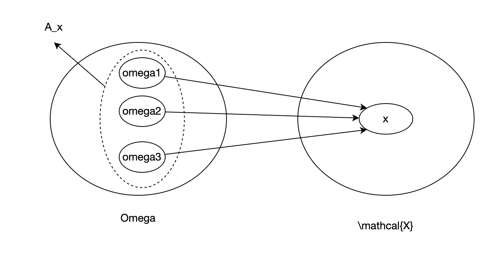

#### 附录B：测度论概率论
测度论是一个更高维度、更大范围的理论，测度理论概率论是其中一个分支，概率论套用了测度论的一些理论来描述概率论问题。  

##### 概率三元组
-样本空间$`\Omega`$，包含了所有可能发生的结果，其中元素是$`\omega`$。  
-事件域$`\mathcal{F}`$,样本空间中所有元素的组合中，满足$`\sigma`$-algebra条件的子集。其中元素是事件$`A`$。  
-概率测度$`\mathbb{P}`$，从$`\mathcal{F}`$到[0,1]的映射。  
> $`\mathcal{F}`$中有很多事件，他们的概率测度$`\mathbb{P}`$在[0,1]之间。分母是样本空间$`\Omega`$，而不是$`\mathcal{F}`$。比如$`\mathcal{F}`$中有一个事件$`A=\Omega`$,它的概率测度$`\mathbb{P}(A)=1`$。  

> $`\mathcal{F}`$的存在是为了限定要分析的对象。" it is a σ-algebra (or σ-field) of
Ω"。  

##### 随机变量
随机变量就是将$`\Omega`$中的样本映射到实数空间$`\mathbb{R}`$的"方法"。  
但并非所有映射都是随机变量。映射必须满足：  
对于任意实数$`x\in\mathbb{R}`$,小于$`x`$的映射$`X(\omega)`$也属于事件域$`\mathcal{F}`$。  
公式：$`A=\{\omega\in\Omega|X(\omega)<=x\}\in\mathcal{F}`$  
>这里<=和限制$`\mathcal{F}`$都有含义。<=感觉是一种可加性，限制$`\mathcal{F}`$是防止突破三元组中$`\mathcal{F}`$的讨论范畴。具体不太明白。  

##### 随机变量的期望
>这段公式太牛逼了，看得我一愣一愣的  

先给随机变量的定义：  
$`X(\omega) = \sum_{x\in\mathcal{X}}x \mathbb{1}_{A_{x}}(\omega)`$  
随机变量就是样本空间$`\Omega`$到实数空间$`x\in\mathbb{R}`$的映射，记为$`X`$。所以可以看到这个公式里，左边输入是样本空间中某样本$`\omega`$，经过映射$`X`$变换后，右边是一个对实数$`x`$的运算。  
比较奇葩的是这个函数，这个符号叫指示函数：  
$`\mathbb{1}_{A_{x}}(\omega)\doteq\left\{\begin{array}{ll}
1, &\omega\in A_{x},\\
0, &\text{otherwise.}
\end{array}\right.`$  
这个函数输入是样本$`\omega`$和一个集合$`A_x`$，如果$`\omega`$在集合$`A_x`$中，输出值为1，否则为0.说白了，就是判断$`\omega`$在不在集合$`A_x`$中。  
所以$`A_x`$是个啥？这定义也挺绕的：  
$`A_x=\{\omega \in \Omega|X(\omega)=x\}=X^{-1}(\omega)`$  
这个集合，是样本$`\omega`$的集合。其中的样本，通过随机变量$`X`$映射后的值为$`x`$。注意，这里的映射是多对一的，也就是多个$`\omega`$可能映射到一个$`x`$。这些$`\omega`$组成了一个集合叫$`A_x`$。最右边的一项是另一种解释，$`X`$不是把$`\omega`$映射到$`x`$了吗，$`^{-1}`$是逆运算，就是反过来，给$`x`$映射回$`\omega`$。  
给个图说明下：  
  
所以，$`X(\omega_1)`$是多少？嗯，就是$`x`$，但是根据公式你得绕一圈才能得到这个答案。  
遍历所有样本$`\omega`$，能映射为$`x`$的有三个：$`\omega_1`$, $`\omega_2`$, $`\omega_3`$.所以$`A_x=\{\omega_1,\omega_2,\omega_3\}`$。$`1_{A_x}(\omega_1)=1`$，因为$`\omega_1`$在$`A_x`$里。  
对所有$`x\in\mathcal{X}`$加和，因为只有$`\omega_1`$这一项的$`1_{A_x}(\omega_1)=1`$，所以$`X(\omega)=x`$。  
>听着很脱了裤子放屁，但是这个定义是个更高维的框架，是一种看问题的方式，更本质些。  
  
然后是期望。  
期望是什么？一个值和它出现的概率加权求和。  
现在要计算一个随机变量的概率，那就是这个随机变量的值$`x`$和发生的概率。  
根据前面的定义，某个随机变量取值$`x`$发生的概率是多少呢？$`x`$对应样本空间中映射到$`x`$的样本的集合是$`A_x`$。所以$`x`$发生的概率就是$`A_x/\Omega`$。  
看上图的例子，右侧$`x`$由左侧$`\omega_1,\omega_2,\omega_3`$映射而来，所以概率就是$`\omega_1,\omega_2,\omega_3`$比上样本空间全体$`\Omega`$。  
这只是一个取值$`x`$和它的概率的加权，扩展到所有取值就是：  
$`\mathbb{E}(X)=\sum_{x\in\mathcal{X}}x \mathbb{P}(A_x)`$  
  
另外，这会儿不知道有什么用，书上说，指示函数$`\mathbb{1}_{A}`$也可以看作一个随机变量。确实，它把在$`A`$里的$`\omega`$映射成1，不在的映射成0，满足随机变量的定义。  
且，$`\mathbb{E}(\mathbb{1_{A}})=\mathbb{P}(A)`$  
就这么想。$`\mathbb{1_{A}}`$由两部分组成，一部分是在$`A`$里的，随机变量是1，一部分是不在$`A`$里的，随机变量是0.随机变量是0的，就不用考虑了，所以只考虑在$`A`$里这部分样本$`\omega`$。这部分概率是多少呢？每一个样本$`\omega`$的概率都是$`\frac{1}{\Omega}`$，乘值1之后还是$`\frac{1}{\Omega}`$。$`A`$里所有这样的$`\omega`$加一起，就是$`\frac{A}{\Omega}`$,这不就是$`\mathbb{P}(A)`$吗。  

##### 随机变量条件期望
$`X,Y,Z`$是三个随机变量。提出了三种情况，理解一下：  
Case1: $`\mathbb{E}[X|Y=2]`$是一个数字。按照上面随机变量的定义，这么理解。$`X,Y`$其实都是个映射。所谓条件$`Y=2`$就是说，把样本空间中所有的$`\omega`$都通过$`Y`$映射到$`\mathcal{Y}`$，其中映射结果等于2的那些个$`\omega`$组成的集合。相当于在样本空间$`\Omega`$里画了个小圈。在这个小圈里，对$`\omega`$执行$`X`$映射，会映射到$`\mathcal{X}`$中。然后，计算$`X`$映射后的值及概率，求期望，得到的是一个数。这个求概率的过程跟上文说的一致，只是此时分母不是$`\Omega`$了，而是$`Y=2`$的这些$`\omega`$组成的集合。  

>"概率就是面积"，这句话的含金量还在上升  

Case2:$`\mathbb{E}[X|Y=y]`$是一个$`y`$的函数。扩展一下case1，上边$`Y=2`$是划定了一个小圈，如果把2变成一个变量$`y`$呢？这个圈就随着$`y`$的变化而变化。由于$`X`$的作用对象是$`Y`$划定的这个小圈，所以$`X`$的期望自然也随着$`y`$的变化而变化。期望也是如此。最后就变成了一个$`y`$的函数。  
Case3:$`\mathbb{E}[X|Y]`$是一个随机变量。这个有点抽象。凑合这么理解。上边两个case，都通过$`Y=?`$圈定了$`X`$在$`\Omega`$的作用域。但Case3没有圈定，所以，它的作用范围就是整个$`\Omega`$。这么想，整个$`\Omega`$里，有两个映射，分别把所有的$`\omega`$映射到实数域。如果这两个映射，完全没有关系，或者说独立，或者说$`Y`$把一个$`\omega`$映射成2和$`X`$把同一个$`\omega`$映射成5没有依赖关系的话，那其实计算$`X`$的期望就跟$`Y`$没关系，所以就是$`\mathbb{E}(X|Y)=\mathbb{E}(X)`$，结果就是个实数。如果$`Y`$把一个$`\omega`$映射成2时$`X`$把同一个$`\omega`$映射成5，$`Y`$把一个$`\omega`$映射成3时$`X`$把同一个$`\omega`$映射成6，这样，$`X`$把一个$`\omega`$映射成谁跟$`Y`$的映射结果有依赖关系的话，那$`X`$和$`Y`$就不是独立的。这时候，计算$`X`$的期望，就依赖随机变量$`Y`$了，所以它是随机变量$`Y`$的函数，还是个随机变量。  
> 有的事/概念理解不好，其实是底层逻辑没有构建好。当底层逻辑构建好、运用好之后，那些结论是可以自己分析出来的。  

##### 随机变量期望性质  
$`\mathbb{E}[X|Y]`$和$`\mathbb{E}[X|Y=y]`$有什么区别？为什么明明他们不等价，但是证明里却老提后者？  
前者是个随机变量，你不知道$`Y`$会取哪个值。后者已经确定要取$`y`$了，虽然它也是个变量，但总之是不随机了。书里的讨论都是证明对于"every y"满足某性质，也就意味着$`Y`$满足某性质了  
(a)$`\mathbb{E}[a|Y]=a`$  
这是一个有关Y的函数，假设$`Y=y`$  
$` \mathbb{E}[a|Y=y]=\sum_x x*p(a=x|Y=y)= a*p(a|Y=y)=a `$  
这里开始证明我犯了一个错误，误以为$`Y`$是个没有被确定值限定范围的随机变量，所以按照定义应该展开成：$`\mathbb{E} [ a|Y ] =\sum_y yp(a|y)`$。一个显然的反驳点就是，上面说$`\mathbb{E}[X|Y=y]`$是个$`y`$的函数，如果$`y`$展开了，就没有$`y`$了，那就变成常数了，与前论相悖。所以$`\mathbb{E}[X|Y]`$应该理解成，$`Y`$是用来圈定范围的，$`X`$才是要展开求的值。所以无论何时都要用$`X`$展开，$`Y`$只能是个变量。  
(b)$`\mathbb{E}[aX+bY]=a\mathbb{E}[X]+b\mathbb{E}[Y]`$  
期望的线性性质  
(c)$`\mathbb{E}[X|Y]=\mathbb{E}[X],如果\ X,Y 独立`$  
```math
\begin{align}
\mathbb{E}[X=y|Y=y]&=\sum_x x*p(X=x|Y=y)\\
&= \sum_x x*\frac{p(X=x,Y=y)}{p(Y=y)}\\
&= \sum_x x*\frac{p(X=x)p(Y=y)}{p(Y=y)}\\
&= \sum_x x*p(X=x)\\
&= \mathbb{E}[X]
\end{align}
```
(d)$`\mathbb{E}[Xf(Y)|Y]=f(Y)\mathbb{E}[X|Y]`$  
对每一个$`y`$：
```math
\begin{align}
\mathbb{E}[Xf(Y=y)|Y=y]&=\sum_x xf(Y=y)p(X=x|Y=y)\\
& f(y)跟x无关，可以从加和里提出来，但p(x|y)跟x是相关的\\
&= f(Y=y) \sum_x xp(X=x|Y=y)\\
&= f(Y=y)\mathbb{E}[X|Y=y]
\end{align}
```
(e)$`\mathbb{E}[f(Y)|Y]=f(Y)`$  
直接套用(a)  
(f)$`\mathbb{E}[X|Y,f(Y)]=\mathbb{E}[X|Y]`$  
对每一个y  
```math
\begin{align}
\mathbb{E}[X|Y=y,f(Y=y)]&=\sum_x xp(x|y,f(y))\\
& y确定了，f(y)也就确定了，所以p(x|y,f(y))=p(x|y)=p(x|f(y))\\
&= \sum_x xp(x|y)\\
&= \mathbb{E}[X|Y=y]
\end{align}
```
(g) if X > 0,$`\mathbb{E}[X|Y]>0`$  
(h) if X > Z, $`\mathbb{E}[X|Y]>\mathbb{E}[Z|Y]`$  
$`\mathbb{E}[X|Y=y]=\sum_x xp(x|Y=y)`$  
这个证明，同贝尔曼最优方程里最优行动的证明。  

##### 随机变量期望2 
(a) $`\mathbb{E}[\mathbb{E}[X|Y]]=\mathbb{E}[X]`$  
首先，$`\mathbb{E}[X|Y]=f(Y)`$,因为它是随机变量$`Y`$的函数。  
```math
\begin{align}
\mathbb{E}[\mathbb{E}[X|Y]] &= \mathbb{E}[f(Y)]\\
&= \sum_y f(y) p(f(Y=y))\\
& y确定了，f(y)也就确定了，所以p(f(y)) = p(y)\\
&= \sum_y f(y) p(y)\\
&= \sum_y \mathbb{E}[X|Y=y]p(y)\\
&= \sum_y \sum_x xp(x|y)p(y)\\
&= \sum_y \sum_x x p(x,y)\\
&= \sum_x x \sum_y p(x,y)\\
&= \sum_x x p(x) \\
&= \mathbb{E}[X]
\end{align}
```
这么理解，里层Y相当于圈定了一部分样本，求这部分样本X的期望。然后又求整体样本对于Y的期望，其实就是求整体样本X的期望。  

(b) $`\mathbb{E}[\mathbb{E}[X|Y,Z]]=\mathbb{E}[X]`$  
(c) $`\mathbb{E}[\mathbb{E}[X|Y]|Y]=\mathbb{E}[X|Y]`$  
类似(a)可证。  

##### 随机收敛定义
这里的收敛说的不是下意识想的，一个实数序列最终会收敛到一个实数值。  
这里的收敛说的是随机变量也就是从样本$`\omega`$到$`x`$的映射方法收敛。涉及两个维度：  
1. 对哪些样本收敛？  
2. 收敛到什么程度？  

下边逐个总结下

- Sure convergence  
```math
A=\Omega, where A=\{\omega \in \Omega:\lim_{k \to \infty} X_k(\omega) = X(\omega)\}
```
收敛的范围是全体$`\omega`$，收敛的程度，是：收敛到映射$`X`$。这是约束最强的收敛。  

- Almost sure convergence  
```math
\mathbb{P}(A)=1, where A=\{\omega \in \Omega:\lim_{k \to \infty} X_k(\omega) = X(\omega)\}
```
注意，和Sure convergence的区别是收敛范围，不再是全体样本，而是收敛范围内样本概率为1.有些事件，发生的概率趋近于0.这些事件不收敛。  

- Convergence in probability  
```math
\lim_{k\to\infty}\mathbb{P}(A)=0, where A=\{\omega \in \Omega:|X_k(\omega)-X(\omega)|>\epsilon\}
```
这个是说，那些不收敛的样本，发生概率随着k增加趋近于0。约束的不是哪些样本收敛，而是那些不收敛的样本发生的概率。  

- Convergence in mean  
```math
\lim_{k\to\infty}\mathbb{E}[|X_k-X|^r]=0
```
约束了随机变量的期望和方差一致。  

- Convergence in distribution
```math
\lim_{k\to\infty}\mathbb{P}(X_k\leq a) = \mathbb(X\leq a)
```
$`\mathbb{P}(X_k\leq a)`$是$`X_k`$在样本空间上的概率分布累积值。也就是映射的概率分布收敛。  

#### 附录C：确定性序列收敛  
这下不是随机变量序列了，是实数序列。收敛就是实数序列的值会收敛到某个实数。  
##### 单调序列收敛  
两个条件：  
- 非递增，即$`x_{k+1} \leq x_k`$  
- 有下界，即$`x_k\geq\alpha, for\ all\ k`$  

则$`\{x_k\}`$收敛。反之：
- 非递减，即$`x_{k+1} \geq x_k`$
- 有上界，即$`x_k \leq \alpha, for\ all\ k`$  

也收敛。

##### 非单调序列收敛
对于非负序列$`x_k>0`$，如果$`\sum_{k=1}^\infty(x_{k+1}-x_k)^+\lt \infty`$，则$`\{x_k\}`$收敛  
这个看着简单，涉及的概念还挺多。  
这个右上角的$`^+`$是说，大于等于0的保留，小于0的用0替换。$`^-`$同理  
对$`x_k`$分解：  
```math
\begin{align}
x_k &= x_k - x_{k-1}+x_{k-1}-x_{k-2}+x_{k-2}...x_3-x_2+x_2-x_1+x_1\\
&=\sum_{i=1}^{k-1}(x_{i+1}-x_i) + x_1\\
&=S_{k}+x_1
\end{align}
```
说白了，就是求序列中每个元素和上一个元素的差值，全都加到$`x_1`$上，就是$`x_k`$。条件中的$`\sum_{k=1}^\infty(x_{k+1}-x_k)^+\lt \infty`$就是对差值序列中正的部分求和进行约束。  
- 证明一：有界  
差值序列按照正负可以分成两个序列和：  
$`S_k^+=\sum_{k=1}^\infty(x_{k+1}-x_k)^+`$  
$`S_k^-=\sum_{k=1}^\infty(x_{k+1}-x_k)^-`$  
$`S_k=S_k^++S_k^-`$  
所以：  
$`x_k=S_k+x_1=S_k^++S_k^-+x_1 \geq 0`$  
也就是：  
$`S_k^-\geq -S_k^+-x_1`$  
如果$`S_k^+=\sum_{k=1}^{k-1}(x_{k+1}-x_k)^+\lt \infty`$  
$`S_k^- \gt -\infty`$  
也就是$`S_k^-`$是有下界的。  
所以只要约束了$`\sum_{k=1}^\infty(x_{k+1}-x_k)^+\lt \infty`$，也就约束了$`\sum_{k=1}^\infty(x_{k+1}-x_k)^-\gt \infty`$,也就是差值序列里的非负和和非正和都是有界的。  
- 证明二：非递增/非递减  
然后，根据$`S_k`$的定义可以得出，$`S_k`$是非递减的(都是正数或0，肯定是增长或不变)。
- 结论：  
$`x_k`$收敛于$`S_k^+ + S_k^- + x_1`$  

##### 推论：非单调序列收敛  
对非负序列$`x_k \geq 0`$，有$`x_{k+1}\leq x_k+\eta_k`$，如果$`\eta_k \geq 0 , \sum_{k=1}^\infty \eta_k \lt \infty`$,则序列$`\{x_k\}`$收敛。  
由于  
$`x_{k+1} \leq x_k+\eta_k`$  
所以  
$`\sum_{k=1}^\infty(x_{k+1}-x_k) \leq \sum_{k=1}^\infty(x_{k+1}-x_k)^+ \leq \sum_{k=1}^\infty \eta_k \lt \infty`$  
根据前面的推导，非递减且有上界，得出$`x_k`$收敛。  

#### 附录C：随机序列的收敛
依赖鞅定理  

##### 鞅定义
对于随机变量组成的序列，两个条件：
- 序列中的随机变量期望有界: $`\mathbb{E}[|X_k|] \lt \infty`$  
- 序列下一个随机变量的期望等于当前随机变量值：$`\mathbb{E}[X_{k+1}|X_k,X_{k-1},X_{k-2}...X_1]=\mathbb{E}[X_{k+1}|\mathcal{H}_k]=X_k`$  

第二个条件也就意味着随机变量的期望都是相等的，因为之前的推导：
$`\mathbb{E}[\mathbb{E}[X|Y]]=E[X]`$  
所以：  
$`\mathbb{E}[\mathbb{E}[X_{k+1}|\mathcal{H}_k]]=E[X_{k+1}]=E[X_k]`$  
  
错误理解：鞅的条件表明序列中的随机变量是相互独立的。  
因为看到$`E[X_{k+1}]=E[X_k]`$，下意识的认为随机变量之间是相互独立的。其实不然。  
如果$`X,Y`$相互独立，有$`\mathbb{E}[X|Y]=\mathbb{E}[X]`$，但定义中的条件是$`\mathbb{E}[X|Y]=X`$，两者不同。  
另一个理解方式，上文附录B已讨论，$`\mathbb{E}[X|Y]`$是个$`Y`$相关的随机变量，因此$`\mathbb{E}[X_{k+1}|\mathcal{H}_k]`$是个随机变量。或者说，$`\mathcal{H}_k`$圈定了样本范围，计算下一个随机变量$`X_{k+1}`$的期望，所以$`\mathbb{E}[X_{k+1}|\mathcal{H}_k]`$是随着$`\mathcal{H}_k`$的变化而变化的随机变量——另一个维度说明随机变量之间不是独立的，而是相关的。  
>这会儿也get不到这性质有什么用  

##### 下鞅
对于随机变量组成的序列，两个条件：
- 随机变量期望有上下界：$`\mathbb{E}[|X_k|]\lt\infty`$  
- $`\mathbb{E}[X_{k+1}|\mathcal{H_k}]\geq X_k`$  

跟鞅不同的就是$`\mathbb{E}[X_{k+1}|\mathcal{H_k}]\geq X_k`$，通过$`\mathbb{E}[\mathbb{E}[X|Y]]=E[X]`$也可以导出：  
$`\mathbb{E}[X_{k+1}]\geq \mathbb{E}[X_{k}] \geq \mathbb{E}[X_{k-1}]...\geq \mathbb{E}[X_1]`$  
也就是随机变量序列的期望是非递减的。  

##### 上鞅
和上鞅相反，随机变量序列的期望是非递增的。  

>这个定义的名词确实容易懵逼。上鞅super，是递减的，下鞅sub是递增的。  

##### 鞅收敛
上鞅和下鞅会almost surely收敛到一个随机变量$`X`$。  

##### 拟鞅
上面确定性序列通过约束相邻元素差的和，导出收敛。  
鞅的约束得以让随机变量序列的期望有了类似确定性序列的性质。  
因此，拟鞅这里结合了两者，通过对随机变量序列相邻元素的期望差的和进行约束，导出收敛。  
类似上文的$`S_k^+,S_k^-`$，这里也要有对应的正向、负向表示：  
```math
\mathbb{1}_{A_{k}}=\left\{\begin{array}{ll}
1, & \mathbb{E}\left[X_{k+1}-X_{k} \mid \mathcal{H}_{k}\right] \geq 0, \\
0, & \mathbb{E}\left[X_{k+1}-X_{k} \mid \mathcal{H}_{k}\right] < 0.
\end{array}\right.
```
这个就相当于确定性序列界的$`S_k^+`$。注意$`\mathbb{E}[X_{k+1}-X_{k} \mid \mathcal{H}_{k}]`$：  
- 它是个有关$`\mathcal{H}_k`$的随机变量，可取范围内的实数值。  
- 它是对$`X_{k+1}-X_{k}`$求期望。这是相邻随机变量的差值。  

为什么$`\mathbb{1}`$后面要跟个$`A_k`$，且类似$`S_k^-`$的公式用$`\mathbb{1}_{A_k^c}`$表示？  
因为$`\mathbb{E}[X_{k+1}-X_{k} \mid \mathcal{H}_{k}]`$是个随机变量，$`\mathbb{E}[X_{k+1}-X_{k} \mid \mathcal{H}_{k}] \geq 0`$的含义是取随机变量值大于0的部分，实际就是圈定了样本空间$`\Omega`$中的部分样本组成一个集合，也就是$`A_k`$：  
$`A_k=\{\omega\in\Omega, \mathbb{E}[X_{k+1}-X_{k} \mid \mathcal{H}_{k}] \geq 0\}`$
所以，它的另一面是补集。  
  
拟鞅收敛：  
对于非负随机变量序列$`\{X_k\geq0\}`$,满足:  
$`\sum_{k=1}^\infty\mathbb{E}[(X_{k+1}-X_k)\mathbb{1}_{A_k}]\lt\infty`$  
则随机变量序列收敛。  
类似确定性非单调非负序列的收敛，增加上界约束，则下界也受约束，从而导向收敛。  

