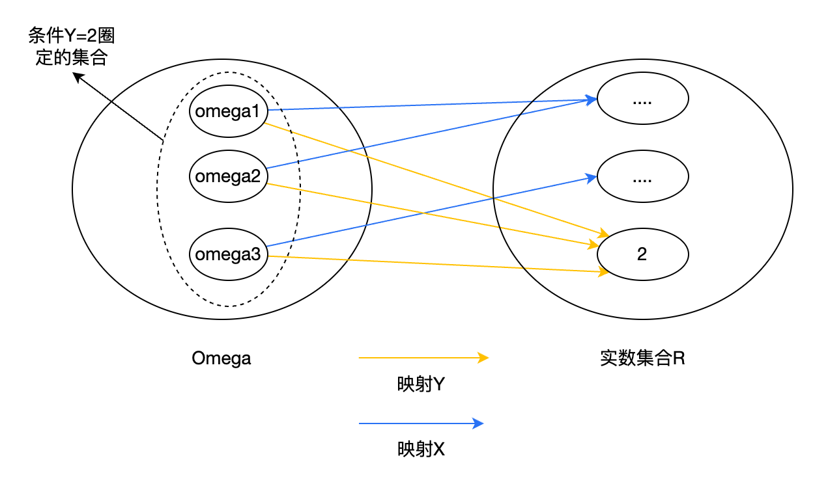

#### 附录B：测度论概率论
测度论是一个更高维度、更大范围的理论，测度理论概率论是其中一个分支，概率论套用了测度论的一些理论来描述概率论问题。  

##### 概率三元组
-样本空间$`\Omega`$，包含了所有可能发生的结果，其中元素是$`\omega`$。  
-事件域$`\mathcal{F}`$,样本空间中所有元素的组合中，满足$`\sigma`$-algebra条件的子集。其中元素是事件$`A`$。  
-概率测度$`\mathbb{P}`$，从$`\mathcal{F}`$到[0,1]的映射。  
> $`\mathcal{F}`$中有很多事件，他们的概率测度$`\mathbb{P}`$在[0,1]之间。分母是样本空间$`\Omega`$，而不是$`\mathcal{F}`$。比如$`\mathcal{F}`$中有一个事件$`A=\Omega`$,它的概率测度$`\mathbb{P}(A)=1`$。  

> $`\mathcal{F}`$的存在是为了限定要分析的对象。" it is a σ-algebra (or σ-field) of
Ω"。  

##### 随机变量
随机变量就是将$`\Omega`$中的样本映射到实数空间$`\mathbb{R}`$的"方法"。  
但并非所有映射都是随机变量。映射必须满足：  
对于任意实数$`x\in\mathbb{R}`$,小于$`x`$的映射$`X(\omega)`$也属于事件域$`\mathcal{F}`$。  
公式：$`A=\{\omega\in\Omega|X(\omega)<=x\}\in\mathcal{F}`$  
>这里<=和限制$`\mathcal{F}`$都有含义。<=感觉是一种可加性，限制$`\mathcal{F}`$是防止突破三元组中$`\mathcal{F}`$的讨论范畴。具体不太明白。  

##### 随机变量的期望
>这段公式太牛逼了，看得我一愣一愣的  

先给随机变量的定义：  
$`X(\omega) = \sum_{x\in\mathcal{X}}x \mathbb{1}_{A_{x}}(\omega)`$  
随机变量就是样本空间$`\Omega`$到实数空间$`x\in\mathbb{R}`$的映射，记为$`X`$。所以可以看到这个公式里，左边输入是样本空间中某样本$`\omega`$，经过映射$`X`$变换后，右边是一个对实数$`x`$的运算。  
比较奇葩的是这个函数，这个符号叫指示函数：  
$`\mathbb{1}_{A_{x}}(\omega)\doteq\left\{\begin{array}{ll}
1, &\omega\in A_{x},\\
0, &\text{otherwise.}
\end{array}\right.`$  
这个函数输入是样本$`\omega`$和一个集合$`A_x`$，如果$`\omega`$在集合$`A_x`$中，输出值为1，否则为0.说白了，就是判断$`\omega`$在不在集合$`A_x`$中。  
所以$`A_x`$是个啥？这定义也挺绕的：  
$`A_x=\{\omega \in \Omega|X(\omega)=x\}=X^{-1}(\omega)`$  
这个集合，是样本$`\omega`$的集合。其中的样本，通过随机变量$`X`$映射后的值为$`x`$。注意，这里的映射是多对一的，也就是多个$`\omega`$可能映射到一个$`x`$。这些$`\omega`$组成了一个集合叫$`A_x`$。最右边的一项是另一种解释，$`X`$不是把$`\omega`$映射到$`x`$了吗，$`^{-1}`$是逆运算，就是反过来，给$`x`$映射回$`\omega`$。  
给个图说明下：  
  
所以，$`X(\omega_1)`$是多少？嗯，就是$`x`$，但是根据公式你得绕一圈才能得到这个答案。  
遍历所有样本$`\omega`$，能映射为$`x`$的有三个：$`\omega_1`$, $`\omega_2`$, $`\omega_3`$.所以$`A_x=\{\omega_1,\omega_2,\omega_3\}`$。$`1_{A_x}(\omega_1)=1`$，因为$`\omega_1`$在$`A_x`$里。  
对所有$`x\in\mathcal{X}`$加和，因为只有$`\omega_1`$这一项的$`1_{A_x}(\omega_1)=1`$，所以$`X(\omega)=x`$。  
>听着很脱了裤子放屁，但是这个定义是个更高维的框架，是一种看问题的方式，更本质些。  
  
然后是期望。  
期望是什么？一个值和它出现的概率加权求和。  
现在要计算一个随机变量的概率，那就是这个随机变量的值$`x`$和发生的概率。  
根据前面的定义，某个随机变量取值$`x`$发生的概率是多少呢？$`x`$对应样本空间中映射到$`x`$的样本的集合是$`A_x`$。所以$`x`$发生的概率就是$`A_x/\Omega`$。  
看上图的例子，右侧$`x`$由左侧$`\omega_1,\omega_2,\omega_3`$映射而来，所以概率就是$`\omega_1,\omega_2,\omega_3`$比上样本空间全体$`\Omega`$。  
这只是一个取值$`x`$和它的概率的加权，扩展到所有取值就是：  
$`\mathbb{E}(X)=\sum_{x\in\mathcal{X}}x \mathbb{P}(A_x)`$  
  
另外，这会儿不知道有什么用，书上说，指示函数$`\mathbb{1}_{A}`$也可以看作一个随机变量。确实，它把在$`A`$里的$`\omega`$映射成1，不在的映射成0，满足随机变量的定义。  
且，$`\mathbb{E}(\mathbb{1_{A}})=\mathbb{P}(A)`$  
就这么想。$`\mathbb{1_{A}}`$由两部分组成，一部分是在$`A`$里的，随机变量是1，一部分是不在$`A`$里的，随机变量是0.随机变量是0的，就不用考虑了，所以只考虑在$`A`$里这部分样本$`\omega`$。这部分概率是多少呢？每一个样本$`\omega`$的概率都是$`\frac{1}{\Omega}`$，乘值1之后还是$`\frac{1}{\Omega}`$。$`A`$里所有这样的$`\omega`$加一起，就是$`\frac{A}{\Omega}`$,这不就是$`\mathbb{P}(A)`$吗。  

##### 随机变量条件期望
$`X,Y,Z`$是三个随机变量。提出了三种情况，理解一下：  
Case1: $`\mathbb{E}[X|Y=2]`$是一个数字。按照上面随机变量的定义，这么理解。$`X,Y`$其实都是个映射。所谓条件$`Y=2`$就是说，把样本空间中所有的$`\omega`$都通过$`Y`$映射到$`\mathcal{Y}`$，其中映射结果等于2的那些个$`\omega`$组成的集合。相当于在样本空间$`\Omega`$里画了个小圈。在这个小圈里，对$`\omega`$执行$`X`$映射，会映射到$`\mathcal{X}`$中。然后，计算$`X`$映射后的值及概率，求期望，得到的是一个数。这个求概率的过程跟上文说的一致，只是此时分母不是$`\Omega`$了，而是$`Y=2`$的这些$`\omega`$组成的集合。  

>"概率就是面积"，这句话的含金量还在上升  

Case2:$`\mathbb{E}[X|Y=y]`$是一个$`y`$的函数。扩展一下case1，上边$`Y=2`$是划定了一个小圈，如果把2变成一个变量$`y`$呢？这个圈就随着$`y`$的变化而变化。由于$`X`$的作用对象是$`Y`$划定的这个小圈，所以$`X`$的期望自然也随着$`y`$的变化而变化。期望也是如此。最后就变成了一个$`y`$的函数。  
Case3:$`\mathbb{E}[X|Y]`$是一个随机变量。这个有点抽象。凑合这么理解。上边两个case，都通过$`Y=?`$圈定了$`X`$在$`\Omega`$的作用域。但Case3没有圈定，所以，它的作用范围就是整个$`\Omega`$。这么想，整个$`\Omega`$里，有两个映射，分别把所有的$`\omega`$映射到实数域。如果这两个映射，完全没有关系，或者说独立，或者说$`Y`$把一个$`\omega`$映射成2和$`X`$把同一个$`\omega`$映射成5没有依赖关系的话，那其实计算$`X`$的期望就跟$`Y`$没关系，所以就是$`\mathbb{E}(X|Y)=\mathbb{E}(X)`$，结果就是个实数。如果$`Y`$把一个$`\omega`$映射成2时$`X`$把同一个$`\omega`$映射成5，$`Y`$把一个$`\omega`$映射成3时$`X`$把同一个$`\omega`$映射成6，这样，$`X`$把一个$`\omega`$映射成谁跟$`Y`$的映射结果有依赖关系的话，那$`X`$和$`Y`$就不是独立的。这时候，计算$`X`$的期望，就依赖随机变量$`Y`$了，所以它是随机变量$`Y`$的函数，还是个随机变量。  
> 有的事/概念理解不好，其实是底层逻辑没有构建好。当底层逻辑构建好、运用好之后，那些结论是可以自己分析出来的。  

##### 随机变量期望性质  
$`\mathbb{E}[X|Y]`$和$`\mathbb{E}[X|Y=y]`$有什么区别？为什么明明他们不等价，但是证明里却老提后者？  
前者是个随机变量，你不知道$`Y`$会取哪个值。后者已经确定要取$`y`$了，虽然它也是个变量，但总之是不随机了。书里的讨论都是证明对于"every y"满足某性质，也就意味着$`Y`$满足某性质了  
(a)$`\mathbb{E}[a|Y]=a`$  
这是一个有关Y的函数，假设$`Y=y`$  
$` \mathbb{E}[a|Y=y]=\sum_x x*p(a=x|Y=y)= a*p(a|Y=y)=a `$  
这里开始证明我犯了一个错误，误以为$`Y`$是个没有被确定值限定范围的随机变量，所以按照定义应该展开成：$`\mathbb{E} [ a|Y ] =\sum_y yp(a|y)`$。一个显然的反驳点就是，上面说$`\mathbb{E}[X|Y=y]`$是个$`y`$的函数，如果$`y`$展开了，就没有$`y`$了，那就变成常数了，与前论相悖。所以$`\mathbb{E}[X|Y]`$应该理解成，$`Y`$是用来圈定范围的，$`X`$才是要展开求的值。所以无论何时都要用$`X`$展开，$`Y`$只能是个变量。  
(b)$`\mathbb{E}[aX+bY]=a\mathbb{E}[X]+b\mathbb{E}[Y]`$  
期望的线性性质  
(c)$`\mathbb{E}[X|Y]=\mathbb{E}[X],如果\ X,Y 独立`$  
```math
\begin{align}
\mathbb{E}[X=y|Y=y]&=\sum_x x*p(X=x|Y=y)\\
&= \sum_x x*\frac{p(X=x,Y=y)}{p(Y=y)}\\
&= \sum_x x*\frac{p(X=x)p(Y=y)}{p(Y=y)}\\
&= \sum_x x*p(X=x)\\
&= \mathbb{E}[X]
\end{align}
```
(d)$`\mathbb{E}[Xf(Y)|Y]=f(Y)\mathbb{E}[X|Y]`$  
对每一个$`y`$：
```math
\begin{align}
\mathbb{E}[Xf(Y=y)|Y=y]&=\sum_x xf(Y=y)p(X=x|Y=y)\\
& f(y)跟x无关，可以从加和里提出来，但p(x|y)跟x是相关的\\
&= f(Y=y) \sum_x xp(X=x|Y=y)\\
&= f(Y=y)\mathbb{E}[X|Y=y]
\end{align}
```
(e)$`\mathbb{E}[f(Y)|Y]=f(Y)`$  
直接套用(a)  
(f)$`\mathbb{E}[X|Y,f(Y)]=\mathbb{E}[X|Y]`$  
对每一个y  
```math
\begin{align}
\mathbb{E}[X|Y=y,f(Y=y)]&=\sum_x xp(x|y,f(y))\\
& y确定了，f(y)也就确定了，所以p(x|y,f(y))=p(x|y)=p(x|f(y))\\
&= \sum_x xp(x|y)\\
&= \mathbb{E}[X|Y=y]
\end{align}
```
(g) if X > 0,$`\mathbb{E}[X|Y]>0`$  
(h) if X > Z, $`\mathbb{E}[X|Y]>\mathbb{E}[Z|Y]`$  
$`\mathbb{E}[X|Y=y]=\sum_x xp(x|Y=y)`$  
这个证明，同贝尔曼最优方程里最优行动的证明。  

##### 随机变量期望2 
(a) $`\mathbb{E}[\mathbb{E}[X|Y]]=\mathbb{E}[X]`$  
首先，$`\mathbb{E}[X|Y]=f(Y)`$,因为它是随机变量$`Y`$的函数。  
```math
\begin{align}
\mathbb{E}[\mathbb{E}[X|Y]] &= \mathbb{E}[f(Y)]\\
&= \sum_y f(y) p(f(Y=y))\\
& y确定了，f(y)也就确定了，所以p(f(y)) = p(y)\\
&= \sum_y f(y) p(y)\\
&= \sum_y \mathbb{E}[X|Y=y]p(y)\\
&= \sum_y \sum_x xp(x|y)p(y)\\
&= \sum_y \sum_x x p(x,y)\\
&= \sum_x x \sum_y p(x,y)\\
&= \sum_x x p(x) \\
&= \mathbb{E}[X]
\end{align}
```
这么理解，里层Y相当于圈定了一部分样本，求这部分样本X的期望。然后又求整体样本对于Y的期望，其实就是求整体样本X的期望。  

(b) $`\mathbb{E}[\mathbb{E}[X|Y,Z]]=\mathbb{E}[X]`$  
(c) $`\mathbb{E}[\mathbb{E}[X|Y]|Y]=\mathbb{E}[X|Y]`$  
类似(a)可证。  

##### 随机收敛定义
这里的收敛说的不是下意识想的，一个实数序列最终会收敛到一个实数值。  
这里的收敛说的是随机变量也就是从样本$`\omega`$到$`x`$的映射方法收敛。涉及两个维度：  
1. 对哪些样本收敛？  
2. 收敛到什么程度？  

下边逐个总结下

- Sure convergence  
```math
A=\Omega, where A=\{\omega \in \Omega:\lim_{k \to \infty} X_k(\omega) = X(\omega)\}
```
收敛的范围是全体$`\omega`$，收敛的程度，是：收敛到映射$`X`$。这是约束最强的收敛。  

- Almost sure convergence  
```math
\mathbb{P}(A)=1, where A=\{\omega \in \Omega:\lim_{k \to \infty} X_k(\omega) = X(\omega)\}
```
注意，和Sure convergence的区别是收敛范围，不再是全体样本，而是收敛范围内样本概率为1.有些事件，发生的概率趋近于0.这些事件不收敛。  

- Convergence in probability  
```math
\lim_{k\to\infty}\mathbb{P}(A)=0, where A=\{\omega \in \Omega:|X_k(\omega)-X(\omega)|>\epsilon\}
```
这个是说，那些不收敛的样本，发生概率随着k增加趋近于0。约束的不是哪些样本收敛，而是那些不收敛的样本发生的概率。  

- Convergence in mean  
```math
\lim_{k\to\infty}\mathbb{E}[|X_k-X|^r]=0
```
约束了随机变量的期望和方差一致。  

- Convergence in distribution
```math
\lim_{k\to\infty}\mathbb{P}(X_k\leq a) = \mathbb(X\leq a)
```
$`\mathbb{P}(X_k\leq a)`$是$`X_k`$在样本空间上的概率分布累积值。也就是映射的概率分布收敛。  

#### 附录C：确定性序列收敛  
这下不是随机变量序列了，是实数序列。收敛就是实数序列的值会收敛到某个实数。  
##### 单调序列收敛  
两个条件：  
- 非递增，即$`x_{k+1} \leq x_k`$  
- 有下界，即$`x_k\geq\alpha, for\ all\ k`$  

则$`\{x_k\}`$收敛。反之：
- 非递减，即$`x_{k+1} \geq x_k`$
- 有上界，即$`x_k \leq \alpha, for\ all\ k`$  

也收敛。

##### 非单调序列收敛
对于非负序列$`x_k>0`$，如果$`\sum_{k=1}^\infty(x_{k+1}-x_k)^+\lt \infty`$，则$`\{x_k\}`$收敛  
这个看着简单，涉及的概念还挺多。  
这个右上角的$`^+`$是说，大于等于0的保留，小于0的用0替换。$`^-`$同理  
对$`x_k`$分解：  
```math
\begin{align}
x_k &= x_k - x_{k-1}+x_{k-1}-x_{k-2}+x_{k-2}...x_3-x_2+x_2-x_1+x_1\\
&=\sum_{i=1}^{k-1}(x_{i+1}-x_i) + x_1\\
&=S_{k}+x_1
\end{align}
```
说白了，就是求序列中每个元素和上一个元素的差值，全都加到$`x_1`$上，就是$`x_k`$。条件中的$`\sum_{k=1}^\infty(x_{k+1}-x_k)^+\lt \infty`$就是对差值序列中正的部分求和进行约束。  
- 证明一：有界  
差值序列按照正负可以分成两个序列和：  
$`S_k^+=\sum_{k=1}^\infty(x_{k+1}-x_k)^+`$  
$`S_k^-=\sum_{k=1}^\infty(x_{k+1}-x_k)^-`$  
$`S_k=S_k^++S_k^-`$  
所以：  
$`x_k=S_k+x_1=S_k^++S_k^-+x_1 \geq 0`$  
也就是：  
$`S_k^-\geq -S_k^+-x_1`$  
如果$`S_k^+=\sum_{k=1}^{k-1}(x_{k+1}-x_k)^+\lt \infty`$  
$`S_k^- \gt -\infty`$  
也就是$`S_k^-`$是有下界的。  
所以只要约束了$`\sum_{k=1}^\infty(x_{k+1}-x_k)^+\lt \infty`$，也就约束了$`\sum_{k=1}^\infty(x_{k+1}-x_k)^-\gt \infty`$,也就是差值序列里的非负和和非正和都是有界的。  
- 证明二：非递增/非递减  
然后，根据$`S_k`$的定义可以得出，$`S_k`$是非递减的(都是正数或0，肯定是增长或不变)。
- 结论：  
$`x_k`$收敛于$`S_k^+ + S_k^- + x_1`$  

##### 推论：非单调序列收敛  
对非负序列$`x_k \geq 0`$，有$`x_{k+1}\leq x_k+\eta_k`$，如果$`\eta_k \geq 0 , \sum_{k=1}^\infty \eta_k \lt \infty`$,则序列$`\{x_k\}`$收敛。  
由于  
$`x_{k+1} \leq x_k+\eta_k`$  
所以  
$`\sum_{k=1}^\infty(x_{k+1}-x_k) \leq \sum_{k=1}^\infty(x_{k+1}-x_k)^+ \leq \sum_{k=1}^\infty \eta_k \lt \infty`$  
根据前面的推导，非递减且有上界，得出$`x_k`$收敛。  

#### 附录C：随机序列的收敛
依赖鞅定理  

##### 鞅定义
对于随机变量组成的序列，两个条件：
- 序列中的随机变量期望有界: $`\mathbb{E}[|X_k|] \lt \infty`$  
- 序列下一个随机变量的期望等于当前随机变量值：$`\mathbb{E}[X_{k+1}|X_k,X_{k-1},X_{k-2}...X_1]=\mathbb{E}[X_{k+1}|\mathcal{H}_k]=X_k`$  

第二个条件也就意味着随机变量的期望都是相等的，因为之前的推导：
$`\mathbb{E}[\mathbb{E}[X|Y]]=E[X]`$  
所以：  
$`\mathbb{E}[\mathbb{E}[X_{k+1}|\mathcal{H}_k]]=E[X_{k+1}]=E[X_k]`$  
  
错误理解：鞅的条件表明序列中的随机变量是相互独立的。  
因为看到$`E[X_{k+1}]=E[X_k]`$，下意识的认为随机变量之间是相互独立的。其实不然。  
如果$`X,Y`$相互独立，有$`\mathbb{E}[X|Y]=\mathbb{E}[X]`$，但定义中的条件是$`\mathbb{E}[X|Y]=X`$，两者不同。  
另一个理解方式，上文附录B已讨论，$`\mathbb{E}[X|Y]`$是个$`Y`$相关的随机变量，因此$`\mathbb{E}[X_{k+1}|\mathcal{H}_k]`$是个随机变量。或者说，$`\mathcal{H}_k`$圈定了样本范围，计算下一个随机变量$`X_{k+1}`$的期望，所以$`\mathbb{E}[X_{k+1}|\mathcal{H}_k]`$是随着$`\mathcal{H}_k`$的变化而变化的随机变量——另一个维度说明随机变量之间不是独立的，而是相关的。  
>这会儿也get不到这性质有什么用  

##### 下鞅
对于随机变量组成的序列，两个条件：
- 随机变量期望有上下界：$`\mathbb{E}[|X_k|]\lt\infty`$  
- $`\mathbb{E}[X_{k+1}|\mathcal{H_k}]\geq X_k`$  

跟鞅不同的就是$`\mathbb{E}[X_{k+1}|\mathcal{H_k}]\geq X_k`$，通过$`\mathbb{E}[\mathbb{E}[X|Y]]=E[X]`$也可以导出：  
$`\mathbb{E}[X_{k+1}]\geq \mathbb{E}[X_{k}] \geq \mathbb{E}[X_{k-1}]...\geq \mathbb{E}[X_1]`$  
也就是随机变量序列的期望是非递减的。  

##### 上鞅
和上鞅相反，随机变量序列的期望是非递增的。  

>这个定义的名词确实容易懵逼。上鞅super，是递减的，下鞅sub是递增的。  

##### 鞅收敛
上鞅和下鞅会almost surely收敛到一个随机变量$`X`$。  

##### 拟鞅
上面确定性序列通过约束相邻元素差的和，导出收敛。  
鞅的约束得以让随机变量序列的期望有了类似确定性序列的性质。  
因此，拟鞅这里结合了两者，通过对随机变量序列相邻元素的期望差的和进行约束，导出收敛。  
类似上文的$`S_k^+,S_k^-`$，这里也要有对应的正向、负向表示：  
```math
\mathbb{1}_{A_{k}}=\left\{\begin{array}{ll}
1, & \mathbb{E}\left[X_{k+1}-X_{k} \mid \mathcal{H}_{k}\right] \geq 0, \\
0, & \mathbb{E}\left[X_{k+1}-X_{k} \mid \mathcal{H}_{k}\right] < 0.
\end{array}\right.
```
这个就相当于确定性序列界的$`S_k^+`$。注意$`\mathbb{E}[X_{k+1}-X_{k} \mid \mathcal{H}_{k}]`$：  
- 它是个有关$`\mathcal{H}_k`$的随机变量，可取范围内的实数值。  
- 它是对$`X_{k+1}-X_{k}`$求期望。这是相邻随机变量的差值。  

为什么$`\mathbb{1}`$后面要跟个$`A_k`$，且类似$`S_k^-`$的公式用$`\mathbb{1}_{A_k^c}`$表示？  
因为$`\mathbb{E}[X_{k+1}-X_{k} \mid \mathcal{H}_{k}]`$是个随机变量，$`\mathbb{E}[X_{k+1}-X_{k} \mid \mathcal{H}_{k}] \geq 0`$的含义是取随机变量值大于0的部分，实际就是圈定了样本空间$`\Omega`$中的部分样本组成一个集合，也就是$`A_k`$：  
$`A_k=\{\omega\in\Omega, \mathbb{E}[X_{k+1}-X_{k} \mid \mathcal{H}_{k}] \geq 0\}`$
所以，它的另一面是补集。  
  
拟鞅收敛：  
对于非负随机变量序列$`\{X_k\geq0\}`$,满足:  
$`\sum_{k=1}^\infty\mathbb{E}[(X_{k+1}-X_k)\mathbb{1}_{A_k}]\lt\infty`$  
则随机变量序列收敛。  
类似确定性非单调非负序列的收敛，增加上界约束，则下界也受约束，从而导向收敛。  

#### Dvoretzky’s convergence theorem
RM算法：
序列$`w_{k+1}=w_k-a_k(g(w_k)+\eta_k)`$收敛到$`g(w)`$的根$`w^*`$,如果$`g(w),a_k,\eta_k`$满足约束。  
这里Dvoretzky收敛是RM算法更高一层的理论，通过Dvoretzky收敛可以导出RM的收敛。  

>这段条件过多了，理解有限，几乎是照葫芦画瓢重写一遍  
后来，我问了一个问题：为什么是$`\mathbb{E}[\eta_k|\mathcal{H}_k]=0`$而不是$`\mathbb{E}[\eta_k]=0`$?打开了理解的大门。  
所以，问：为什么不是，比问，为什么是，能获取到的信息要更多。  

Dvoretzky迭代公式：  
$`\triangle_{k+1}=(1-\alpha_k)\triangle_k+\beta_k\eta_k`$  
约束：  
- $`\alpha_k`$:$`\sum_{k=1}^\infty \alpha_k = \infty, \sum_{k=1}^\infty \alpha_k^2 \lt \infty`$,同RM算法里说的，不能太慢也不能太快  
- $`\beta_k`$:$`\sum_{k=1}^\infty \beta_k^2 \lt \infty`$  
- $`\eta_k`$:$`\mathbb{E}[\eta_k|\mathcal{H}_k]=0,\mathbb{E}[\eta_k^2|\mathcal{H}_k]\leq C`$，$`\mathcal{H}_k=\{\triangle_k...\alpha_{k-1}...\beta_{k-1}\...\eta_{k-1}\}`$,总之，就是前面所有的随机变量  
- 都是almost surely  

满足约束时，$`\triangle_{k+1}\to 0`$ almost surely

这条件太多，初看平平无奇，细看处处玄机：  
- 发现和RM的差异没。RM是收敛到根，也就是$`w_k`$收敛到$`g(w_k)=0`$时的$`w^*`$，而Dvoretzky这里是收敛到$`\triangle_{k+1}=0`$。所以$`\triangle_{k+1}`$就是$`g(w)`$的更宽泛表示吗？不是，$`\triangle_{k+1}`$表示的是当前点到根的距离,也就是$`\omega_{k+1} - \omega^*`$。当$`\triangle_{k+1}`$收敛到0时，$`\omega`$收敛到$`\omega^*`$。可是迭代公式里没有$`\omega`$啊？初始值$`w_1`$是随机选的，是个随机变量，收敛后的值$`w^*`$也可以认为是一个随机变量，需要构造$`\triangle_k=\omega_1-\omega_k`$并分析其中的随机变量是否满足约束，来证明是否能收敛到根。  

- 为什么是$`\mathbb{E}[\eta_k|\mathcal{H}_k]=0`$而不是$`\mathbb{E}[\eta_k]=0`$?需要细究一下两者的含义区别。先说什么时候两者相等呢？相互独立的时候，$`\mathbb{E}[\eta_k|\mathcal{H}_k]=\mathbb{E}[\eta_k]`$，也就是当前的噪声$`\eta_k`$和过去的随机变量完全无关。所以$`\mathbb{E}[\eta_k|\mathcal{H}_k]=0`$比$`\mathbb{E}[\eta_k]=0`$的条件要宽松。前者没有要求完全独立，但独立也包含其中。独立是很严苛的条件，要$`\eta_k`$和过去的所有随机变量都无关是很难的。这里的条件是，可以相关，但期望是0，方差有界。含义就是：过去的随机变量对当前的噪声可以相关，可以有正的影响，也可以有负的影响，但总体归0，等于没有影响。否则，如果期望是正的或者是负的，就会导致过去对当前的噪声持续有影响，随着叠加，影响越来越大，最终难以收敛。  

- 既然$`\eta_k`$代表噪声，那$`\beta_k`$是干嘛的？类似$`\alpha_k`$对$`\triangle_k`$的调控，$`\beta_k`$是对噪声$`\eta_k`$的调控。它可以是一个确定性序列，也可以是依赖$`\mathcal{H}_k`$的随机变量。它跟$`\alpha_k`$不一样的一点是，不要求它$`\sum_{k=1}^\infty \beta_k=\infty`$。为啥呢？$`\sum_{k=1}^\infty \alpha_k=\infty`$，意味着当$`k\to\infty`$时，$`\alpha_k`$没有衰减到0，还能对$`\triangle_k`$产生作用。如果$`\alpha_k`$在某个点衰减到0，就意味着必须在这个点之前$`\triangle_k`$收敛到0才行，因为再之后$`\alpha_k`$不起作用了（这个在RM算法中也有证明）。但对于噪声$`\eta_k`$来说，肯定希望它越早衰减到0越好，如果不行，那也要限制它的增长范围。所以没有限制$`\sum_{k=1}^\infty \beta_k = \infty`$，只是限制了$`\sum_{k=1}^\infty \beta_k^2 \lt \infty`$。

#### Dvoretzky’s convergence theorem 证明
证明方法类似附录C里的收敛证明思路，通过构造相邻序列差，并约束差合的期望，来证明收敛。  
假设$`h_k=\triangle_k^2`$,则  
```math
\begin{align}
h_{k+1}-h_k&=\triangle_{k+1}^2-\triangle_k^2\\  
&=(\triangle_{k+1}+\triangle_k)(\triangle_{k+1}-\triangle_k)\\
&=[(1-\alpha_k)\triangle_k+\beta_k\eta_k+\triangle_k][(1-\alpha_k)\triangle_k+\beta_k\eta_k-\triangle_k]\\
&=[(2-\alpha_k)\triangle_k+\beta_k\eta_k][-\alpha_k\triangle_k+\beta_k\eta_k]\\
&=-\alpha_k(2-\alpha_k)\triangle_k^2-\alpha_k\beta_k\eta_k\triangle_k+(2-\alpha_k)\beta_k\eta_k\triangle_k+\beta_k^2\eta_k^2\\  
&=-\alpha_k(2-\alpha_k)\triangle_k^2+2(1-\alpha_k)\beta_k\eta_k\triangle_k+\beta_k^2\eta_k^2
\end{align}
```
加上期望：  
```math
\begin{align}
\mathbb{E}[h_{k+1}-h_k|\mathcal{H}_k]&=\mathbb{E}[-\alpha_k(2-\alpha_k)\triangle_k^2|\mathcal{H}_k]+\mathbb{E}[2(1-\alpha_k)\beta_k\eta_k\triangle_k|\mathcal{H}_k]+\mathbb{E}[\beta_k^2\eta_k^2|\mathcal{H}_k]
\end{align}
```
分析：
- $`\triangle_k`$包含在$`\mathcal{H}_k`$里，所以可以移出来  
- $`\alpha_k,\beta_k`$一般是$`\triangle_k`$函数，包含在$`\mathcal{H}_k`$里，或确定性序列，和$`\mathcal{H}_k`$无关，所以也可以移出来。  

所以：  
```math
\begin{align}
\mathbb{E}[h_{k+1}-h_k|\mathcal{H}_k]
&=-\alpha_k(2-\alpha_k)\triangle_k^2
+2(1-\alpha_k)\beta_k\triangle_k\mathbb{E}[\eta_k|\mathcal{H}_k]
+\beta_k^2\mathbb{E}[\eta_k^2|\mathcal{H}_k]
\end{align}
```
这么看，说白了只有$`\eta_k`$这个噪声是不确定因素，其他的其实都可以看作可控的变量，所以可以移出来。  

其中，条件$`\mathbb{E}[\eta_k|\mathcal{H}_k]=0`$是已经假定的，所以可以减掉一项：  
```math
\begin{align}
\mathbb{E}[h_{k+1}-h_k|\mathcal{H}_k]
&=\beta_k^2\mathbb{E}[\eta_k^2|\mathcal{H}_k]-\alpha_k(2-\alpha_k)\triangle_k^2
\end{align}
```
其中，条件$`\mathbb{E}[\eta_k^2|\mathcal{H}_k]\leq C`$是已经假定的，所以：  
```math
\beta_k^2\mathbb{E}[\eta_k^2|\mathcal{H}_k]\leq \beta_k^2C
```
又来一个假定：由于$`\sum_{k=1}^\infty \alpha_k^2 \lt \infty`$,所以$`\alpha_k \to 0`$，所以“不失一般性”，$`\alpha_k\leq 1`$。  
所以：  
```math
\begin{align}
-\alpha_k(2-\alpha_k)\triangle_k^2 &\lt 0\\
\beta_k^2\mathbb{E}[\eta_k^2|\mathcal{H}_k]-\alpha_k(2-\alpha_k)\triangle_k^2 &\leq \beta_k^2C\\
\mathbb{E}[h_{k+1}-h_k|\mathcal{H}_k]&\leq \beta_k^2C\\
\sum_{k=1}^\infty\mathbb{E}[h_{k+1}-h_k|\mathcal{H}_k]&\leq \sum_{k=1}^\infty\beta_k^2C \lt \infty
\end{align}
```

所以对于：
```math
\begin{align}
\sum_{k=1}^\infty\alpha_k(2-\alpha_k)\triangle_k^2
&=\sum_{k=1}^\infty\beta_k^2\mathbb{E}[\eta_k^2|\mathcal{H}_k]-\sum_{k=1}^\infty\mathbb{E}[h_{k+1}-h_k|\mathcal{H}_k]
\end{align}
```
等式右边两项都有界，所以左边也有界：  
```math
\sum_{k=1}^\infty\alpha_k(2-\alpha_k)\triangle_k^2 \lt \infty
```
且：
```math
\sum_{k=1}^\infty\alpha_k(2-\alpha_k)\triangle_k^2 \geq \sum_{k=1}^\infty\alpha_k\triangle_k^2 \geq 0
```
所以$`\sum_{k=1}^\infty\alpha_k\triangle_k^2`$有界。  
又因为$`\sum_{k=1}^\infty\alpha_k = \infty`$,所以必须有$`\triangle_k \to 0`$。
>这证明证的，各种假设。不是专家压根搞不清楚哪些是合理的，只能大概领略一下了。  
看这个证明过程，感觉是先有一个大概假设形式，然后去推导，推导最后必须满足的作为条件约束。  

#### Dvoretzky应用到均值估计  
回顾一下，均值估计是说，有一个随机变量$`X`$，现在得到一个采样序列$`x_1,x_2...x_k`$,现在要求它的期望$`\mathbb{E}[X]`$。一种是全部加和求平均值，一种是迭代式求解，方法是：  
```math
w_{k+1}=w_k + \alpha_k(x_k-w_k)
```
其中$`\alpha_k=\frac{1}{k}`$,满足$`\sum_{k=1}^\infty \alpha_k=\infty, \sum_{k=1}^\infty \alpha_k^2\lt\infty`$。  
现在要证明，以上迭代法可以收敛到$`\mathbb{E}[X]=w^*`$。  
上边也说了，Dvoretzky算法证明的是某点到目标点的收敛性，所以证明要先构造当前点到目标点的差，作为$`\triangle_k`$,于是：  
```math
\begin{align}
w_{k+1}-w^*&=w_k -w^* + \alpha_k(x_k-w^*+w^*-w_k)\\
w_{k+1}-w^*&=(w_k -w^*) + \alpha_k(x_k-w^*-(w_k-w^*))\\
\triangle_{k+1}&=\triangle_k+\alpha_k(x_k-w^*-\triangle_k)\\
\triangle_{k+1}&=(1-\alpha_k)\triangle_k+\alpha_k(x_k-w^*)
\end{align}
```
变形为Dvoretzky的形式，其中$`\alpha_k(x_k-w^*)`$部分的$`\alpha_k`$相当于标准公式中的$`\beta_k`$，$`x_k-w^*`$相当于标准公式中的$`\eta_k`$。  
$`\alpha_k`$无需赘言，完全满足Dvoretzky中的条件。$`\beta_k=\alpha_k`$也满足$`\sum_{k=1}^\infty \beta_k^2 \lt \infty`$的条件。  
然后看$`\eta_k`$是否满足条件：
```math
\begin{align}
\mathbb{E}[\eta_k|\mathcal{H}_k]&=\mathbb{E}[x_k-w^*|\mathcal{H}_k]\\
&=\mathbb{E}[x_k|\mathcal{H}_k]-\mathbb{E}[w^*|\mathcal{H}_k]\\
&=w^* - w^*\\
&=0
\end{align}
```
其中$`x_k`$的期望当然是$`w^*`$，$`w^*`$是个实数所以期望还是$`w^*`$。  
```math
\begin{align}
\mathbb{E}[\eta_k^2|\mathcal{H}_k]&=\mathbb{E}[(x_k-w^*)^2|\mathcal{H}_k]\\
&=\mathbb{E}[(x_k^2+(w^*)^2-2(w^*)x_k)|\mathcal{H}_k]\\
&=\mathbb{E}[x_k^2|\mathcal{H}_k]+\mathbb{E}[(w^*)^2|\mathcal{H}_k]-\mathbb{E}[2(w^*)x_k|\mathcal{H}_k]\\
&=\mathbb{E}[x_k^2|\mathcal{H}_k]+(w^*)^2-2(w^*)\mathbb{E}[x_k|\mathcal{H}_k]\\
&=\mathbb{E}[x_k^2|\mathcal{H}_k]+(w^*)^2-2(w^*)^2\\
&=\mathbb{E}[x_k^2|\mathcal{H}_k]-(w^*)^2
\end{align}
```
如果$`\mathbb{E}[x_k^2|\mathcal{H}_k]`$有界，则$`\mathbb{E}[\eta_k^2|\mathcal{H}_k]`$有界。  
综上，根据Dvoretzky定理，如果$`\mathbb{E}[x_k^2|\mathcal{H}_k]`$有界，通过$`w_{k+1}=w_k + \alpha_k(x_k-w_k)`$可以收敛到$`\mathbb{E}[X]`$。  

#### Dvoretzky定理证明RM算法  
回顾下RM算法。  
RM算法是说，有个未知函数$`g(w)`$，现在只能观察到带噪声的结果序列$`\tilde{g}(w_k)=g(w_k)+\eta_k`$，怎么根据这个$`\tilde{g}(w_k)`$来找到$`g(w)=0`$的解$`w^*`$。RM算法说：  
```math
w_{k+1}=w_k+a_k\tilde{g}(w_k)
```
且满足3个约束（下文证明时给出），通过不断迭代，就能找到$`w^*`$。  
现在通过Dvoretzky定理证明RM算法会收敛。  
同样的，构造从当前点到目标点的距离：  
```math
\begin{align}
w_{k+1}-w^*&=w_k-w^*+a_k\tilde{g}(w_k)\\
w_{k+1}-w^*&=w_k-w^*+a_k(g(w_k)+\eta_k)\\
&由于g(w^*)=0\\
w_{k+1}-w^*&=w_k-w^*+a_k(g(w_k)-g(w^*)+\eta_k)\\
\triangle_{k+1}&=\triangle_k+a_k(g(w_k)-g(w^*)+\eta_k)\\
&由于g(w_k)-g(w^*)=\nabla g(w')(w_k-w^*),w'\in[w_k, w^*]\\
\triangle_{k+1}&=\triangle_k+a_k(\nabla g(w')(w_k-w^*)+\eta_k)\\
\triangle_{k+1}&=\triangle_k+a_k(\nabla g(w')\triangle_k+\eta_k)\\
\triangle_{k+1}&=(1+a_k\nabla g(w'))\triangle_k+a_k\eta_k
\end{align}
```
RM的三个约束：  
(a) $`0<c_1<\nabla_w g(w)<c_2`$  
(b)$`\sum_{k=1}^\infty a_k > \infty`$且$`\sum_{k=1}^\infty a_k^2 < \infty`$  
(c)$`\mathbb{E}(\eta_k|\mathcal{H}_k)=0`$且$`\mathbb{E}(\eta_k^2|\mathcal{H}_k)<\infty`$  
根据约束可以得出：  
- 因为$`0<c_1<\nabla_w g(w)<c_2`$有界，所以$`a_k\nabla g(w')`$性质和$`a_k`$一致，根据RM条件(b),$`a_k\nabla g(w')`$满足Dvoretzky条件。  
- RM中$`a_k`$有界，满足Dvoretzky中$`\beta_k`$的条件  
- RM条件(c)对噪声的约束和Dvoretzky一致  

因此，根据Dvoretzky定理，RM算法收敛。  

#### Dvoretzky定理多变量拓展  
上面Dvoretzky定理，如果把$`\triangle_k,k=1,2...\infty`$当做一个带有随机噪声的序列，那定理证明了，只要其中的随机变量满足某些条件，$`\triangle_k`$可以收敛到0。如果把$`\triangle_k`$当做当前值和解之间的误差，则可以认为只要误差中的噪声满足某些条件，误差可以通过定理中的方法迭代最终降到0。  
~~这些都是针对一个序列，或者说一个问题的，用$`s`$表示。我们用集合$`\mathcal{S}`$代表多个序列或者说多个问题的集合。这些问题之间的随机变量和误差可能会相互干扰。在什么条件下，集合$`\mathcal{S}`$中的问题可以全部收敛呢？Dvoretzky定理的拓展就解答的这个问题。~~  
说不清楚这个多变量到底是什么含义了。我是觉得Dvoretzky定理是解了一个"收敛问题"，现在是有多个相互干扰又同时要收敛的"问题"。但是问deepseek又非说这不能叫问题。$`s`$是什么呢？书上说它是一个数，但是这个数干扰到随机过程收敛了吗？没有，我说它没有参与计算。书上又说，它是一个索引，这个倒是比较准确，它映射了一组随机变量($`\alpha_k(s),\beta_k(s),\eta_k(s),\triangle_k(s)`$)，通过迭代可以让$`\triangle_k(s)`$收敛。但是我能说，之前Dvoretzky是单索引，现在是多索引吗？不能。或者说，原来是单一变量，现在是多变量？那也不对吧，你还是可以说$`s`$是一个变量，不同的$`s`$映射到不同的一组随机参数，但随机参数组成的这个收敛的过程，到底叫什么呢？  
那就叫多随机过程收敛吧。  
在多随机过程中：  
```math
\triangle_{k+1}(s)=(1-\alpha_k(s))\triangle_k(s)+\beta_k(s)\eta_k(s)
```
其实针对单个随机过程$`s`$的迭代方式没变，变的是收敛成立的条件。  
条件是证明出来的，书里省略了，这里就也先省略，只做一个初步理解。  
(a)首先是熟悉的$`\sum_{k=1}^\infty \alpha_k(s)=\infty,\sum_{k=1}^\infty \alpha_k^2(s)\lt\infty,\sum_{k=1}^\infty \beta_k^2(s)\lt\infty`$,前面已经理解过了。新增了一个条件$`\mathbb{E}[\beta_k(s)|\mathcal{H}_k] \leq \mathbb{E}[\alpha_k(s)|\mathcal{H}_k]`$ almost surely。  
(b)针对噪声:$`||\mathbb{E}[\eta_k(s)|\mathcal{H}_k]||_\infty \lt \gamma||\triangle_k(s)||_\infty, \gamma \in (0,1)`$。  
(c)噪声方差约束：$`\mathrm{var}[\eta_k(s)|\mathcal{H}_k]\leq C(1-||\triangle_k(s)||_\infty)^2`$,C是常量。
  
说说几个我问过的问题吧。
- 多随机过程收敛只需要每个随机过程都满足Dvoretzky定理，不就可以都收敛了吗？为什么这里还需要单独的证明？  
如果多随机过程之间完全没有任何联系，那当然只需证明每个随机过程满足Dvoretzky条件就可以了。但这里的多随机过程之间是有联系的。其中的$`\mathcal{H}_k`$没有区分$`s`$，也就是包含了所有随机过程的历史信息。既然s间的历史随机变量可以互相干扰，那是否收敛就不能单独分别看待了。所以条件中多了$`||?||_\infty`$，含义是所s中取最大的。也就是说条件的约束，是整个集合S维度的。
- $`\mathrm{var}[X]`$和$`\mathbb{E}[X^2]`$什么关系？  
$`\mathrm{var}[X]=\mathbb{E}[X^2]-\mathbb{E}[X]^2`$,这俩可不是一个东西。方差才是衡量波动性的指标。  
- $`\alpha_k(s)`$和$`\beta_k(s)`$是人工设置的参数吗？  
是的，他们是留给人工调的参数，只要满足收敛的条件，就可以收敛。  
- 那该怎么设置呢？噪声是随机的，不可能和$`\triangle_k(s)`$分离，又怎么给它加上$`\beta_k(s)`$这样的调控系数呢？  
确实不能分离，这里只是公式化的理论分析。就像RM中让$`\tilde{g}(w_k)`$分解成$`g(w_k)+\eta_k`$一样，实际中是不能分离的，只是在公式上分离可以更好的分析噪声。$`\beta_k(s)`$也不是一个直接作用在$`\eta_k(s)`$上的系数，就像Dvoretzky证明RM算法一样，通过变形之后一些可调参数会转化成$`\beta_k(s)`$的形式，而不是上来对噪声设置一个系数然后调整。  

这个定理后面会用来分析强化学习算法的收敛。一个随机过程收敛对应强化学习中一个状态价值或行动价值。集合$`S`$的收敛对应所有状态价值或行动价值的收敛。  

#### 附录D:梯度下降
>以为要讲梯度下降原理，跃跃欲试，结果研究的方面不一样。这里要研究的是，什么情况下可以用梯度下降，怎么判断能不能用，用了之后找到的是全局极值还是局部的，怎么判断能不能找到，梯度下降的步要设置多长...这些问题。这些问题确实和应用更贴近些。 

首先，什么情况下可以用梯度下降法找极值？引出凸集、凸函数的概念。  
##### 凸集
是一个集合，满足$`\mathcal{D}\in\mathbb{R}^n`$,集合中的任意元素$`x,y`$满足$`z=cx+(1-c)y \in \mathcal{D}, c\in[0,1]`$。  
集合$`\mathcal{D}`$就是个点集合。集合中的任意两点，连成一个直线，直线上的点就是$`cx+(1-c)y,c\in[0,1]`$，直线上的点也在集合$`\mathcal{D}`$里的，是凸集。  
写这么复杂(严谨)，其实意思挺简单，给两个示例：
  
这个圆及其中的点组成一个凸集$`\mathcal{D}`$。因为圆中任意两点连接的直线上的点都在圆中。
  
这个空心圆中的点组成一个集合。但集合中两点连线穿过了中间的非集合区域，所以不满足$`cx+(1-c)y`$的条件，不是一个凸集。

##### 凸函数  
从定义域$`\mathcal{D}`$到$`\mathbb{R}^n`$的映射，其中定义域$`\mathcal{D}`$是凸集，映射满足定义域中任意$`x,y, f(cx+(1-c)y)\leq cf(x)+(1-c)f(y)`$。  
注意不等式里包含等号，也就是直线也是凸函数。不等式的含义就是函数上任意两点$`(x,y)`$连线，函数上的[x,y]之间的点在连线之下。  
如图，是一个抛物线，就是一个凸函数。c=0.5。


##### 类似抛物线这种明明是凹的，为什么叫凸函数
这个数学定义和日常生活就是反的。  
日常生活是以地面为参照，突出地面的叫凸，陷入地面的凹。  
凸函数的定义是"上帝视角"，从天上往下看。假如你是“上帝”，头朝地面站在云上，你的活动空间是大气层。你会觉得河谷是凸出大气层了，高山是凹进大气层了。  
所以，凸函数的凸是从函数上方往下看的视角。这时候$`y=x^2`$是凸出了。  

##### 为什么梯度下降要先定义凸集
定义凸函数我是理解的，因为没有凸函数，就没有最优点。但我开始没搞明白的是，凸函数为什么一定要定义在凸集上。  
>!!!注意，下边是错误理解  

我假设这么一个图形：  
  
空心圆蓝色部分是非凸集合$`\mathcal{D}`$，在集合中有一个抛物线，这个抛物线满足凸函数的定义。虽然抛物线在非凸集合内，但抛物线本身是可以找最小值的，这种问题为什么要排除在凸函数定义之外呢？  
仔细思考之后发现我的理解有误。  
注意看凸函数的定义，其中是函数定义域是个凸集，而不是定义域和值域均是凸集$`\mathcal{D}`$。对于图中抛物线来说，定义域$`\mathcal{D}`$是$`x\in [-4,4]`$,是一个连续的取值范围，满足取值范围内任意两点之间的点还在区间内的条件，因此是个凸集。因此，抛物线是个凸函数，没有被排除。  
什么样的函数的定义域是图中蓝色空心圆部分，从而不是凸函数呢？那需要再加一维，比如一个空心圆柱，这种函数由于定义域不是凸集，函数也不是凸函数，是不能找最小值的。  
  
>以下是正确理解  

凸集的定义是$`\mathbb{R}^n`$的子集$`\mathcal{D}`$。  
n=1的时候，$`\mathcal{D}`$是一维的，是个取值范围，或者说一条线段。  
n=2的时候，$`\mathcal{D}`$是二维的，是个平面。  
...  
当$`\mathcal{D}`$是定义域的时候，函数必然多一维。  

为什么要给定义域做凸集的限制呢？  
凸集其实意味着在集合内的任意两点之间是连续的，没有断层的。也就意味着凸函数的定义域一定是连续的。定义域中没有任何两点中的点是落在无意义的定义域之外的。  
因为梯度下降法是一种不断迭代找最小值的方法，如果定义域不连续，意味着在迭代过程中，可能落入定义域之外无意义的点，导致无法继续迭代，也就无法找最小值了。  
所以，为了应用梯度下降法，一定要是凸函数，而凸函数的定义域一定要连续，也就是凸集。  

##### 凸函数判定条件
```math
f(y)-f(x)\geq \nabla f(x)^T(y-x), for\ any\ x,y\in\mathcal{D}
```
梯度可以认为是另外一个函数，这个函数是f在x点的梯度。不等式右边就是梯度函数从x到y的变化量，左边是f从x到y的变化量。不等式说的是f的增长量要大于梯度函数的增长量。  
这意味着，f的梯度是在不断增长的。也就意味着二阶梯度是正的：
```math
\nabla^2 f(x) \succeq 0, x\in\mathcal{D}
```  
其中$`\succeq`$表示半正定，和正定$`\succ`$的区别，就是包含等于0的情况。  
说明两点：
- 以上讨论的自变量都是向量，在多维空间表示多个方向。这个正定/半正定是针对所有梯度方向的，也就是在x点的每个维度方向的二阶梯度都是大于等于0的。  
- 二阶梯度等于0的含义同等于凸函数定义中的等号。  

对向量来说，二阶梯度用Hessian矩阵表示：
```math
H(f) = \begin{bmatrix}
\dfrac{\partial^2 f}{\partial x_1^2} & \dfrac{\partial^2 f}{\partial x_1 \partial x_2} & \cdots & \dfrac{\partial^2 f}{\partial x_1 \partial x_n} \\
\dfrac{\partial^2 f}{\partial x_2 \partial x_1} & \dfrac{\partial^2 f}{\partial x_2^2} & \cdots & \dfrac{\partial^2 f}{\partial x_2 \partial x_n} \\
\vdots & \vdots & \ddots & \vdots \\
\dfrac{\partial^2 f}{\partial x_n \partial x_1} & \dfrac{\partial^2 f}{\partial x_n \partial x_2} & \cdots & \dfrac{\partial^2 f}{\partial x_n^2}
\end{bmatrix}
```
举个具体例子，判定
```math
g(x,y)=x^2+4xy+4y^2
```  
是凸函数。  
一阶梯度向量：  
```math
[2x+4y, 4y+8y]
```
Hessian矩阵：
```math
\nabla^{2} g = \begin{bmatrix}
2 & 4 \\
4 & 8
\end{bmatrix}
```
计算特征值$`\mathrm{det}(\nabla^2g-\lambda I)=0`$:  
```math
\nabla^2g-\lambda I = \begin{bmatrix}
2-\lambda & 4 \\
4 & 8-\lambda
\end{bmatrix}
```
```math
\mathrm{det}(\nabla^2g-\lambda I)=(2-\lambda)(8-\lambda)-4*4=0
```
解一元二次方程，得两个解$`\lambda_1=0, \lambda_2=10`$,均大于0。  
因此$`g(x,y)=x^2+4xy+4y^2`$是凸函数。  

如图，很凸。  

##### 凸的程度
凸意味着能找到一个最小值点，也就是有解。但有多凸指导了$`\alpha_k`$的取值，也就是如何快速找到解。  
通过分析Hessian矩阵，可以获取函数凸的程度。  
书里给了几个case：
- 如果Hessian矩阵在某点秩亏，说明在这点上有方向是平的，也就不是强凸。上例的$`g(x,y)=x^2+4xy+4y^2`$的Hessian矩阵就是秩亏的，图形中可以看到，函数像山谷一样，在谷底某方向的斜率是0，而不是像碗一样各个方向都是凸的。这种就是弱凸。  
- 如果Hessian矩阵最小奇异值是正的，而且比较大，则函数在点周围是卷曲的，是强凸（也就是各个方向上斜率都大于0）
  
通过Hessian矩阵的下界，可以判定函数是否是强凸的；通过上界，可以判定函数是不是无限凸的。  
  
**下界：存在$`\ell\gt 0`$使得$`\nabla^{2} f(x) \succeq \ell I_{n}`$。则$`f(x)是强凸的`$**  

还以$`g(x,y)=x^2+4xy+4y^2`$为例，  
Hessian矩阵：
```math
\nabla^{2} g = \begin{bmatrix}
2 & 4 \\
4 & 8
\end{bmatrix}
```
证明$`\nabla^{2} f(x) \succeq \ell I_{n}`$等价于证明$`\nabla^{2} f(x) - \ell I_{n} \succeq 0`$  
之前已经求得$`\nabla^{2} f(x)`$的特征值$`\lambda_1=0,\lambda_2=10`$，  
$`\nabla^{2} f(x) - \ell I_{n}`$的特征值$`\mu`$可以直接得出，为$`\mu_1=0-\ell,\mu_2=10-\ell`$  
不存在$`\ell\gt0`$使得$`\mu_1,\mu_2 \geq 0`$。  
因此$`g(x,y)=x^2+4xy+4y^2`$不是强凸的。  
从图形上也可以看出来，在谷底并不是每个方向都是凸的。  

**上界：Lipschitz condition of $`\nabla f(x)`$**
公式不重复写了。  
函数在某点有上界意味着函数在该点不是arbitrarily convex的。什么是arbitrarily convex的？  
如图，一维函数$`y=-x^{\frac{1}{2}}`$在$`x=0`$点是arbitrarily convex的。
  
在$`x=0`$这点，其一阶导数是负无穷，二阶导数是正无穷，不满足Lipschitz condition的条件，没有上界，因此是arbitrarily convex的。  
下界证明函数是凸的，存在最优点。上界证明函数不是无限凸的，可以找到最优点。  

###### 如果Hessian矩阵在某点接近秩亏，那么点周围是平坦的，表现出弱凸。  
比如函数：  
```math
g(x,y)=x^2+4xy+4y^2
```  

可以看到，是秩亏的。  


##### 梯度下降算法
假设有一个函数$`f(x)`$，要找它的最小值$`\min_x f(x)`$，其中$`x\in\mathcal{D}\in\mathbb{R}^n`$，算法：  
```math
x_{k+1} = x_k-\alpha_k \nabla f(x)
```
这个我感觉是不是无需赘言了[狗头]。
- 迭代方向。梯度指向当前点增加最快的方向。因此取负之后变为减小最快的方向。因此$`x_k`$向着降低$`f(x_k)`$最快的方向迭代。  
- 变化幅度。由$`\alpha_k`$和$`\nabla f(x_k)`$共同决定。
  - $`\nabla f(x_k)`$。希望越靠近最优点$`x^*`$越小，以防止越过最优点。
  - $`\alpha_k`$。需要根据f在最优点附近凸的程度选择。如果在最优点附近陡峭，则需要调大一点，快速收敛。如果在最优点附近平坦，则需要调小一点，以防止错过最优点。  

##### 收敛分析
暂略

#### 随机梯度下降
假设有这么一个函数:$`f(w,X)`$，受两个变量影响，一个是可调参数$`w`$，一个是随机变量$`X`$。想要找一个$`w`$，使函数取值最小。
由于$`X`$是个随机变量，因此需要转化为期望，函数变为$`\mathrm{E}[f(w,X)]`$。  
问题变为寻找一个$`w`$使$`\mathrm{E}[f(w,X)]`$最小：  
```math
\min J_w(w)=\mathrm{E}[f(w,X)]
```
> 这个公式的构造有讲究。有一个疑问，为什么是$`\mathrm{E}[f(w,X)]`$而不是$`f(w,\mathrm{E}[X])`$?可以用一个一次方程简单理解。比如$`f(w,X)=wX`$,我们想通过对随机变量X做拟合，来获取一个w，从而来新的X的时候，可以通过w预估$`f(w,X)`$的值。如果构造的函数是$`\mathrm{E}[f(w,X)]`$，意味着用w来拟合X，让$`f(w,X)`$的期望最低，这时w可以"感受"到X的变化从而做出调整。如果构造的函数是$`f(w,\mathrm{E}[X])`$,意味着w"感受"到的是$`\mathrm{E}[X]`$的变化。$`\mathrm{E}[X]`$是所有$`X`$取值的均值，不能反应X的分布，也就没法预测新的X的值。

这里其实有两个问题要解决，一个是怎么获取随机变量期望的问题，一个是怎么找最小值的问题。  
先说怎么找最小值的问题，可以通过上面的梯度下降法解决：
```math
w_{k+1} = w_k-\alpha_k \nabla_w \mathrm{E}[f(w_k,X)]
```
由于期望的线性性质，$`\nabla_w \mathrm{E}[f(w,X)]=\mathrm{E}[\nabla_w f(w,X)]`$，因此：  
```math
w_{k+1} = w_k-\alpha_k \mathrm{E}[\nabla_k f(w_k,X)]
```
然后是怎么获取随机变量期望的问题。  
一种是用蒙特卡洛法，独立采样，用采样值代替理论期望：  
$`\mathrm{E}[\nabla_k f(w_k,X)]\approx \frac{1}{n}\sum_{i=1}^n \nabla_k f(w_k,x_i)`$  
在每次迭代时(注意公式里有$`k`$)进行n次采样，获取样本，求均值，代替当前迭代随机变量的期望：  
```math
w_{k+1} = w_k-\alpha_k \frac{1}{n}\sum_{i=1}^n \nabla_k f(w_k,x_i)
```
显然，这种方法效率很低。  
另一种方法是，每次迭代采样一个样本，当做随机变量的期望：
```math
w_{k+1} = w_k-\alpha_k \nabla_k f(w_k,x_k)
```
这就是随机梯度下降。和梯度下降的区别是，它的随机变量期望是随机采样获取的。  
但这么用$`\nabla_k f(w_k,x_k)`$替换$`\mathrm{E}[\nabla_k f(w_k,X)]`$，函数还会收敛吗？毕竟他们的值不同。  
实际上，虽然单词迭代时他们的值不同，但多次迭代过程中，其期望是0，因此还是会收敛的。  
假设他们的差是$`\nabla_k f(w_k,x_k) - \mathrm{E}[\nabla_k f(w_k,X)]=\eta_k`$,则：
```math
\begin{align}
w_{k+1} &= w_k-\alpha_k (\mathrm{E}[\nabla_k f(w_k,X)] + \eta_k)\\
&=w_k-\alpha_k \mathrm{E}[\nabla_k f(w_k,X)] - \alpha_k\eta_k
\end{align}
```
和标准的梯度下降法只差一个$`\alpha_k\eta_k`$,而:  
$`\mathrm{E}[\eta_k]=\mathrm{E}[\nabla_k f(w_k,x_k) - \mathrm{E}[\nabla_k f(w_k,X)]]=\mathrm{E}[\nabla_k f(w_k,x_k)]-\mathrm{E}[\nabla_k f(w_k,X)]=0`$  
因此，在多次迭代中，不会影响函数的收敛。  

##### 用于均值估计
均值估计是说有一个随机变量$`X`$，怎么通过迭代法找到它的期望$`\mathrm{E}[X]`$。代入到随机梯度下降算法，需要找个函数$`f(w,X)`$，它的最小值就是$`\mathrm{E}[X]`$，然后用随机梯度下降法找到最小值。  
这个函数的构造挺有意思。我们要找到一个函数，满足：1. 凸函数，2. 最小值点$`w=\mathrm{E}[X]`$。
```math
\mathrm{E}[f(w,X)]=\mathrm{E}[\frac{1}{2}||w-X||^2]
```
一阶导数：
```math
\mathrm{E}[\nabla_w f(w,X)]=\mathrm{E}[w-X]=w-\mathrm{E}[X]
```
二阶导数：
```math
\mathrm{E}[\nabla_w^2 f(w,X)]=1
```
因此，是凸函数，且最小值点在$`w=\mathrm{E}[X]`$  
也就是解：
```math
\mathrm{min}J(w)=\mathrm{E}[\frac{1}{2}||w-X||^2]
```
根据梯度下降算法：  
```math
\begin{align}
w_{k+1} &= w_k - \alpha_k \mathrm{E}[\nabla_w J(w)]\\
&= w_k - \alpha_k (w_k-\mathrm{E}[X])\\
&= (1-\alpha_k)w_k-w_k\mathrm{E}[X]
\end{align}
```
也就是每次迭代要求$`\mathrm{E}[X]`$。  
根据随机梯度下降算法：  
```math
\begin{align}
w_{k+1} &= w_k - \alpha_k \nabla_{w_k} J(w_k)\\
&= w_k - \alpha_k (w_k - x_k)
\end{align}
```
公式和前面多次证明的相同。  

##### 收敛模式
随机梯度下降用随机抽样的样本值代替样本期望，是否还能收敛到最小值？结论是随机的扰动随着和最小值的距离减小而增加。  
梯度下降中的梯度为：$`\mathrm{E}[\nabla_w f(w,X)]`$，随机梯度下降中的随机样本值为：$`f(w_k,x_k)`$  
相对误差为：  
```math
\delta_k = \frac{|f(w_k,x_k)-\mathrm{E}[\nabla_w f(w,X)]|}{|\mathrm{E}[\nabla_w f(w,X)]|}
```
在最小值点$`w^*`$，$`\mathrm{E}[\nabla_w f(w^*,X)]=0`$，因此：  
```math
\begin{align}
\delta_k &= \frac{|f(w_k,x_k)-\mathrm{E}[\nabla_w f(w,X)]|}{|\mathrm{E}[\nabla_w f(w,X)]|} \\
&= \frac{|f(w_k,x_k)-\mathrm{E}[\nabla_w f(w,X)]|}{|\mathrm{E}[\nabla_w f(w,X)]-\mathrm{E}[\nabla_w f(w^*,X)]|}\\
&= \frac{|f(w_k,x_k)-\mathrm{E}[\nabla_w f(w,X)]|}{|\mathrm{E}[\nabla_w f(w,X)-\nabla_w f(w^*,X)]|}
\end{align}
```
根据中值定理，$`\nabla_w f(w,X)-\nabla_w f(w^*,X) = \nabla_{w}^2 f(\tilde{w_k},X)(w_k-w^*)`$,其中$`\tilde{w_k} \in (w_k, w^*)`$。  
因此：  
```math
\begin{align}
\delta_k &= \frac{|f(w_k,x_k)-\mathrm{E}[\nabla_w f(w,X)]|}{|\mathrm{E}[\nabla_w f(w,X)]|} \\
&= \frac{|f(w_k,x_k)-\mathrm{E}[\nabla_w f(w,X)]|}{|\mathrm{E}[\nabla_{w}^2 f(\tilde{w_k},X)(w_k-w^*)]|}
\end{align}
```
由于$`f`$是强凸的，所以$`\nabla_{w}^2 f(w,X) \geq c \gt 0`$。  
因此分母$`|\mathrm{E}[\nabla_{w}^2 f(\tilde{w_k},X)(w_k-w^*)]| \geq c|w_k-w^*|`$,因此  
```math
\begin{align}
\delta_k 
&= \frac{|f(w_k,x_k)-\mathrm{E}[\nabla_w f(w,X)]|}{|\mathrm{E}[\nabla_{w}^2 f(\tilde{w_k},X)(w_k-w^*)]|}\\
&\leq \frac{|f(w_k,x_k)-\mathrm{E}[\nabla_w f(w,X)]|}{c|w_k-w^*|}
\end{align}
```
相对误差和$`w_k`$到最小值点$`w^*`$的距离成反比。

##### 确定性问题转化为SDG
有的场景下问题是这样的，不存在一个采样好的样本序列，而是有一个样本集$`\{{x_i}\}_{i=1}^n`$。现在想要通过参数$`w`$对样本集进行拟合，通过$`f(w,x_i)`$计算损失，最终找到$`w^*`$使得平均损失最小：  
```math
\min J(w)=\frac{1}{n}\sum_{i=1}^nf(w,x_i)
```
如果用梯度下降法解决：  
```math
w_{k+1} = w_k - \alpha_k \nabla_w \frac{1}{n}\sum_{i=1}^n f(w,x_i)
```
每次要计算所有样本均值，如果样本量大，会导致迭代很慢。所以每次使用一条样本增量迭代：  
```math
w_{k+1} = w_k - \alpha_k \nabla_w f(w,x_i)
```
这看起来形式和SDG一样，所以这是SDG吗？
这不是SDG，因为SDG中的$`X`$是个随机变量，$`x_i`$是随机变量的采样。而这里的样本不是随机变量，也不是通过对随机变量采样得来的。  
但可以通过对样本集$`\{{x_i}\}_{i=1}^n`$进行等概率随机采样，来将样本集转化为一个随机变量$`X`$，从而转化为SDG问题。  
由于样本是随机采样获取到的，因此，同一条样本可能进入迭代多次。  
这不就是现代模型训练的场景吗？  

##### SGD,BGD,MBGD
- SGD,每次迭代使用随机抽取一条样本
```math
w_{k+1}=w_k-\alpha_k \nabla_w f(w_k, x_k)
```
- BGD,每次迭代使用所有样本
```math
w_{k+1}=w_k-\alpha_k \frac{1}{n}\sum_{i=1}^n \nabla_w f(w_k, x_i)
```
- MBGD,每次迭代随机抽取m条样本，其中$`\mathcal{I}_k`$是第k次迭代通过独立同分布方式抽取的m条样本。
```math
w_{k+1}=w_k-\alpha_k \frac{1}{m}\sum_{j=\mathcal{I}_k} \nabla_w f(w_k, x_j)
```
一些说明：  
- MBGD收敛比SDG快，因为SDG每次迭代只用一条样本，随机性强，而MGDB使用多条样本平均，减弱了随机性。  
- MBGD中如果m=n，MGDB也不等价于BGD。因为BGD每次迭代用全体样本，每条样本只出现一次。而MGDB的n条样本是随机抽取出来的，同一条样本可能出现多次。所以两者并不等价。  

**用于均值估计**  
将以上几种方法用于均值估计。假设有一个数据集$`\{{x_i}\}_{i=1}^n`$,要通过迭代获取均值$`\frac{1}{n}\sum_{i=1}^n x_i`$,
构造优化函数：  
```math
\min J(w) = \frac{1}{2n}\sum_{i=1}^n ||w-x_i||^2
```
一阶导数：  
```math
 \nabla_w J(w) = \frac{1}{n}\sum_{i=1}^n (w-x_i)=w - \frac{1}{n}\sum_{i=1}^n x_i
```
当一阶导数是0时得到解$`w^*=\frac{1}{n}\sum_{i=1}^n x_i`$。  
- SGD:  
```math
w_{k+1}=w_k-\alpha_k (w_k-x_k)
```
- BGD:  
```math
w_{k+1}=w_k-\alpha_k \frac{1}{n} \sum_{i=1}^n (w_k-x_i) = w_k - \alpha_k(w_k - \bar{x})
```
- MBGD:  
```math
w_{k+1}=w_k-\alpha_k \frac{1}{m} \sum_{j=\mathcal{I_k}} (w_k-x_j)=w_k - \alpha_k(w_k - \bar{x}_k)
```

### TD中为什么可以用$`v_{\pi}(S_{t+1})`$代替$`G_{t+1}`$
> 从状态价值的定义，可以导出贝尔曼方程  

原状态价值定义：  
```math
\begin{align}
v_{\pi}(S_t=s) &= \mathbb{E}[R_{t+1}+\gamma G_{t+1}|S_t=s] \\
&= \mathbb{E}[R_{t+1}|S_t=s] + \gamma \mathbb{E}[G_{t+1}|S_t=s]
\end{align}
```
当前状态价值，为此状态开始，获取的即使奖励期望+未来折扣奖励期望。  
而  
```math
\mathbb{E}[G_{t+1}|S_t=s] = \sum_{a \in \mathcal{A}}\pi(A_t=a|S_{t}=s)\sum_{s'\in\mathcal{S}}p(S_{t+1}=s'|S_t=s,A_t=a)v_\pi(S_{t+1}=s')
```
前面的$`\sum_{a \in \mathcal{A}}\pi(A_t=a|S_{t}=s)\sum_{s'\in\mathcal{S}}p(S_{t+1}=s'|S_t=s,A_t=a)`$是状态跳转到$`s'`$的概率，最后的$`v_\pi(S_{t+1}=s')`$是$`s'`$的状态价值。  
注意，大写的$`S_t,A_t`$都是随机变量，而小写的$`s,a`$都是一个用来示意的具体取值。
因此：  
```math
\begin{align}
\mathbb{E}[G_{t+1}|S_t=s] &= \sum_{a \in \mathcal{A}}\pi(A_t=a|S_{t}=s)\sum_{s'\in\mathcal{S}}p(S_{t+1}=s'|S_t=s,A_t=a)v_\pi(S_{t+1}=s')\\
&= \mathbb{E}[v_\pi(S_{t+1})|S_t=s]
\end{align}
```
未来折扣奖励的期望，就是可能跳转到的状态的状态价值的期望。  
  
在本书的不同阶段，状态价值公式的展开方式是不一样的。  
在贝尔曼方程、贝尔曼最优方程阶段，前面的概率是已知的环境模型，$`v_\pi(S_{t+1}=s')`$是一个变量。这样可以组成一个状态间相互依赖的方程，通过解方程，可以得到状态价值。  
在蒙特卡洛法阶段，是通过收集回合样本，从回合尾部向前计算折扣奖励，并求平均，来估算期望，不需要展开这个公式。缺点是，必须收集好整条回合样本才能计算。  
而TD法，是部分展开，由于环境模型未知，所以环境模型还是收拢为一个$`\mathbb{E}`$，这个期望是可以通过收集数据来估算的。$`v_{\pi}(S_{t+1})`$保留（而不像蒙特卡洛法一样也省掉），这样可以通过其他状态的状态价值来估算当前状态的状态价值（而不像蒙特卡洛法一样用回溯的真实值计算）。  

#### TD算法推导
TD法相对于蒙特卡洛法，实际有两个改进。  
一个是，用下一状态价值的期望，来代替蒙特卡洛法中通过真实样本回溯计算得出的未来折扣奖励。这一改进，提升了计算效率，不用先收集好样本后再计算状态价值了，可以边收集样本边计算。  
一个是，用RM算法代替蒙特卡洛法中的均值估计。  
为什么要用RM算法代替蒙特卡洛法中的求均值？鱼书中的说法，均值估计有两种方法：一个是收集好所有样本之后加和取平均，一个是按权重增量式更新。RM属于后者的进一步拓展，其中的$`\alpha`$参数是可调的，因此可以应对不同的环境、场景，保证收敛。  
  
  
先回顾下RM算法。  
RM算法是说，你有一个函数$`g(w)`$，想找这个函数的根，也就是$`g(w)=0`$的解。  
你现在不知道函数$`g(w)`$的具体公式，但是你可以拿到一系列带有噪声的样本$`\tilde{g}(w)`$。可以表示为$`\tilde{g}(w)=g(w)+\eta`$。  
请问，怎么通过样本$`\tilde{g}(w)`$得到$`g(w)=0`$的解?  
RM算法说，可以通过设置一个随机初始值$`w_0`$，然后通过迭代：  
```math
w_{k+1}=w_k-\alpha_k(w_k - \tilde{g}(w))
```
在说下现在要解决的问题。  
现在要计算状态$`s`$的状态价值。状态价值的公式上边列了，但我们并不知道环境模型，所以没法通过公式计算得出。好在我们收集了很多样本。是这么收集的。固定住策略$`\pi`$，让智能体按照策略$`\pi`$执行。对于状态$`s`$，在t时刻经过的时候，会记录下获得的即时奖励$`r_t`$和未来折扣奖励$`\gamma v_{\pi}(s_{t+1})`$，得到奖励$`r_t+\gamma v_{\pi}(s_{t+1})`$。我们想通过收集的$`r_t+\gamma v_{\pi}(s_{t+1})`$来估计状态$`s_t`$的期望。
>这里比较麻烦的是这个t。之前没有时间步的概念，一个状态$`s`$就是表示状态空间$`\mathcal{S}`$中的某个状态。现在加入了个时间序t，$`s_t`$就成了时间序里某个状态。$`s_t`$和$`s_{t+1}`$有可能是状态空间里的同一个状态。再加上大小写，很容易迷糊。大写的$`S`$是随机变量，小写的是具体的取值。  

$`v_{\pi}(s_t)`$的期望是$`\mathbb{E}[R_t+\gamma v_{\pi}(S_{t+1})]`$，因此RM里的$`g(v_{\pi}(s_t))=v_{\pi}(s_t)-\mathbb{E}[R_t+\gamma v_{\pi}(S_{t+1})]`$,问题转化为求它的根，也就是$`v_{\pi}(s_t)-\mathbb{E}[R_t+\gamma v_{\pi}(S_{t+1})]=0`$时，$`v_{\pi}(s_t)`$等于多少。  
对应的
```math
\begin{align}
\tilde{g}(v_{\pi}(s_t)) &= v_{\pi}(s_t)-\mathbb{E}[R_t+\gamma v_{\pi}(S_{t+1})] + \mathbb{E}[R_t+\gamma v_{\pi}(S_{t+1})] - r_t+\gamma v_{\pi}(s_{t+1})\\
&= g(v_{\pi}(s_t)) + \eta
\end{align}
```
小写的$`r_t+\gamma v_{\pi}(s_{t+1})`$是真实的采样值，$`\mathbb{E}[R_t+\gamma v_{\pi}(S_{t+1})]`$是估计的目标。误差也就是真实采样值和理论值之间的差。  
因此，套用RM的迭代公式：  
```math
v_{t+1}(s_t)=v_t(s_t)-\alpha_t(s_t)(v_t(s_t)-(r_t+\gamma v_{\pi}(s_{t+1})))
```
>这个t是真让我想死。$`v_{t+1}`$和$`s_{t+1}`$中t的含义不一样。或者可以理解$`v_{t+1}`$是在智能体跳转到$`t+1`$时刻算出来的。  

这里$`v_t(s_{t+1})`$和$`v_{\pi}(s_{t+1})`$是不一样的。前者是在迭代过程中通过真实样本计算出来的预估值。而后者是多轮迭代收敛后的值。公式里用的是理想的收敛后的值，但实际上在开始运行时，都是预估值而不是收敛值，所以应该是$`v_t(s_{t+1})`$。后面会分析用估计值代替理想值能不能收敛。  
$`\alpha_t(s_t)`$是可调参数，不同状态可以不同，相同状态随着时间步推移也可以变化。  

#### TD特性分析  
回顾迭代公式：  
```math
v_{t+1}(s_t) = v_{t}(s_t)-\alpha_t(s_t)(v_{t}(s_t) - (r_{t+1} + \gamma v_{t}(s_{t+1})))
```
其中的$`v_\pi(s_{t+1})`$已被估计值$`v_{t}(s_{t+1})`$代替。  
##### TD target
公式中的$`r_{t+1} + \gamma v_{t}(s_{t+1})=\bar{v}_{t}`$成为TD target。因为对于状态价值$`v_{\pi}(s_t)`$来说，它是新导入系统的值，会更新到状态价值里，引导了状态价值的变更方向。换个写法：  
```math
\begin{align}
v_{t+1}(s_t) - \bar{v}_{t} &= v_{t}(s_t)-\alpha_t(s_t)(v_{t}(s_t) - \bar{v}_t) - \bar{v}_{t}\\
&= v_{t}(s_t) - \alpha_t(s_t)v_{t}(s_t) + \alpha_t(s_t)\bar{v}_t - \bar{v}_{t} \\
&= (1- \alpha_t(s_t))v_{t}(s_t) - (1- \alpha_t(s_t))\bar{v}_{t}\\
&= (1- \alpha_t(s_t))(v_{t}(s_t) - \bar{v}_{t})
\end{align}
```
加上绝对值也成立：  
```math
|v_{t+1}(s_t) - \bar{v}_{t}|=|(1- \alpha_t(s_t))||(v_{t}(s_t) - \bar{v}_{t})||
```
由于$`0<\alpha_t(s_t)<1`$，因此$`0<1-\alpha_t(s_t)<1`$.因此:
```math
|v_{t+1}(s_t) - \bar{v}_{t}| \lt |(v_{t}(s_t) - \bar{v}_{t})|
```
可以看出，迭代后的状态价值估计值$`v_{t+1}(s_t)`$相比迭代前的$`(v_{t}(s_t)`$更靠近TD target、也就是新引入的样本值了。
所以叫TD target。

##### TD error
公式还可以这么解释。TD法就是拿新的估计值$`r_{t+1}+\gamma v_t(s_{t+1})`$和旧值$`v_{t}(s_{t})`$的差加权之后融合到旧值$`v_{t}(s_{t})`$里。$`v_{t}(s_{t})`$是多条样本加权融合后的值，用来估计状态价值的期望。它是一种增量更新，就是用新值和老值的变化量加权更新到老值里。鱼书里有介绍，$`\frac{1}{n}\sum_{i=0}^n x_i`$也可以变形为这种增量更新的方式。  
其中新值和老值的差，即$`v_{t}(s_{t})-(r_{t+1}+\gamma v_t(s_{t+1}))`$就称之为TD error。  
理论上，如果没有误差，TD error的期望是0。因为$`v_{t}(s_{t})`$是对状态价值期望的估计，新值的期望也是状态价值期望的估计，两者之差为0。  

##### 为什么是$`r_{t+1}`$而不是$`r_{t+1}(s_t)`$,也不是$`r_t`$
$`r_t`$和$`r_{t+1}`$其实没什么区别，看怎么理解，总之就是这一状态跳转到下一状态的奖励。写为$`r_{t+1}`$也有道理，因为是跳转到下一状态才获得的奖励。  
$`r_t`$是个采样值，也就是智能体运行时实际收集的值，不是一个函数，和当前状态无关，所以写为
$`r_{t+1}`$更好些。

##### 为什么TD法估计方差低，蒙特卡洛法估计方差高  
首先，什么是估计方差estimation variance。  
这里涉及好几个概念。  
方差不是误差。方差指的是一组数据在期望周围的波动程度。样本量大小和方差没啥关系，样本量小数据也可能在期望附近波动，方差低。  
注意两个方差。一个是某个状态的理论状态价值本身的方差，理论说的是通过状态价值定义计算出来的方差，由于环境变量未知实际是拿不到的。一个是通过采样数据估计出来的状态价值的方差。后者是前者的估计值，他们之间有误差。强化学习的目标就是让后者更接近前者。  
“估计方差”指的就是采样数据估计出来的状态价值的方差。
  
其实，model-free的强化学习，就是在用数据去估计那个理想中的值。估计的指标就是两个，一个是期望，一个是方差。估计的期望和理想期望越近越好，这个差叫偏差。估计的方差和理想的方差越近越好。  
问题是，由于理想的期望和方差是无法获取到的（不然就不叫model free了），所以无法通过和估计期望、方差之间的差来衡量算法的好坏。  
那就只能要求尽量估计值无偏、低方差。  
状态价值中的未来折扣奖励，蒙特卡洛法是严格用生成样本中的值计算出来的，其中包含了从本状态起之后所有状态、行动、奖励的信息。是准确的，没有偏差的。但，由于涉及的随机变量很多（包括本状态及之后所有的状态、动作、奖励，都是随机变量），随机性更大，所以采样得到的估计方差也大。  
而TD法中的未来折扣奖励，没有用真实值，而是用下一个状态的状态价值代替。这就导致数据是有偏的。但是由于它只依赖当前状态的三个随机变量，随机性小，更稳定，估计方差更小。  
看起来，TD法就是通过牺牲偏差，换来了方差的降低和计算效率的提升（每产生一条样本就可以参与计算）。  

#### TD收敛证明  
TD是RM算法一种，RM是Dvoretzky算法的特例，所以收敛性证明主要是证明TD法满足Dvoretzky的三个条件。  
而且是多变量的Dvoretzky算法。这个多变量，每个变量对应TD里的一个状态。  
回顾一下多变量的Dvoretzky。是说，有个数据集$`\mathcal{S}`$，对其中的每个$`s\in\mathcal{S}`$进行迭代：  
```math
\triangle_{k+1}(s)=(1-\alpha_k(s))\triangle_k(s)+\beta_k(s)\eta_k(s)
```
$`\triangle(s)`$会收敛到0，如果满足三个条件。  
先把TD迭代的公式变换为Dvoretzky的形式。Dvoretzky中的$`\triangle(s)`$衡量的是估计值和目标值的差。$`\triangle(s)`$收敛到0，意味着估计值收敛到目标值。  
对于TD法，目标值就是$`v_{\pi}(s_t)`$，估计值是$`v_t(s_t)`$。因此：  
```math
\triangle(s_t)=v_t(s_t)-v_{\pi}(s_t)
```
书里的证明十分严谨。在时间步t，生成的奖励是$`r_{t+1}`$，更新的状态价值是状态$`s_t`$的状态价值$`v_t(s_t)`$。对于其他状态，由于没有样本，是没有更新的。所以完整的TD公式里还带了个：$`v_{t+1}(s_t)=v_{t}(s_t), s \neq s_t`$。书里也讨论了这种情况的收敛。实际上一个状态的状态价值的更新，如果在t时刻经过了这个状态，就更新状态价值，后续的时间步没有经过这个状态，就一直保持原状。从一个状态的角度看，保持原状实际也是样本序列的一部分。举例，可能一个状态采样出来的值就是:1,0,0,0,0,2,0,0,0....。0的时候就是没有经过这个状态。这种情况我就跳过不讨论了。  
TD法公式变形：  
```math
\begin{align}
v_{t+1}(s_t) = v_{t}(s_t)-\alpha_t(s_t)[v_t(s_t) - (r_{t+1} + \gamma v_t(s_{t+1}))]
\end{align}
```
为了构造$`\triangle(s_t)`$，两边减去 $`v_{\pi}(s_t)`$
```math
\begin{align}
v_{t+1}(s_t) - v_{\pi}(s_t) = v_{t}(s_t)-\alpha_t(s_t)[v_t(s_t) - (r_{t+1} + \gamma v_t(s_{t+1}))] - v_{\pi}(s_t)\\
[v_{t+1}(s_t) - v_{\pi}(s_t)] = [v_{t}(s_t) - v_{\pi}(s_t)] - \alpha_t(s_t)[v_t(s_t) - v_{\pi}(s_t) + v_{\pi}(s_t) - (r_{t+1} + \gamma v_t(s_{t+1}))]\\
\triangle_{t+1}(s_t) = \triangle_{t}(s_t) - \alpha_t(s_t)[\triangle_{t}(s_t) + v_{\pi}(s_t) - (r_{t+1} + \gamma v_t(s_{t+1}))]\\
\triangle_{t+1}(s_t) = \triangle_{t}(s_t) - \alpha_t(s_t)\triangle_{t}(s_t) - \alpha_t(s_t)[v_{\pi}(s_t) - (r_{t+1} + \gamma v_t(s_{t+1}))]\\
\triangle_{t+1}(s_t) = [1-\alpha_t(s_t)]\triangle_{t}(s_t) + \alpha_t(s_t)[(r_{t+1} + \gamma v_t(s_{t+1})) - v_{\pi}(s_t)]
\end{align}
```
用TD变化来的公式和Dvoretzky的公式做比较，得出：  
```math
\begin{align}
\triangle(s_t)&=v_t(s_t)-v_{\pi}(s_t)\\
\beta_k(s)&=\alpha_t(s_t)\\
\eta_k(s)&=r_{t+1} + \gamma v_t(s_{t+1}) - v_{\pi}(s_t)
\end{align}
```
Dvoretzky中的k就是TD中的t。Dvoretzky的三条条件，也是针对这三个参数做的约束  
第一个条件是对$`\alpha_t(s)`$的约束，$`\alpha_t(s)`$是个超参，在TD法定义里已经约束了，所以无需证明。回顾下，这个参数的要求大概就是，既要足够持久，又不能无限发散，否则可能无法迭代到收敛的时候。  
主要证明第二个条件。  
```math
||\mathbb{E}[\eta_t(s)|\mathcal{H}_t]|| \lt \gamma ||\triangle_t(s)||
```
$`\mathcal{H}_t=\triangle_{t-1},\triangle_{t-2}...\alpha_{t-1}...\beta_{t-1}...\eta_{t-1}...`$指历史信息。  
这个公式是说，在历史随机变量发生的条件下，新的误差/噪声$`\eta_t(s)`$的期望，小于估计值和目标的差的$`\gamma`$倍。其实是在约束噪声的大小，如果噪声太大，比估计值和目标值的差还大，就会变成主要因素，影响迭代的方向。  
由于马尔科夫决策过程中，各状态之间是独立的，也就是历史信息对当前决策没有影响，所以：  
```math
\mathbb{E}[\eta_t(s)|\mathcal{H}_t]=\mathbb{E}[\eta_t(s)]
```
当$`s=s_t`$时展开（不等的情况上面说了省略）：  
```math
\begin{align}
\mathbb{E}[\eta_t(s)]&=\mathbb{E}[r_{t+1} + \gamma v_t(s_{t+1}) - v_{\pi}(s_t)|s=s_t]\\
&= \mathbb{E}[r_{t+1} + \gamma v_t(s_{t+1})|s=s_t] - \mathbb{E}[v_{\pi}(s_t)|s=s_t]\\
&= \mathbb{E}[r_{t+1} + \gamma v_t(s_{t+1})|s=s_t] - v_{\pi}(s_t)\\
&= \mathbb{E}[r_{t+1} + \gamma v_t(s_{t+1})|s=s_t] - \mathbb{E}[r_{t+1} + \gamma v_{\pi}(s_{t+1})|s=s_t]\\
&= \mathbb{E}[\gamma v_t(s_{t+1})-\gamma v_{\pi}(s_{t+1})|s=s_t]\\
&= \gamma \mathbb{E}[v_t(s_{t+1})-v_{\pi}(s_{t+1})|s=s_t]\\
&用具体的状态s'\in\mathcal{S}代替s_{t+1}, 从s_t跳转到s'的概率为p(s'|s_t)\\
&= \gamma [\sum_{s'\in \mathcal{S}}p(s'|s_t)v_t(s')-\sum_{s'\in \mathcal{S}}p(s'|s_t)v_{\pi}(s')]\\
&= \gamma\sum_{s'\in \mathcal{S}}p(s'|s_t)[v_t(s')-v_{\pi}(s')]
\end{align}
```
取绝对值：  
```math
\begin{align}
|\mathbb{E}[\eta_t(s)]|&= \gamma|\sum_{s'\in \mathcal{S}}p(s'|s_t)[v_t(s')-v_{\pi}(s')]|
\end{align}
```
此时类似之前的求贝尔曼最优方程的问题，$`y=w_1x_1+w_2x_2+w_3x_3, \sum_{i=1}^3 w_i=1`$。也就是分配权重给x，怎么分能让y是最大值？答案是权重全部分给最大的x。因此：  
```math
\begin{align}
|\mathbb{E}[\eta_t(s)]|&= \gamma|\sum_{s'\in \mathcal{S}}p(s'|s_t)[v_t(s')-v_{\pi}(s')]|\\
&\leq \gamma\max_{s'\in\mathcal{S}}|v_t(s')-v_{\pi}(s')|\\
&= \gamma||v_t(s')-v_{\pi}(s')||_\infty\\
&= \gamma ||\triangle_t(s')||_\infty
\end{align}
```
$`s'`$就是状态中任意一个$`s`$，因此满足Dvoretzky第二个条件。  
  
仔细观察证明过程。  
$`\eta_t(s)=r_{t+1} + \gamma v_t(s_{t+1}) - v_{\pi}(s_t)`$  
$`\triangle_t(s_t)=v_t(s_t)-v_{\pi}(s_t)`$  
前者是某次迭代的估计值和理想值的差。后者是经过多次迭代得到的的估计值和理想值的差。定义二证明的是单词迭代$`r_{t+1} + \gamma v_t(s_{t+1}) - v_{\pi}(s_t)`$的期望的最大值小于$`v_t(s_t)-v_{\pi}(s_t)`$的最大值的折扣。也就是说新增样本的期望的最差的情况比之前迭代过的样本估计值最差情况更好。依照这个规律，随着迭代，误差会逐渐减小。  
  
条件三暂略。  

### Sarsa
迭代公式:
```math
q_{t+1}(s_t,a_t)=q_{t}(s_t,a_t)-\alpha_t(s_t,a_t)[q_{t}(s_t,a_t)-(r_{t+1} + \gamma q_{t+1}(s_{t+1},a_{t+1}))]
```
单看迭代公式挺好理解，直接把TD法里的状态价值改为行动价值即可。  
但状态价值里，是从状态价值定义推导得出的，这里也需要从行动价值的定义推导出来才踏实。  
行动价值定义：  
```math
\begin{align}
q_{\pi}(s,a) &= \mathbb{E}[G_t|S_t=s,A_t=a]\\
&= \sum_{r\in\mathcal{R}}p(r|s,a)r + \gamma \sum_{s'\in\mathcal{S}}p(s'|s,a)v_{\pi}(s')
\end{align}
```
可以看到，行动价值其实和未来的状态价值是相关的。但迭代法需要建立起行动价值之间的关系。  
把状态价值展开成行动价值：  
```math
\begin{align}
q_{\pi}(s,a) &= \mathbb{E}[G_t|S_t=s,A_t=a]\\
&= \sum_{r\in\mathcal{R}}p(r|s,a)r + \gamma \sum_{s'\in\mathcal{S}}p(s'|s,a)v_{\pi}(s')\\
&= \sum_{r\in\mathcal{R}}p(r|s,a)r + \gamma\sum_{s'\in\mathcal{S}}p(s'|s,a)\sum_{a'\in\mathcal{A}}\pi(a'|s')q_{\pi}(s',a')
\end{align}
```
其中：
```math
\begin{align}
p(s',a'|s,a)&=p(a'|s',s,a)p(s'|s,a)\\
&由于马尔可夫过程的性质，在s'状态下选择a'和前一状态的s,a无关，所以\\
&=p(a'|s')p(s'|s,a)\\
&=\pi(a'|s')p(s'|s,a)
\end{align}
```
代入行动价值定义：  
```math
\begin{align}
q_{\pi}(s,a) &=\sum_{r\in\mathcal{R}}p(r|s,a)r + \gamma\sum_{s'\in\mathcal{S}}p(s'|s,a)\sum_{a'\in\mathcal{A}}\pi(a'|s')q_{\pi}(s',a')\\
&= \sum_{r\in\mathcal{R}}p(r|s,a)r + \gamma \sum_{s'\in\mathcal{S}}\sum_{a'\in\mathcal{A}}p(s',a'|s,a)q_{\pi}(s',a')\\
&=\mathbb{E}[R+\gamma q_{\pi}(S',A')|s,a]
\end{align}
```
和状态价值版TD不同的是，TD只需要采取一个行动，就可以根据下一个状态的状态价值估计值计算奖励。但sarsa当前(状态，行动)的奖励计算，依赖下一个状态行动后的奖励。这就需要等下一个状态行动完之后，才能计算当前(状态，行动)的奖励。  
这就是为什么鱼书的实现里：  
https://github.com/YoungAndSure/RlZero/blob/main/agents.py#L150  
需要缓存两个行动，用后一个计算前一个行动价值。  

#### Expected Sarsa
有点意思。上面我推导sarsa时，为了将行动价值定义转为行动价值之间的关系，将行动价值定义中的状态价值展开成了行动价值。这里Expected Sarsa其实是不展开，就用下一个状态价值来估计当前的行动价值。  
这样的好处是，下一个状态价值是一个多样本融合后的期望值，方差更低。  
坏处是多了些计算。因为sarsa里只需要计算行动价值，Expected sarsa等于还需要计算一个状态价值并保存。  

#### n-step Sarsa
到这就比较清晰了。就是选择用多少真实数据来估计当前行动价值的问题。  
蒙特卡洛法用全回合的真实数据来估计当前行动价值，导致低偏差高方差。  
反之，sarsa仅用当前这一步的真实奖励+下一步的行动价值估计值，来估计当前行动价值，导致高偏差低方差。  
可以看出，估计时，用的真实数据越多，偏差越小。但真实数据依赖的随机变量多，随机性大，导致方差大。反之，估计时，用的真实数据越少，偏差越大。依赖的随机变量少，方差也小。  
还有一个，step越多，需要记录的真实数据就越多，理论上消耗的计算和存储就越多。  

#### Q-learning
简单说，q_learning是用一下一个状态里最大的行动价值来更新当前的行动价值。  
之前sarsa还需要在下一状态$`s_{t+1}`$下再行动一步$`a_{t+1}`$，在q-learning里不必了，直接用$`s_{t+1}`$下行动价值最大的就可以了。  
  
对于这句"Showing that (7.19) is the Bellman optimality equation"我总觉得哪里有点别扭。  
从蒙特卡洛法开始，就一直在试图用采样真实值来估计状态价值/行动价值。到了q-learning这里，就是用当前奖励和下一状态的最大行动价值来估计当前的行动价值。这样，当前的行动价值就自然是最大的行动价值。似乎也就是在解贝尔曼方程。  
但是总感觉怪怪的。  

#### 为什么q-learning是off-policy?
有一点，不管是蒙特卡洛，还是sarsa，它当前状态价值/行动价值，都依赖后续的动作。这个动作执行的策略影响了当前估计值的计算，也就影响了当前要提升的策略。这两个必须是一致的。  
而q-learning由于它直接取的是下一个状态的最大行动价值——不依赖动作的执行，你执行哪个动作最大行动价值都不变。所以这个动作执行的策略就和当前要提升的策略无关。所以行为策略和目标策略可以是不一样的。  

#### 用逼近函数表示状态价值  
输入是状态特征，输出是状态价值。需要训练的是函数中的参数。  
最简单的线性函数，$`y=ax+b`$，把状态当做x输入进去，输出y是状态价值。  

#### 为什么之前没有考虑状态的分布，到函数逼近法要考虑了？  
因为之前都是用表来表示状态价值，更新状态价值只需要更新表中对应值就行了。而采用函数来表示状态价值后，就需要综合所有状态的状态价值给出损失函数。这时候就涉及一个各状态权重的问题。  
函数逼近的后者的好处就在于，所有的状态价值之间有了联系，即使没有采集到某状态的样本，也可以根据其他状态样本的训练，得到一个估计值。当然，缺点就是牺牲了准确性。  

#### 马尔科夫决策过程中的状态分布  
首先是状态转移矩阵$`P_{\pi} \in \mathbb{R}^{n\times n}`$的概念。
假如有三个状态，$`s0,s1,s2`$，一个状态转移矩阵的例子：  
```math
P_{\pi} = \begin{bmatrix}
    0.8 & 0.15 & 0.05 \\
    0.3 & 0.6 & 0.1 \\
    0.1 & 0.2 & 0.7
\end{bmatrix}
```
可以看到，有n个状态，状态转移矩阵就是$`n\times n`$的。其中从状态$`s_i`$转移到状态$`s_j`$的状态转移概率就是$`[P_{\pi}]_{ij}`$。在例子中，$`s_0`$转移到$`s_1`$的概率就是0.6。  
状态转移概率和策略$`\pi`$及环境模型模型有关。
然后是多步的状态转移概率。比如，分2步，从$`s_i`$先跳到$`s_q`$,然后才跳到$`s_j`$的状态转移概率是多少呢？答案是，有k步，就是状态转移概率矩阵自乘几次。  
```math
P_{\pi}^2=\begin{bmatrix}
    0.8 & 0.15 & 0.05 \\
    0.3 & 0.6 & 0.1 \\
    0.1 & 0.2 & 0.7
\end{bmatrix} \times \begin{bmatrix}
    0.8 & 0.15 & 0.05 \\
    0.3 & 0.6 & 0.1 \\
    0.1 & 0.2 & 0.7
\end{bmatrix} = \begin{bmatrix}
    0.69    & 0.22    & 0.09    \\
    0.43    & 0.425   & 0.145   \\
    0.21    & 0.275   & 0.515
\end{bmatrix}
```
所以，分2步从$`s_i`$跳转到$`s_j`$的概率就是$`[P_{\pi}^2]_{ij}`$。  
为什么是这样呢？可以这么想，你看，$`P_{\pi}`$第一行的含义是，从状态$`s_0`$跳转到其他状态$`s_0,s_1,s_2`$的概率$`[P_{\pi}]_{00},[P_{\pi}]_{01},[P_{\pi}]_{02}`$。$`P_{\pi}`$第一列的含义是，从其他状态$`s_0,s_1,s_2`$跳转到$`s_0`$的概率$`[P_{\pi}]_{00},[P_{\pi}]_{10},[P_{\pi}]_{20}`$。这两个向量逐个相乘，就是$`[P_{\pi}]_{00}[P_{\pi}]_{00},[P_{\pi}]_{01}[P_{\pi}]_{10},[P_{\pi}]_{02}[P_{\pi}]_{20}`$,分别是，从$`s_0`$跳转到$`s_0`$再跳转到$`s_0`$的概率、从$`s_0`$跳转到$`s_1`$再跳转到$`s_0`$的概率...也就是$`s_0`$跳转到各个状态再跳转回$`s_0`$的概率。他们再加到一起，就是$`[P_{\pi}^2]_{00}`$,也就是分两步从$`s_0`$跳转到$`s_0`$的概率。矩阵中其他元素依次类推。  
因此，k步的状态转移概率矩阵就是$`[P_{\pi}^k]`$,通过对$`[P_{\pi}]`$自乘k次得来。从状态$`s_i`$通过k步到达状态$`s_j`$的状态转移概率就是$`[P_{\pi}^k]_{ij}`$。  
然后是稳定分布stationary distributions。  
刚才说的是状态转移概率，现在说的是状态的分布。状态的分布是一个向量，有几个状态，向量就有几维。比如举例中，状态有3个，状态分布向量就是3维，且和为1.比如是:  
```math
d_0 = \begin{bmatrix}
    0.2     \\
    0.3     \\
    0.5    
\end{bmatrix}
```
0表示时间步，也就是最开始初始化的时候，会让状态$`s_0`$的分布概率是0.2。  
stationary distributions是说，随着时间的推移，状态的分布会收敛到一个稳定的状态，也就是不会再变化。  
用公式表明，第一次迭代（时间步）后，状态的分布是什么样的呢？  
```math
d_1^T = d_0^T P_{\pi} = \begin{bmatrix}
    0.2 &
    0.3 &
    0.5    
\end{bmatrix} \times \begin{bmatrix}
    0.8 & 0.15 & 0.05 \\
    0.3 & 0.6 & 0.1 \\
    0.1 & 0.2 & 0.7
\end{bmatrix} = \begin{bmatrix}
    0.30 &
    0.31 &
    0.39 
\end{bmatrix}
```
用初始概率分布乘状态转移概率，就是经过1个时间步之后的状态分布。  
以此类推，经过k步后的状态分布为：  
```math
d_k^T = d_0^T P_{\pi}^k
```
>本来状态分布是个向量，也就是$`n \times 1`$的矩阵，但状态转移概率是$`n\times n`$的，没法和向量做运算，所以要加个转置，让向量变成$`1 \times n`$的。这样状态分布转置$`1 \times n`$乘状态转移矩阵$`n \times n`$后还是$`1 \times n`$的状态分布。  

如果经过无数步之后，状态分布会收敛到一个固定值$`d_{\pi}^T`$，那就意味着：  
```math
\lim_{k\to\infty} P_{\pi}^k = 1_n d_{\pi}^T
```
也就是说，状态转移概率自乘无数次后，收敛到一个稳定的状态分布。  
那个$`1_n`$是个啥？因为$`P_{\pi}^k`$是$`n \times n`$的，所以自乘多少次形状都不会变的。但是状态分布是个向量，他们形状不同。所以，这个$`1_n`$就是个$`n \times 1`$的全是1的向量，和$`d_{\pi}^T`$相乘后是个$`n \times n`$的矩阵，等于把$`d_{\pi}^T`$扩展到了$`n`$行。也就是说状态转移概率在k个时间步之后每行都一样了。意味着从任何一个状态跳转到状态$`s_i`$的概率都一样了，也就是状态的分布稳定了。  
再叠加上初始的概率分布后：  
```math
\begin{align}
d_k^T &= d_0^T P_{\pi}^k\\
\lim_{k\to\infty} d_k^T &= \lim_{k\to\infty} d_0^T P_{\pi}^k \\
&= d_0^T \lim_{k\to\infty} P_{\pi}^k\\
&= d_0^T 1_n d_{\pi}^T \\
&= d_{\pi}^T
\end{align}
```
其中$`d_0^T`$是$`1 \times n`$的，$`1_n`$是$`n \times 1`$的，相乘就是$`1 \times 1`$的，且初始概率分布和为1，所以乘完之后就是个常数1。初始状态分布对收敛后的状态分布没有影响。  
如何计算稳定状态分布呢？  
由于：  
```math
\begin{align}
 d_{k}^T &= d_{k-1}^T P_{\pi} \\
 \lim_{k\to\infty} d_{k}^T &= \lim_{k\to\infty} d_{k-1}^T P_{\pi}\\
 d_{\pi}^T &= d_{\pi}^T P_{\pi}
 \end{align}
```
因此，$`d_{\pi}^T`$是$`P_{\pi}`$的特征值为1的左特征值向量。  
> 左特征值向量：对一个矩阵$`A`$，存在一个向量$`u`$使$`uA=\lambda u`$，则$`u`$为$`A`$的左特征值向量，特征值为$`\lambda`$。  

所以，如果一个状态转移矩阵存在左特征值向量，那这个在无数次迭代后，状态的分布会收敛到稳定值。  

#### irreducible的马尔可夫过程和regular的马尔科夫过程有什么区别？
$`[P_{\pi}^k]_{ij} \gt 0`$说的是，$`i`$走$`k`$步有$`[P_{\pi}^k]_{ij}`$的概率能到$`j`$。  
irreducible的马尔可夫过程说的是，对于每个$`i,j`$都存在一个$`k`$能让$`[P_{\pi}^k]_{ij} \gt 0`$。说人话，可能这两个节点1步的时候有概率能连通，那个节点在10步的时候有概率连通。总之每个节点都能找到一个k连通。  
regular的马尔可夫过程说的是，存在一个k，在k步的时候，所有的$`[P_{\pi}^k]_{ij} \gt 0`$，也就是所有的节点都有概率连通。
regular更严格一些，regular是irreducible的，反之不成立。  
  
regular一旦找到那个k，使得所有$`[P_{\pi}^k]_{ij} \gt 0`$，则任意$`k'\gt k`$都满足$`[P_{\pi}^{k'}]_{ij} \gt 0`$。  
我问，假如$`P_{\pi}`$里有元素是0，那虽然$`[P_{\pi}^k]_{ij} \gt 0`$,但$`P_{\pi}^{k'}=P_{\pi}^kP_{\pi}`$会不会让$`P_{\pi}^{k'}`$中某一项变成0呢？  
答案是不会，因为矩阵乘的过程不是两个元素直接乘，而是左边的行乘右边的列然后相加，才得出结果矩阵中的一个元素。因此，除非两边某一行或某一列都是0，否则不会导致结果中有0。而如果真的有某一行或某一列是0，则之前连通性的结论不成立，所以不会出现这种情况。  

#### 随机梯度下降法和RM算法的关系
每次一开始建模，就搞目标函数，然后就开始求梯度。下意识觉得这个过程和RM算法有关，但是RM算法是求根的，干嘛这里非搞一个梯度？但看梯度下降法，没有推导，直接迭代公式里就带了梯度。但书上说随机梯度下降法是RM算法的特例，再读随机梯度下降法，看起来是用采样样本逼近真实期望，和梯度也没关系啊。最后这三个算法就搞乱了。  
是这样的。到达SDG，有两条路。  
一条是从梯度下降法出发。梯度下降法要解决的是目标函数的最小值问题。解法就是$`w_{k+1}=w_k-\alpha \nabla J(w)`$。所以它的建模步骤是先找目标函数，然后求梯度，然后代入公式求解。随机梯度下降法是在梯度下降法的基础上，用采样数据代替真实梯度。梯度下降法的视角是解最小值，但最小值就是梯度为0，也就是求根，再加上随机后，就完全落入RM算法的范畴了。所以SDG收敛性证明来自RM算法。  
另一条路是从RM算法出发。RM算法是求根，SDG是求梯度的根。所以SDG是RM算法的特例。我一直试图从这个角度切入，所以老是有种“先有梯度，后求积分得出目标函数”的感觉。  
RM和梯度下降法要解的问题不同，出发点也不同。梯度下降法是找最小值。RM是求根。两者在SDG汇合：找梯度的根。

#### 函数逼近法应用到蒙特卡洛和TD法推导
问题是这样的，每个状态都有一个状态价值$`v_{\pi}(S)`$。它的计算方法两种，一种是蒙特卡洛法，收集大量样本之后，计算均值，逼近$`v_{\pi}(S)`$。另一种是TD法，通过即时奖励和下一状态的状态价值更新状态价值，逼近$`v_{\pi}(S)`$。两种都需要存储每个状态$`s \in S`$的状态价值。  
函数逼近法是说，不存了，用函数估计。也就是弄个状态的函数（或其他特征代表状态）$`\hat{v}(S)`$，输入状态$`s`$可以输出状态价值$`\hat{v}(s)`$。这个$`\hat{v}(S)`$的参数记为$`w`$，所以可以写为$`\hat{v}(S,w)`$。  
之前TD法，是通过RM算法的思路建模。解的是求$`g(v_{\pi}(s))=v_{\pi}(s_t)-\mathbb{E}[R_{t+1}+\gamma v_{\pi}(S_{t+1})|S_t=s_t]`$的根的问题。函数逼近法是通过随机梯度下降法建模。解的是让估计值$`\hat{v}(S,w)`$和"真实值"$`v_{\pi}(S)`$最小的问题。  
首先是如何衡量预估值和真实值的问题。可以用MSE来评估：  
```math
J(w) = \mathbb{E}[(v_{\pi}(S) - \hat{v}(S,w))^2]
```
这里每个状态执行占比遵循一个分布，因此对损失的贡献不同。所以引出了“稳定分布”的概念。见上文。总之，各状态的损失要按照状态的稳定分布$`d_{\pi}(S)`$作为权重加和：   
```math
J(w) = \sum_{s\in S}d_{\pi}(s) (v_{\pi}(S) - \hat{v}(S,w))^2
```
梯度下降法要对$`J(w)`$求导：  
```math
\begin{align}
\nabla_w J(w) &= \nabla_w\mathbb{E}[(v_{\pi}(S) - \hat{v}(S,w))^2]\\
&= \mathbb{E}[\nabla_w (v_{\pi}(S) - \hat{v}(S,w))^2]\\
&= \mathbb{E}[2(v_{\pi}(S) - \hat{v}(S,w))(- \nabla_w\hat{v}(S,w))]
\end{align}
```
根据梯度下降法：  
```math
\begin{align}
w_{k+1} &= w_k - \alpha_k \nabla_wJ(w_k)\\
&= w_k - \alpha_k \mathbb{E}[2(v_{\pi}(S) - \hat{v}(S,w_k))(- \nabla_w\hat{v}(S,w_k))]\\
&= w_k + 2\alpha_k \mathbb{E}[(v_{\pi}(S) - \hat{v}(S,w))\nabla_w\hat{v}(S,w_k)]
\end{align}
```
根据随机梯度下降法，其中的期望可以替换为采样样本：  
```math
w_{t+1} = w_t + \alpha_t  (v_{\pi}(s_t) - \hat{v}(s_t,w_t))\nabla_w\hat{v}(s_t,w_t)
```
通过以上随机梯度下降法，可以让函数的估计状态价值和真实状态价值差距最小。  
但真实状态价值是一个理想值，需要一个label来引导。  
label有两种。  
一种是蒙特卡洛法，用回合结束后计算出的真实的累积奖励来做真实状态价值，引导估计函数收敛。  
```math
w_{t+1} = w_t + \alpha_t  (g_t - \hat{v}(s_t,w_t))\nabla_w\hat{v}(s_t,w_t)
```
一种是TD法，用有偏的估计值$`r_{t+1}+\gamma v(s_{t+1})`$来做真实状态价值，引导估计函数收敛。有趣的是，在之前的TD法里，下一状态的状态价值，是用样本算出来的估计值，这里也要用函数逼近，所以$`v(s_{t+1})`$要替换成$`\hat{v}(s_{t+1},w_t)`$  
```math
w_{t+1} = w_t + \alpha_t  (r_{t+1}+\gamma \hat{v}(s_{t+1},w_t) - \hat{v}(s_t,w_t))\nabla_w\hat{v}(s_t,w_t)
```
需要注意的是：  
蒙特卡洛法不是增量算法，这里的随机梯度下降中的迭代，是要让估计函数收敛，而不是状态价值收敛。蒙特卡洛法里的状态价值是根据策略$`\pi`$生成的样本算出来的，没有什么收敛不收敛的。  
而TD法是增量算法，本身状态价值就是个估计值，涉及收敛的问题。只是，之前估计值依赖的是其他状态的估计值，是通过样本增量更新得来的，这里是用一个函数估计得来的。所以TD法里的收敛，我理解有两个，一个是状态价值逼近函数的收敛，让估计值逼近TD目标；一个是状态价值的收敛，让状态价值逼近根据期望计算出来的状态价值。  
