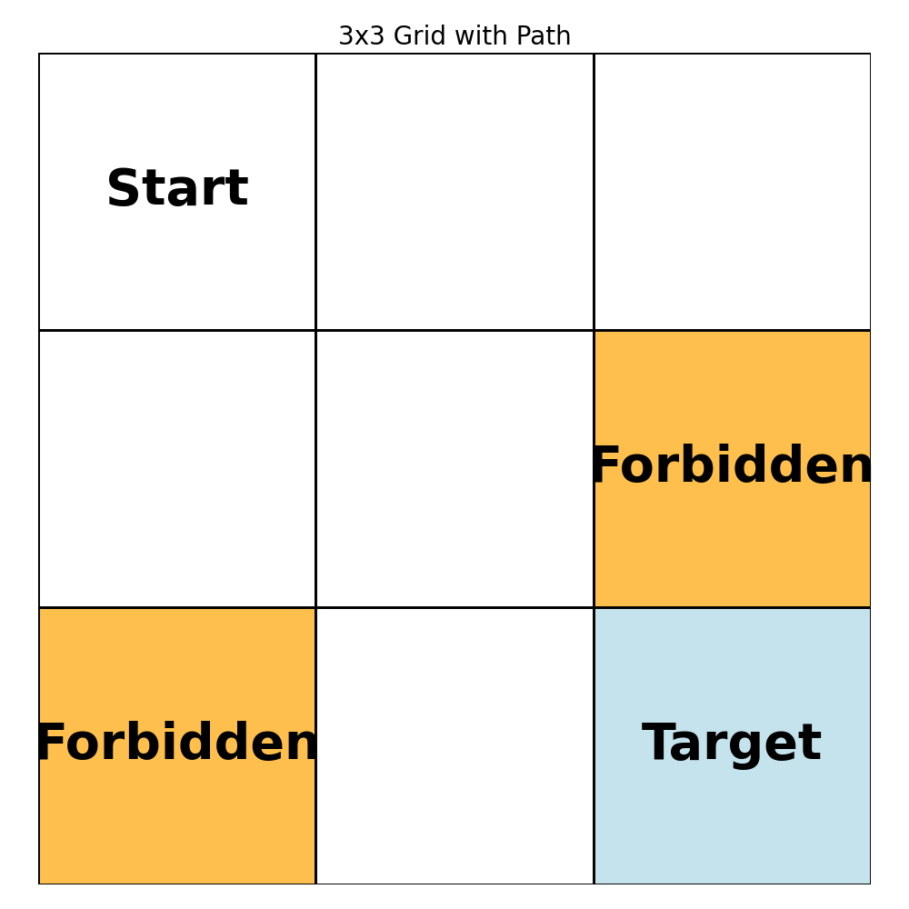
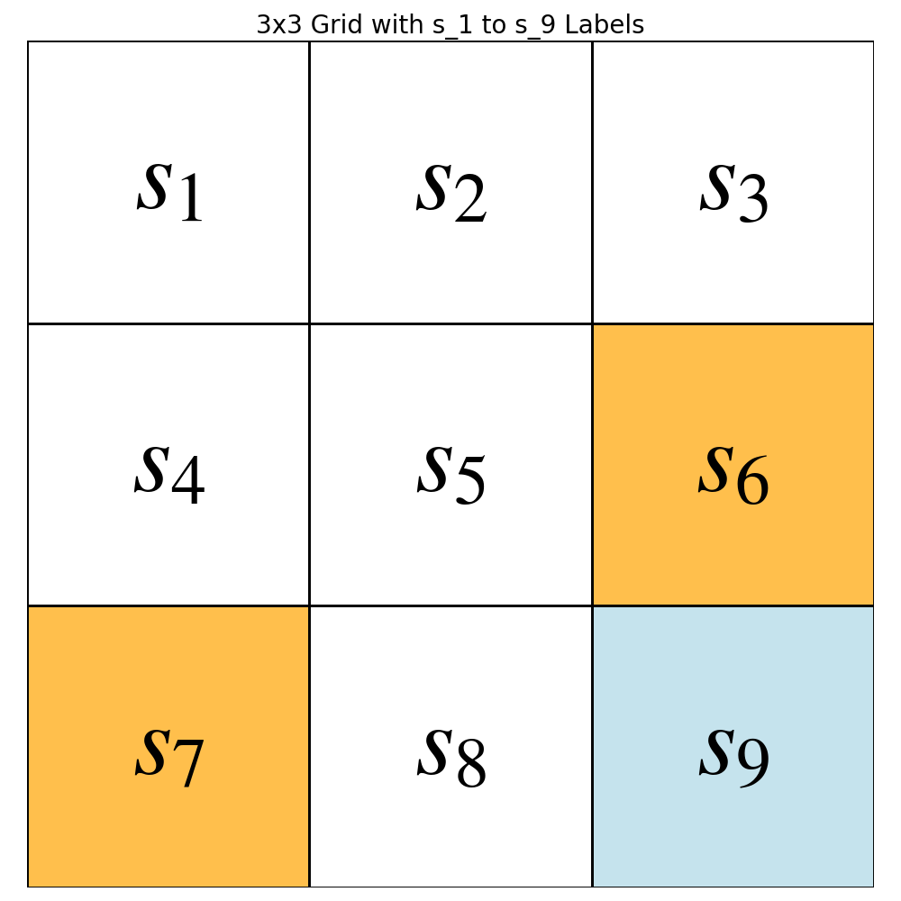
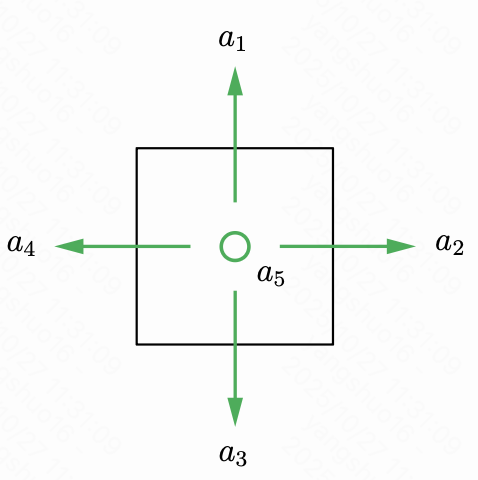
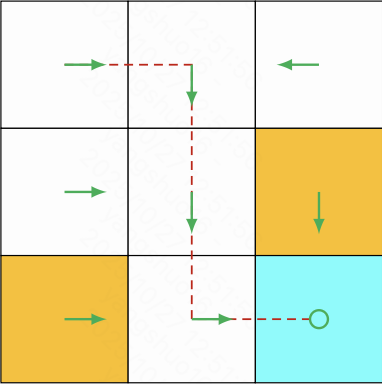
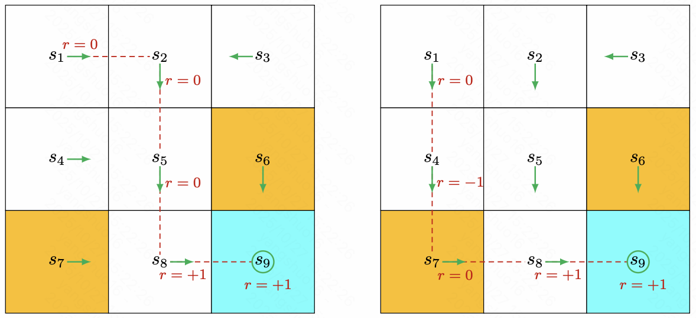

# RL

## Part1:建模
强化学习要解决的，是找到行动的最优策略，使收益最大。解决问题的前提是，对问题进行建模，把一个现实问题转化成可以用公式表达的分析框架。在分析框架的基础上，找最优策略。  
马尔科夫决策过程、贝尔曼方程、贝尔曼最优方程，是强化学习对现实问题的建模方法。最终通过对贝尔曼最优方程分析，来获得最好的策略。  

### 马尔科夫决策过程



如图，九宫格，很经典，讲强化学习都从这个示例讲起。  
要解决的问题是：智能体从左上角start开始行动，如何找一条到右下角的target的最优路径。  
马尔科夫决策过程这么给这个问题建模的：  
#### 状态
首先是设置状态，智能体完成一系列行动，在状态间跳转。  
在这个问题中，共有九个状态：  

#### 动作
在每一个状态里，都有5个行动可以选择。

$`a_5`$表示留在原地。

#### 策略
把状态和行动结合在一起，在每个状态下，以多大概率选择哪个行动，就是策略。每个状态可以选择不同的策略。比如状态$`s_1`$的策略可以是：  
```math
\pi(A|S=s_1) = \begin{cases}
0, & A=a_1 \\
0.5, & A=a_2 \\
0.5, & A=a_3 \\
0, & A=a_4\\
0, & A=a_5
\end{cases}
```
也就是50%的概率往右走，50%的概率往下走，不会往上往左走或呆在原地。
策略是强化学习要优化的目标，也就是找到一个每个状态上最佳的行动概率分布。

#### 状态转移概率
在状态下，选择了动作，会跳转到哪个状态，这个分布是状态转移概率。在九宫格这个问题中，状态转移是确定的，因为一旦确定了动作，也就知道跳转到哪了。所以很容易写出来状态转移概率，比如状态选择行动的状态转移概率：
```math
p(S'|S=s_1,A=a_2)= \begin{cases}
0, & S'=s1 \\
1.0, & S'=s2 \\
0, & S'=s3 \\
0, & S'=s4 \\
0, & S'=s5 \\
0, & S'=s6 \\
0, & S'=s7 \\
0, & S'=s8 \\
0, & S'=s9
\end{cases}
```

#### 奖励
在状态$`S`$，选择了动作$`A`$,跳转到下一状态$`S'`$，会获得一个即时奖励$`R`$。  
奖励是强化学习中留给人工调整的接口，要鼓励什么、惩罚什么，都是通过奖励的设置，反馈到模型中，模型根据奖励来找最优策略。  
比如九宫格中，我们不希望智能体走进禁区，所以设置禁区的奖励为-1，不希望走到九宫格外面，所以设置走到九宫格外的奖励为-1，希望智能体能走到目标，所以设置目标的奖励为1.  
奖励也有一个概率分布，比如按照以上设置，状态下选择动作跳转到获得奖励的概率分布为：  
```math
r(R|S=s_1,A=a_2,S'=s_2) = 0.0
```

### 马尔可夫决策过程
至此，完成了这个九宫格问题的马尔可夫决策过程建模。  
参数设置好后，让智能体从start开始按照参数行动，就得到一个马尔可夫序列。比如，按照策略行动之后，可能产生这么一条路径：  


也就产生一条马尔可夫链：
```math
s_1,a_2,s_2,r_0=0.0,a_3,s_5,r_1=0.0,a_3,s_8,r_2=0.0,a_2,s_9,r_3=10.0
```

这条决策链，最终走到了目的地，并获得了1的奖励。
通过马尔可夫决策过程，我们对一个智能体的行动过程进行了建模，可以通过一系列随机变量及概率分布，描述出一个智能体的行动过程。

### 贝尔曼方程
#### 状态价值
找最优策略的目的是让收益最大化，那在智能体行动的过程中，收益该如何定义？  
比如我从状态出发，在策略、状态转移概率的作用下，可能到达不同的状态，在奖励概率分布的作用下，可能在过程中获取到不同的奖励。  
也就是说，每次从状态$`s_1`$出发，可能获取到不同的马尔科夫链，不同链有的到达了目标，有的反复经过禁区，获得的奖励不同。  
如何综合各种可能来评估从状态出发获得的奖励？  
  
首先，用期望来综合衡量各种情况下状态能获得的奖励。  

如图，条条大路通$`s_9`$，假设前者路线产生的概率为p1, 累积收益为2，后者路线产生的概率为p2，累积收益为1.则状态s1的状态价值可以表示为：  
```math
v(s_1) = p_1 * 2 + p_2 * 1
```
如果用随机变量来表示每条马尔可夫链的收益，则状态价值的定义就是：
```math
v(s)=\mathbb{E}[G]
```
也就是累积收益的期望。  
  
然后，累积奖励如何计算？  
上例是用过程中的奖励直接等比累加，来计算奖励。这样有一个问题，比如上图二中在$`s_8`$时奖励为+1，由于奖励是累加的，那可以在$`s_8`$时不断选择$`a_5`$，来获取+1的奖励。这个策略显然比在$`s_8`$选择动作$`a_2`$跳转到$`s_9`$获得的奖励要高。但这显然不是最优策略，我们希望最优策略应该是路径最短的。  
因此，奖励计算被设计为2部分，一部分是即时奖励，一部分是未来折扣奖励。对于未来的奖励，需要加一个折扣系数$`\gamma`$:  
```math
G_t = R_t + \gamma G_{t+1} = R_t + \gamma R_{t+1} + \gamma^2 R_{t+2}...
```
这样，步数越多，折扣的系数越大，就避免了绕路的问题。  

至此，可以得到状态价值的定义：
```math
v(S_t)=\mathbb{E}[R_t+\gamma G_{t+1}]
```

#### 贝尔曼方程
将状态价值中的即时奖励和未来折扣奖励展开。
```math
R_t = \pi(A_t=a|S_t=s)p(S_{t+1}|S_t=s,A_t=a)r
```
```math
G_{t+1}=\pi(A_t=a|S_t=s)p(S_{t+1}=s'|S_t=s,A_t=a)v(s')
```
在未来折扣奖励中，直接用下一个状态的状态价值。

代入后：
```math
v_(s)=\pi(A_t=a|S_t=s)p(S_{t+1}=s'|A_t=a,S_t=s)[r+v(s')]
```
可以发现，状态价值之间是互相依赖的。当前状态价值的计算依赖其他状态的状态价值。这就形成了一个可解的方程。
这就是贝尔曼方程。其中
