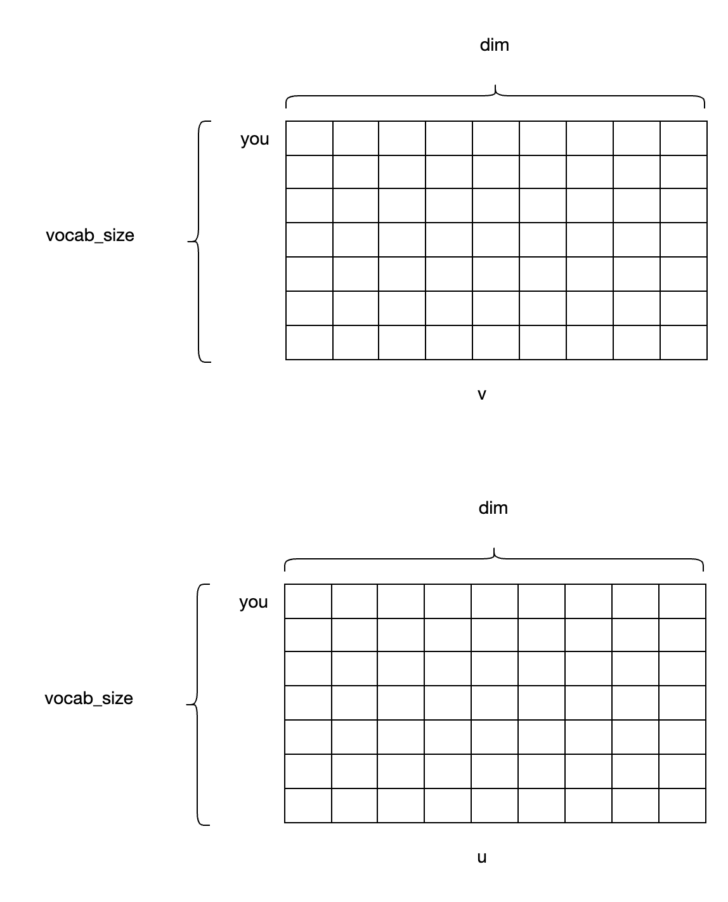
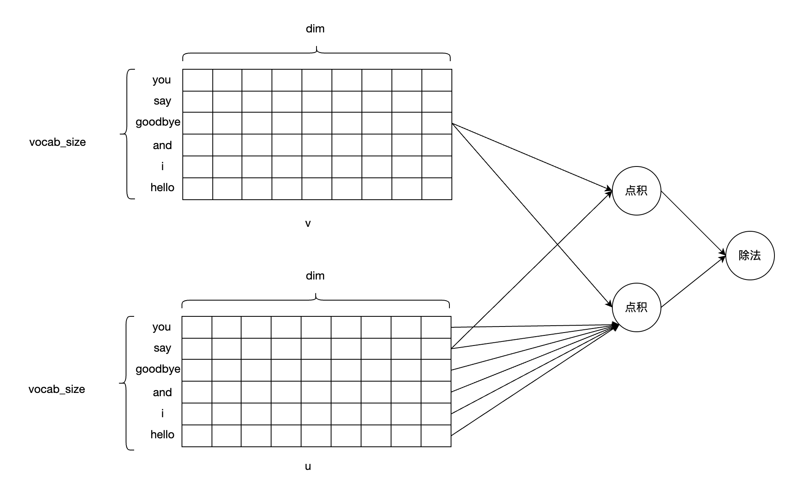
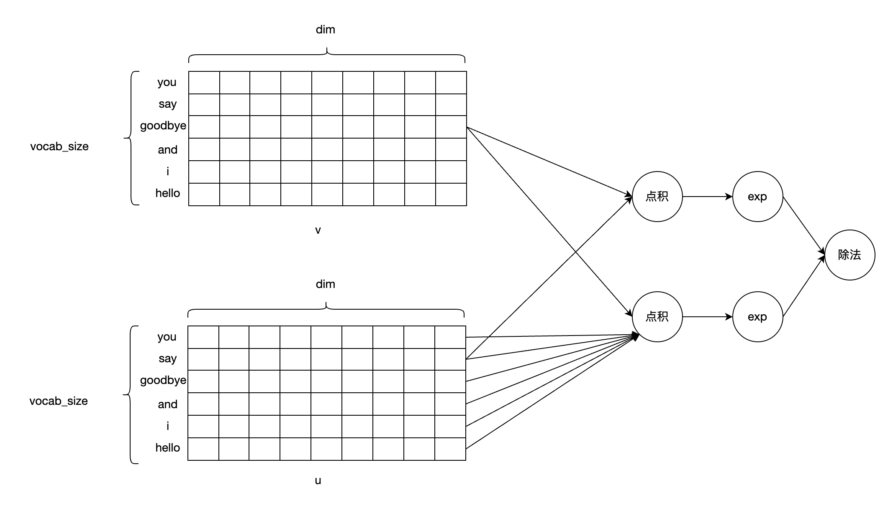
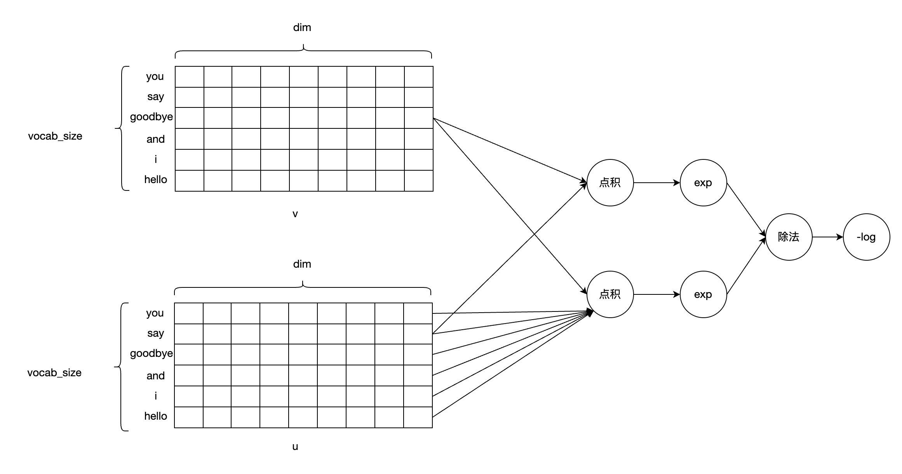
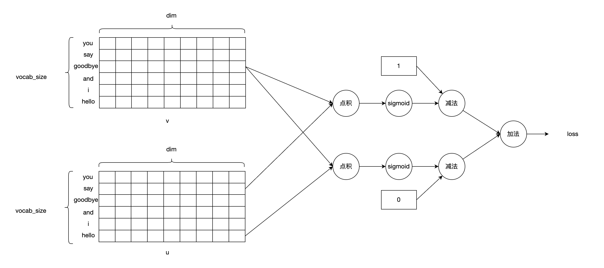
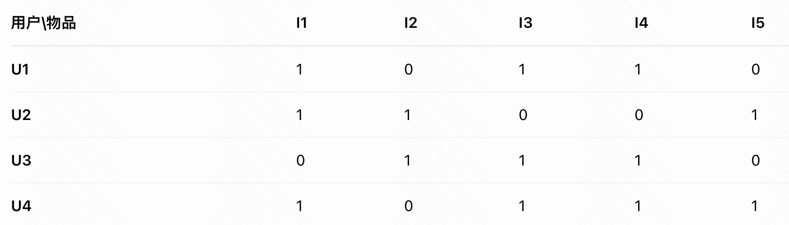
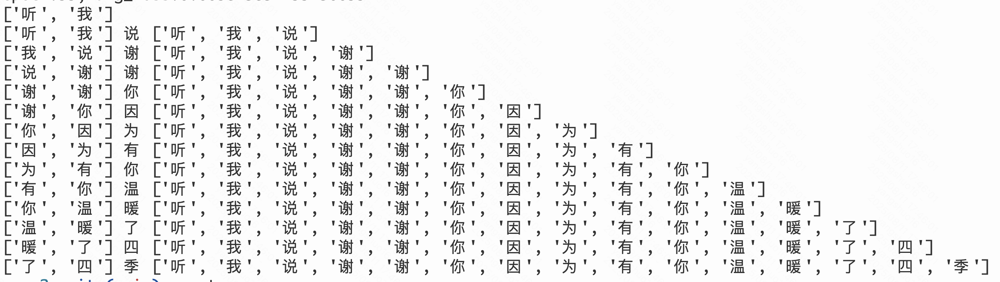
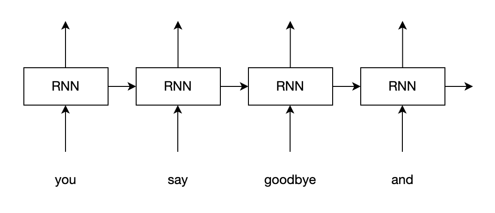
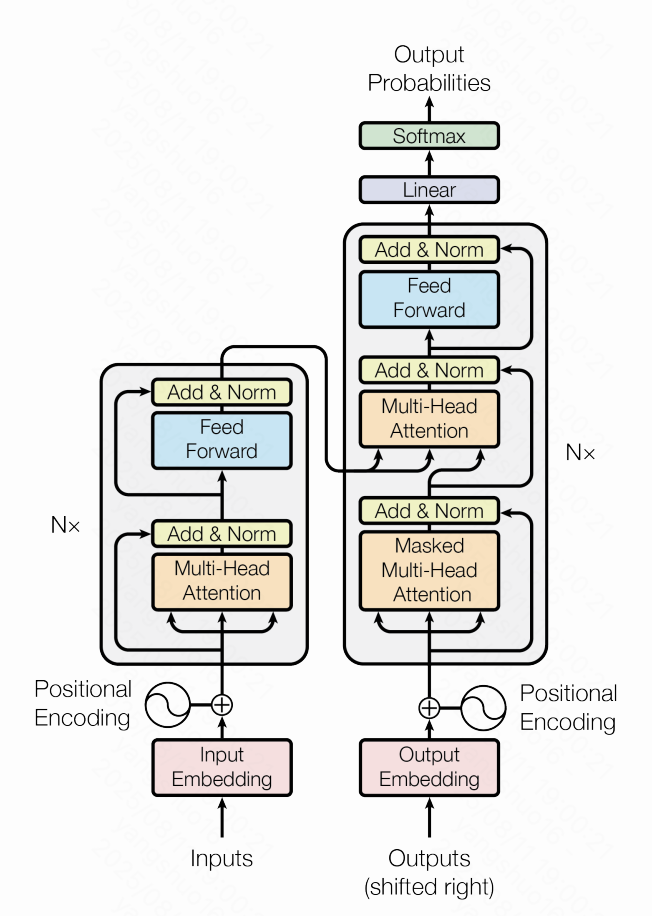

# W2V分享  
> 为组内技术分享写的逐字稿。简化自笔记：https://github.com/YoungAndSure/TechArt/blob/main/RecommandSystem/word2vector_in_rs.md 

今天给大佬们分享下word2vector的模型结构、原理。  

## 为什么
先说下为什么要分享word2vector，这是个“很古老”的技术了。  
之前说要学习下one_rec，然后分享下。那个论文我简单看了，有的地方感觉能看懂点，但是总是感觉理解的比较浅，不够深入。因为深度学习已经发展这么多年了，有很多的模型结构、做法，都直接当做结论在用了，对于算法来说，这些结论是无需证明的，但是我作为工程，算法方面工作做的不多，没法形成一个条件反射的理解，所以很多结论看了，知道了，但不懂，没法应用。  
经过我的学习，我认为word2vector是理解现代模型结构的基石。它相当于一个十字路口，首先它是自然语言处理领域的技术，沿着自然语言处理领域，可以通过RNN、Seq2Seq，走到Transformer。然后推荐系统借鉴了word2vector，embedding在推荐系统的模型里大量应用。  
所以我觉得有必要理解清楚word2vector，为理解其他复杂模型打下基础。  

## 矩阵分解的word2vector
在深度学习以前，都是通过数学方法来做word2vector。  
首先介绍下深度学习以前是怎么做word2vector的。  

### 分布假设
word2vector要做的，就是把词用一个向量表示。这个向量可以表示词意。所谓词意，就是向量之间的距离可以表示词的相近程度。对于同义词，向量的距离要更短，对于反义词，向量的距离要更长。  
怎么编码呢？  
不管是矩阵分解，还是后面的深度学习，都是基于“分布假设”。分布假设是说，一个词的词意，由它的上下文决定。  
比如：  
He went to the store to  **buy**  some groceries.  
He went to the store to  **purchase**  some groceries.  
两个词的上下文相同，他们的含义也相同。  
因此可以用一个词的上下文，来表示这个词。两个词的上下文越相同，说明两个词的含义越相近，反之亦然。  

### 共现矩阵
于是，引出共现矩阵：  
每个词对应矩阵的一行/一列，如果另一个词j是这个词i的上下文，则(i,j)加1.  
具体例子，这句话："you say goodbye and i say hello",转成共现矩阵(上下文范围设置为1）：  
```math
% 需引入 amsmath 宏包
A = \begin{pmatrix}
& \texttt{you} & \texttt{say} & \texttt{goodbye} & \texttt{and} & \texttt{i} & \texttt{hello} \\
\texttt{you}     & 0 & 1 & 0 & 0 & 0 & 0 \\
\texttt{say}     & 1 & 0 & 1 & 0 & 1 & 1 \\
\texttt{goodbye} & 0 & 1 & 0 & 1 & 0 & 0 \\
\texttt{and}     & 0 & 0 & 1 & 0 & 1 & 0 \\
\texttt{i}       & 0 & 1 & 0 & 1 & 0 & 0 \\
\texttt{hello}   & 0 & 1 & 0 & 0 & 0 & 0
\end{pmatrix}
```

这样，每个词都通过一个向量表示了。  
```math
% "you" 的词向量
\mathbf{v}_{\text{you}} = 
\begin{pmatrix}
0 & 1 & 0 & 0 & 0 & 0 
\end{pmatrix}
```
```math
% "say" 的词向量
\mathbf{v}_{\text{say}} = 
\begin{pmatrix}
1 & 0 & 1 & 0 & 1 & 1 
\end{pmatrix}
```
```math
% "goodbye" 的词向量
\mathbf{v}_{\text{goodbye}} = 
\begin{pmatrix}
0 & 1 & 0 & 1 & 0 & 0 
\end{pmatrix}
```
```math
% "and" 的词向量
\mathbf{v}_{\text{and}} = 
\begin{pmatrix}
0 & 0 & 1 & 0 & 1 & 0 
\end{pmatrix}
```
```math
% "i" 的词向量
\mathbf{v}_{\text{i}} = 
\begin{pmatrix}
0 & 1 & 0 & 1 & 0 & 0 
\end{pmatrix}
```
```math
% "hello" 的词向量
\mathbf{v}_{\text{hello}} = 
\begin{pmatrix}
0 & 1 & 0 & 0 & 0 & 0 
\end{pmatrix}
```

### 相似度
怎么计算相似度呢？有很多方法，其中一种是余弦相似度：  
```math
\mathrm{similarity}(\boldsymbol{x},\boldsymbol{y}) = 
\frac{ 
    \boldsymbol{x} \cdot \boldsymbol{y} 
}{ 
    \|\boldsymbol{x}\| \|\boldsymbol{y}\| 
} = 
\frac{ 
    x_1 y_1 + \cdots + x_n y_n 
}{ 
    \sqrt{x_1^2 + \cdots + x_n^2} \cdot \sqrt{y_1^2 + \cdots + y_n^2} 
}
```
假如两个词的上下文完全相同，它们的相似度为1.反之，假如两个词的上下文完全不同，上式的分子为0，相似度为0.  
比如goodbye和hello的相似度：  
```math
\begin{align}
\mathbf{v}_{\text{goodbye}} \cdot \mathbf{v}_{\text{hello}} = (0\times0) + (1\times1) + (0\times0) + (1\times0) + (0\times0) + (0\times0) = 0 + 1 + 0 + 0 + 0 + 0 = 1 \\
\|\mathbf{v}_{\text{goodbye}}\| = \sqrt{0^2 + 1^2 + 0^2 + 1^2 + 0^2 + 0^2} = \sqrt{2} \\
\|\mathbf{v}_{\text{hello}}\|   = \sqrt{0^2 + 1^2 + 0^2 + 0^2 + 0^2 + 0^2} = \sqrt{1} = 1 \\
\sqrt{2} \times 1 \approx 1.4142\\
\mathrm{similarity} = \frac{1}{\sqrt{2}} \approx 0.7071
\end{align}
```

这就完成了最基本的word2vector。  
通过对语料库进行处理，转化为共现矩阵，再分解为向量，可以通过向量计算两个词的相似度。  

### 优化
这个方法是很原始的方法，有很多问题。比如：  
#### PMI
一些常见词，比如介词：the,of，等等，他们出现的频率很高，但并不意味着有相同的这样的上下文，词的含义就相同。因此，需要优化共现矩阵，降低这些词的干扰。PMI矩阵用来解决这个问题。  
#### SVD分解降维  
可以看到，这个vector的长度为词库的长度，有多少个词就有多长。且十分稀疏，就几个项有值。为了解决这个问题，可以对PMI矩阵进行奇异值分解，转为稠密向量，且可以通过截取前k维来近似原矩阵。  

### 总结
可以看出来，以上从建模到优化，全都是在用数学工具在实现。这是深度学习之前的机器学习方法。这种方法缺点是无法自动迭代更新。语料库一换就需要全部刷库生成。  

## 深度学习的word2vector
深度学习的核心原理是反向传播，这个技术在198x年就发明出来了，但是过去数据规模小、计算力不强，所以一直没有大规模应用。说白了就是，以前数据量小，用上面的数学方法就能解决问题。但是到近些年数据量越来越大了，数学方法就不行了，深度学习开始崛起了。

### 概率
深度学习方法的基础也是分布假设。不同的是，它把一个词的出现看作随机事件。  
比如，当出现中心词的条件下，上下文出现的概率为：  
```math
    P(w_{context}|w_{center})
```
当出现上下文的条件下，中心词出现的概率为：  
```math
    P(w_{center}|w_{context})
```
这两种建模方式分别叫skip-gram和cbow，后面以skip-gram为例。  
到具体例子里，比如"you say goodbye and i say hello"，对于中心词say，上下文的概率为：
```math
P(w_{hello},w_{i}|w_{say})
```
对于一个中心词，生成每个上下文词相互之间是独立的，因此，生成完整上下文的概率为：
```math
\prod_{\substack{-m \leq j \leq m \\ j \neq 0}} P\left( w_{(t+j)} \mid w_{(t)} \right)
```
每个中心词生成上下文的概率相互之前也是独立的，因此一句话出现的概率为：  
```math
P(w_1,w_2...w_t)=\prod_{t=1}^{T}\prod_{\substack{-m \leq j \leq m \\ j \neq 0}} P\left( w_{(t+j)} \mid w_{(t)} \right)
```
深度学习的目标就是要提升语料库里出现过的组合的概率，降低没出现过的组合的概率。  

### 建模
矩阵分解是先有了共现矩阵，然后分解出embedding，通过各种方法优化embedding的表达。  
深度学习不同，深度学习是先设定了embedding，然后构造出要优化的目标，最后通过反向传播调整embedding收敛。  
  
#### 先构造embedding
上下文和中心词，分别用不同的向量表示。向量维度设定为dim。词表里有多少词，就有多少个向量。也就组成了两个矩阵，每个矩阵有词表长度行，dim列。  
中心词矩阵用v表示，某个词编号为i，embedding就是vi  
上下文矩阵用u表示。  




#### 如何计算embeding相似度？
上边矩阵分解用的余弦相似度。这里用向量点积。点积和余弦相似度都可以衡量两个向量的相似程度，具体有什么区别，这里不再展开。  
```math
\mathbf{A} \cdot \mathbf{B} 
= \sum_{i=1}^{n} A_{i} B_{i} 
= \|\mathbf{A}\| \|\mathbf{B}\| \cos \theta
```

#### 构造目标
对于一个中心词和一个上下文词：  
```math
\begin{equation*}
P(w_{\text{context}} \mid w_{\text{center}}) = 
\frac{
    u_{\text{context}}^{\top} v_{\text{center}}
}{
    \sum\limits_{u_{i} \in V} \bigl( u_{i}^{\top} v_{\text{center}} \bigr)
}
\end{equation*}
```




也就是说，目标词和其他所有词计算相似度，上下文的相似度应当最高。这里一般会加上exp，一方面对向量乘积做一个塑形，另一方面，exp的导数还是exp，和对数结合可以简化计算。合一起也就是softmax，这个在多分类问题中经常用到。

```math
P\left( w_{context} \mid w_{centor} \right) = \frac{\mathrm{exp}(u_{context}^T v_{center})}{\sum_{u_i\in\mathcal{V}}\mathrm{exp}(u_i^Tv_{centor})}
```


对一个中心词的所有上下文建模就是连乘：  
```math
P(w_{t-m},\ldots, w_{t+m}\mid w_{t}) = \prod_{\substack{-m\leq j\leq m\\ j\neq 0}} \frac{
    \exp\left( \mathbf{u}_{(t+j)}^{T} \mathbf{v}_{t} \right)
}{
    \exp\left( \sum_{\mathbf{u}_{i}\in V} \mathbf{u}_{i}^{T} \mathbf{v}_{t} \right)
}
```
对一句话建模就是连乘所有中心词：
```math
P(w_1,w_2,w_3...) = \prod\limits_{t=1}^{T}\prod\limits_{\substack{-m\leq j\leq m\\ j\neq 0}}\frac{\exp\left(\mathbf{u}_{(t+j)}^{T}\mathbf{v}_{t}\right)}{\sum_{\mathbf{u}_{i}\in V}\exp\left(\mathbf{u}_{i}^{T}\mathbf{v}_{t}\right)}
```
这就是要优化的目标。

#### 优化计算
一个是，统一调整为最小化问题，这样优化器可以统一。为此，公式需要加上负号。  
一个是，乘法的梯度需要链式法则逐个展开每一项，不好计算。所以可以加个log，把乘法转化为加法，降低计算量。  
转化为加法后：
```math
-\sum_{t=1}^{T}\sum_{\substack{-m \leq j \leq m \\ j \neq 0}} \mathrm{log}\frac{\mathrm{exp}(u_{(t+j)}^T v_{t})}{\sum_{u_i\in\mathcal{V}}\mathrm{exp}(u_i^Tv_{t})}
```
这样，只需要逐个选取中心词和上下文计算，最后相加就可以了。  


#### 梯度
反向传播就是求目标函数的梯度。按照梯度更新中心词和上下文向量，向着梯度为0（最小）的方向迭代。由于完成是加法，因此直接求内层的梯度即可，外层是内层梯度相加。  
中心词向量的梯度：  
```math
\mathrm{log}P(u_{t+j}|v_t) =  \mathrm{log}\frac{\mathrm{exp}(u_{(t+j)}^T v_{t})}{\sum_{u_i\in\mathcal{V}}\mathrm{exp}(u_i^Tv_{t})} = u_{(t+j)}^T v_{t} - \mathrm{log}\sum_{u_i\in\mathcal{V}}\mathrm{exp}(u_i^Tv_{t})
```
```math
\begin{align}
\frac{\partial \mathrm{log}P(u_{t+j}|v_t)}{\partial v_t} &= u_{(t+j)}^T - \frac{\partial}{\partial v_t} \mathrm{log}\sum_{u_i\in\mathcal{V}}\mathrm{exp}(u_i^Tv_{t})\\
&= u_{(t+j)}^T-\frac{\frac{\partial}{\partial v_t} \sum_{u_i\in\mathcal{V}}\mathrm{exp}(u_i^Tv_{t})}{\sum_{u_i\in\mathcal{V}}\mathrm{exp}(u_i^Tv_{t})}\\
&= u_{(t+j)}^T - \frac{\sum_{u_i\in\mathcal{V}}u_i^T\mathrm{exp}(u_i^Tv_{t})}{\sum_{u_i\in\mathcal{V}}\mathrm{exp}(u_i^Tv_{t})}\\
&= u_{(t+j)}^T - \sum_{u_i\in\mathcal{V}}u_i^T \frac{\mathrm{exp}(u_i^Tv_{t})}{\sum_{u_i\in\mathcal{V}}\mathrm{exp}(u_i^Tv_{t})}\\
&= u_{(t+j)}^T - \sum_{u_i\in\mathcal{V}}u_i^T P(u_{i}|v_t)
\end{align}
```
当梯度为0时，收敛：
```math
u_{(t+j)}^T = \sum_{u_i\in\mathcal{V}}u_i^T P(u_{i}|v_t)
```
即给出中心词向量$`v_t`$时，所有上下文向量的期望为语料库中真实的上下文。  
上下文向量的梯度：  
```math
\begin{align}
\frac{\partial \mathrm{log}P(u_{t+j}|v_t)}{\partial u_{t+j}} &= v_t - \frac{\partial}{\partial u_{t+j}} \mathrm{log}\sum_{u_i\in\mathcal{V}}\mathrm{exp}(u_i^Tv_{t})\\
&= v_t-\frac{\frac{\partial}{\partial u_{t+j}} \sum_{u_i\in\mathcal{V}}\mathrm{exp}(u_i^Tv_{t})}{\sum_{u_i\in\mathcal{V}}\mathrm{exp}(u_i^Tv_{t})}\\
&= v_t-\frac{v_t \mathrm{exp}(u_{t+j}^T v_t)}{\sum_{u_i\in\mathcal{V}}\mathrm{exp}(u_i^Tv_{t})}\\
&= v_t-v_tP(u_{t+j}|v_t)
\end{align}
```
当梯度为0时，收敛
```math
v_t = v_t P(u_{t+j}|v_t)
```
```math
1 = P(u_{t+j}|v_t)
```
也就是说，给出中心词向量$`v_t`$时，输出是语料库中真实的上下文向量的概率为1.  

### 演示
跑下代码看看，这就是用skip-gram建模代码。  
https://github.com/YoungAndSure/NlpZero/blob/main/pytorch/w2v/skip_gram_v2.py  
训练完之后，输入一个中心词，可以看到输出的上下文中概率最高的。  

### 本质
实际上，深度学习的word2vector本质也是对共现矩阵做矩阵分解，有篇论文介绍了这个问题：  
https://proceedings.neurips.cc/paper_files/paper/2014/file/b78666971ceae55a8e87efb7cbfd9ad4-Paper.pdf  

## 推荐系统
上边这个skip-gram模型其实是最原版的模型，可以看到，一个中心词需要跟词库里所有的其他词进行相似度计算，梯度里也需要计算。这个计算量很大。  
为了降低计算量，优化为对真正的上下文label为1，负采样一些不是上下文的词，作为负样本，label为0.用sigmoid代替softmax，来训练。这样计算量大大降低，效果也不错。相关的公式就不再推导了。  


你会发现这个正负样本跟推荐系统是不是很像？  
没错，推荐系统也是这么一步步发展过来的。  
自然语言处理开始分解的是共现矩阵，而推荐系统分解的是用户行为矩阵。比如点击：  


通过分解这个矩阵，可以得到一个user vector，计算user vector之间的相似度，并且输入user vector，可以召回item。  
  
后来又借鉴了深度学习的word2vector，用embedding表示user和item。继续对user和item分解，每个特征都用一个embedding表示。  
比如，我们调用infer算子，发送了一些user和item字段到infer服务。infer服务首先会拿这些字段抽取特征，一个特征用slot代表，抽取出来的特征值，叫特征签名。在模型里，一个slot就是一个矩阵。一个特征值对应矩阵里的某一行，也就是embedding。这个查找embedding的过程，就是“查表”。理论上是二级key，但为了提升查找效率，一般把slot_id和特征id concat到一起，成为一个id，这样就可以简化为一次查找。infer服务在收到特征之后，就是通过这个id查找的EmbeddingServer，之后执行前向传播计算。  

## 大模型
另一方面，看上面那个skip-gram，输入的是中心词，输出的是上下文。  
另一种模型cbow，输入是上下文，输出是中心词。原理是相同的。  
换个角度想，假如输入是前两个词，输出是后一个词呢？是不是就可以通过前文生成后文了？  

### 演示
跑个代码看看。
https://github.com/YoungAndSure/NlpZero/blob/main/pytorch/w2v/cbow_generate.py  

如图，通过不停输入句子中的后两个词，预测后一个词，最终生成了完整的一句话。  


这也是大语言模型的基本原理。大语言模型其实就是在根据前文不断预测下一个字哪个概率最高，选概率最高的那个。  
但用word2vector改造这个模型有个问题，就是它没有学到词的位置信息。  
所以之前的大语言模型，都用的是基于RNN的模型。RNN是个序列模型，有多个节点连在一起，通过前面的输入预测下一个值。  
如图：  


这种模型的问题是:  
- 必须串行计算，前面的计算完再计算后面的。  
- 随着序列长度增加，误差会越来越大，传到最后全是噪声，导致溢出。  
  

Transformer解决的就是这些问题。它是通过位置编码来表示位置信息。这样并发性好，不用串行计算，也不会有梯度爆炸的问题。以及其中的注意力机制，能更好的挖掘词之间的关系，所以可以应用在超长序列的建模上。  

## OneRec
one_rec大概原理就是基于transformer构造。  
类似上面输入中心词预测上下文的原理，现在是输入用户历史点击序列，预测下一个item。每次预测，都会选取前k个item，生辰k个序列。最终生成512个序列。通过reward model评估哪个序列得分最高，成为最终推荐的序列。  

