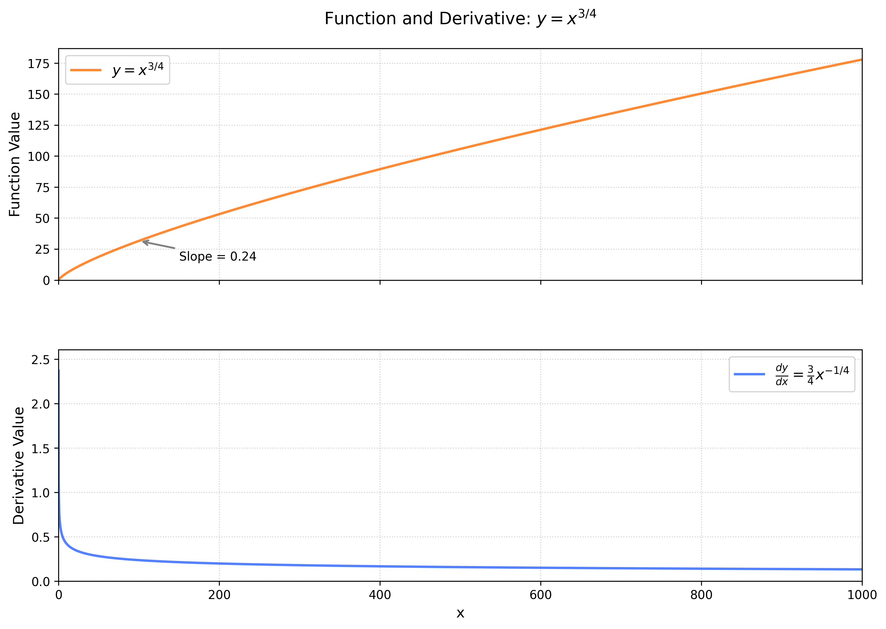

# word2vector in RS

在推荐系统做了几年工程，总觉得知其然而不知其所以然，常常苦恼。近年陆续涉猎了深度学习、自然语言处理、强化学习的基本原理，再回过头来看推荐系统，多了一些理解。但是看推荐系统的最新论文，感觉理解还是不够深入，就是：你知道它用这个数据乘了那个数据，然后做了这个变换，但是为什么可以这样呢？为什么这样就能行呢？说不清楚。只知其表，不知其理，终究还是经不住推敲。  
  
追根溯源，读经典论文DNN，发觉，模型结构和CBOW有共通之处，文中也说借鉴了word2vector。再加上推荐系统的特点：巨大的嵌入表，足以说明，word2vector对推荐系统模型的影响之深。所以，还是要从word2vector理解起。  
  
而word2vector的前身是矩阵分解。  

## 自然语言处理的演化思路
### 矩阵分解
重读鱼书之三中一二章，发现写的不仅简单，还有一点误导。重新梳理总结下推导过程。

#### 如何表示一个词的含义？
分布假设：一个词的含义由上下文决定。  
"you say goodbye and i say hello"，say的含义由you和goodbye决定。上下文窗口是可以调整的，比如上例窗口为1.  
  
| word | contexts(window=1) | contexts(window=2) |
|------|---------------------|---------------------|
|you|say|say,goodbye|  
|say|you,goodbye|you,goodbye,and|
|goodbye|say,and|you,say,and,i|

以此类推

#### 如何在计算机中表示词关系
共现矩阵。  
```math
% 需引入 amsmath 宏包
A = \begin{pmatrix}
& \texttt{you} & \texttt{say} & \texttt{goodbye} & \texttt{and} & \texttt{i} & \texttt{hello} \\
\texttt{you}     & 0 & 1 & 0 & 0 & 0 & 0 \\
\texttt{say}     & 1 & 0 & 1 & 1 & 1 & 1 \\
\texttt{goodbye} & 0 & 1 & 0 & 1 & 0 & 0 \\
\texttt{and}     & 0 & 1 & 1 & 0 & 1 & 0 \\
\texttt{i}       & 0 & 1 & 0 & 1 & 0 & 0 \\
\texttt{hello}   & 0 & 1 & 0 & 0 & 0 & 0
\end{pmatrix}
```
不赘述书中内容了。

#### 如何表示词
词向量,直接从共现矩阵取出：
```math
% "you" 的词向量
\mathbf{v}_{\text{you}} = 
\begin{pmatrix}
0 & 1 & 0 & 0 & 0 & 0 
\end{pmatrix}
```
```math
% "say" 的词向量
\mathbf{v}_{\text{say}} = 
\begin{pmatrix}
1 & 0 & 1 & 1 & 1 & 1 
\end{pmatrix}
```
```math
% "goodbye" 的词向量
\mathbf{v}_{\text{goodbye}} = 
\begin{pmatrix}
0 & 1 & 0 & 1 & 0 & 0 
\end{pmatrix}
```
```math
% "and" 的词向量
\mathbf{v}_{\text{and}} = 
\begin{pmatrix}
0 & 1 & 1 & 0 & 1 & 0 
\end{pmatrix}
```
```math
% "i" 的词向量
\mathbf{v}_{\text{i}} = 
\begin{pmatrix}
0 & 1 & 0 & 1 & 0 & 0 
\end{pmatrix}
```
```math
% "hello" 的词向量
\mathbf{v}_{\text{hello}} = 
\begin{pmatrix}
0 & 1 & 0 & 0 & 0 & 0 
\end{pmatrix}
```

#### 如何计算词相似度
可以用余弦相似度：
```math
\mathrm{similarity}(\boldsymbol{x},\boldsymbol{y}) = 
\frac{ 
    \boldsymbol{x} \cdot \boldsymbol{y} 
}{ 
    \|\boldsymbol{x}\| \|\boldsymbol{y}\| 
} = 
\frac{ 
    x_1 y_1 + \cdots + x_n y_n 
}{ 
    \sqrt{x_1^2 + \cdots + x_n^2} \cdot \sqrt{y_1^2 + \cdots + y_n^2} 
}
```
如hello和goodbye的相似度：
```math
\begin{align}
\mathbf{v}_{\text{goodbye}} \cdot \mathbf{v}_{\text{hello}} = (0\times0) + (1\times1) + (0\times0) + (1\times0) + (0\times0) + (0\times0) = 0 + 1 + 0 + 0 + 0 + 0 = 1 \\
\|\mathbf{v}_{\text{goodbye}}\| = \sqrt{0^2 + 1^2 + 0^2 + 1^2 + 0^2 + 0^2} = \sqrt{2} \\
\|\mathbf{v}_{\text{hello}}\|   = \sqrt{0^2 + 1^2 + 0^2 + 0^2 + 0^2 + 0^2} = \sqrt{1} = 1 \\
\sqrt{2} \times 1 \approx 1.4142\\
\mathrm{similarity} = \frac{1}{\sqrt{2}} \approx 0.7071
\end{align}
```
可以看到，分子中的1主要由向量第二维得来，$`\mathbf{v}_{goodbye}`$和$`\mathbf{v}_{hello}`$的第二维都是1，而第二维表示的是和say的共现次数。也就是说，如果两个词有更多的公共的context，计算出这两个词的相似度就更高。分母由两个词总的共现次数得出，相当于做了归一化。


#### 总结
以上都是书中内容，回答了四个重要问题：  
- 如何表示一个词的含义
- 如何在计算机中表达词关系
- 如何表示词向量
- 如何计算词相似度

每一步的方案都不唯一，但这些问题给出了一个思考的框架。  

思考整个建模的过程，有新的发现：  
首先，如果两个词在对方的context中出现过，即共现矩阵中的值不为0，那可以认为这两个词有比较高的相关性。  
然而，如果两个词没有在对方的context中出现过，也就是共现矩阵中的值为0，这两个词就不相关了吗？该如何计算相似度呢？  
以上建模方法回答了这个问题，即：如果他们有共同的context，那可以认为这两个词之间是有相关性的。  
这是一个：通过已知建立矩阵、对矩阵进行分解、根据分解建立起新的联系，从而可以通过已知获取未知，的过程。  

#### 降低噪声
以上共现矩阵用计数来表示词意。但有的词，比如the，在很多词的前面都会有，却并不表示the和这些词之间有含义上的联系。为了解决这个问题，有了PMI：
```math
\mathrm{PMI}(x, y)=\log _{2}\frac{P(x, y)}{P(x)P(y)}
```
将共现矩阵表示为 C，将单词 x 和 y 的共现次数表示为 C(x, y)，将 单词 x 和 y 的出现次数分别表示为 C(x)、C(y)，将语料库的单词数量记为 N，则式可以重写为:
```math
\mathrm{PMI}(x,y)=\log_{2}\frac{P(x,y)}{P(x)P(y)}=\log_{2}\frac{\dfrac{C(x,y)}{N}}{\dfrac{C(x)}{N}\dfrac{C(y)}{N}}=\log_{2}\frac{C(x,y)\cdot N}{C(x)C(y)}
```
用词本身出现的次数做分母，降低了本身是高频词的影响。  
用PMI重新计算共现矩阵，生成PMI矩阵：
```math
\mathrm{PMI\_Matrix} = 
\begin{pmatrix}
& \texttt{you} & \texttt{say} & \texttt{goodbye} & \texttt{and} & \texttt{i} & \texttt{hello} \\
\texttt{you}     & 0 & 1.807 & 0 & 0 & 0 & 0 \\
\texttt{say}     & 1.807 & 0 & 0.322 & -0.263 & 0.322 & 1.807 \\
\texttt{goodbye} & 0 & 0.322 & 0 & 1.585 & 0 & 0 \\
\texttt{and}     & 0 & -0.263 & 1.585 & 0 & 1.585 & 0 \\
\texttt{i}       & 0 & 0.322 & 0 & 1.585 & 0 & 0 \\
\texttt{hello}   & 0 & 1.807 & 0 & 0 & 0 & 0
\end{pmatrix}
```
矩阵中有负数项，比如and和say，为什么呢，可以公式推导什么时候PMI会小于0：
```math
\begin{align}
C(x,y)*N &< C(x)*C(y)\\
C(x,y) &< \frac{C(x)*C(y)}{N}
\end{align}
```
也就是两个词共同出现的次数远小于本身出现的次数，PMI就是负的。  
特别是如果两个词从来都没有共现过，PMI将为$`-\infty`$。  
因此，定义PPMI，将PMI负值截断为0：
```math
\mathrm{PPMI}(x,y)=\mathrm{max}(0,\mathrm{PMI}(x,y))
```
PPMI矩阵：
```math
\text{PPMI} = 
\begin{pmatrix}
 & \texttt{you} & \texttt{say} & \texttt{goodbye} & \texttt{and} & \texttt{i} & \texttt{hello} \\
\texttt{you}     & 0 & 1.807 & 0 & 0 & 0 & 0 \\
\texttt{say}     & 1.807 & 0 & 0.322 & 0 & 0.322 & 1.807 \\
\texttt{goodbye} & 0 & 0.322 & 0 & 1.585 & 0 & 0 \\
\texttt{and}     & 0 & 0 & 1.585 & 0 & 1.585 & 0 \\
\texttt{i}       & 0 & 0.322 & 0 & 1.585 & 0 & 0 \\
\texttt{hello}   & 0 & 1.807 & 0 & 0 & 0 & 0
\end{pmatrix}
```
以上都是书中有的内容，不作细究。
后面重点看下书中没有细说的内容。

#### 奇异值分解
以上PPMI矩阵中有很多0，比较稀疏，浪费了内存和计算。  
为了解决这个问题，引入了奇异值分解SVD。  

鱼书中对SVD的介绍比较简单，这里稍微详细的展开说下。但只介绍流程，不介绍数学原理。  
SVD是说，一个矩阵可以分解为三个矩阵的乘积：
```math
X = USV^T
```
其中：
- $`U\in{R^{m*m}}`$:左奇异向量矩阵（正交矩阵，$`U^TU=I`$）
- $`V\in{R^{m*m}}`$:左奇异向量矩阵（正交矩阵，$`V^TV=I`$）
- $`S\in{R^{m*m}}`$:对角矩阵

假设词表长度为m，则共现矩阵就是一个$`(m, m)`$大小的矩阵$`X_{(m,m)}`$。可以分解为：
```math
X_{(m,m)} = U_{(m,m)}S_{(m,m)}V_{(m,m)}^T
```
注意，分解出的$`U_{(m,m)},S_{(m,m)},V_{(m,m)}`$维度均为$`(m,m)`$.  
降维操作就是取$`U_{(m,m)}`$矩阵的前$`k`$列$`U_{(m,k)}`$代表$`X_{(m,m)}`$矩阵。  
于是，某词one_hot编码为$`i`$，则SVD分解前的词向量为$`X_{(m,m)}`$第$`i`$
行，分解后为$`U_{(m,k)}`$第$`i`$行，维度从$`m`$降为$`k, (k<m)`$。  

奇异值分解有固定的计算过程，这里不再赘述。  
针对以上PPMI矩阵，计算奇异值分解得：
```math
S = \begin{pmatrix}
2.896 & 0     & 0     & 0     & 0     & 0 \\
0     & 1.916 & 0     & 0     & 0     & 0 \\
0     & 0     & 1.661 & 0     & 0     & 0 \\
0     & 0     & 0     & -1.661& 0     & 0 \\
0     & 0     & 0     & 0     & -1.916& 0 \\
0     & 0     & 0     & 0     & 0     & -2.896
\end{pmatrix}
```
```math
U = V = \begin{pmatrix}
0.347 & -0.139 & -0.436 & 0.436 & -0.139 & 0.347 \\
0.556 & 0.222  & 0.136  & 0.136  & 0.222  & 0.556 \\
-0.285& 0.569  & -0.236 & -0.236 & 0.569  & -0.285 \\
-0.452& -0.452 & 0.452  & 0.452  & -0.452 & -0.452 \\
-0.285& 0.569  & -0.236 & -0.236 & 0.569  & -0.285 \\
0.347 & -0.139 & -0.436 & 0.436 & -0.139 & 0.347
\end{pmatrix}
```
由于共现矩阵是一个对称矩阵，因此U和V相同。组合到一起：
```math
{
    \begin{pmatrix}
    0 & 1.807 & 0 & 0 & 0 & 0 \\
    1.807 & 0 & 0.322 & 0 & 0.322 & 1.807 \\
    0 & 0.322 & 0 & 1.585 & 0 & 0 \\
    0 & 0 & 1.585 & 0 & 1.585 & 0 \\
    0 & 0.322 & 0 & 1.585 & 0 & 0 \\
    0 & 1.807 & 0 & 0 & 0 & 0
    \end{pmatrix}
}
=
{
    \begin{pmatrix}
    0.347 & -0.139 & -0.436 & 0.436 & -0.139 & 0.347 \\
    0.556 & 0.222 & 0.136 & 0.136 & 0.222 & 0.556 \\
    -0.285 & 0.569 & -0.236 & -0.236 & 0.569 & -0.285 \\
    -0.452 & -0.452 & 0.452 & 0.452 & -0.452 & -0.452 \\
    -0.285 & 0.569 & -0.236 & -0.236 & 0.569 & -0.285 \\
    0.347 & -0.139 & -0.436 & 0.436 & -0.139 & 0.347
    \end{pmatrix}
}
{
    \begin{pmatrix}
    2.896 & 0 & 0 & 0 & 0 & 0 \\
    0 & 1.916 & 0 & 0 & 0 & 0 \\
    0 & 0 & 1.661 & 0 & 0 & 0 \\
    0 & 0 & 0 & -1.661 & 0 & 0 \\
    0 & 0 & 0 & 0 & -1.916 & 0 \\
    0 & 0 & 0 & 0 & 0 & -2.896
    \end{pmatrix}
}
{
\begin{pmatrix}
0.347 & 0.556 & -0.285 & -0.452 & -0.285 & 0.347 \\
-0.139 & 0.222 & 0.569 & -0.452 & 0.569 & -0.139 \\
-0.436 & 0.136 & -0.236 & 0.452 & -0.236 & -0.436 \\
0.436 & 0.136 & -0.236 & 0.452 & -0.236 & 0.436 \\
-0.139 & 0.222 & 0.569 & -0.452 & 0.569 & -0.139 \\
0.347 & 0.556 & -0.285 & -0.452 & -0.285 & 0.347
\end{pmatrix}
}

```
至此，PPMI矩阵分解为三个矩阵的乘积。  
其中U矩阵的维度为6，可以通过截取前k维做降维处理。  

#### 为什么用U矩阵降维当做词向量？
这里先不用数学做推理理解，毕竟奇异值分解在《线性代数及其应用》第七章，一时半会还看不到。但是为了不影响这里的继续推理，先做感性认知，后续再另作文深入理解奇异值分解。  
>这种学习法来自强化学习：动态规划法

奇异值分解的作用，是把向量$`X`$映射到另一个坐标空间$`(V^T)`$，按照另一个空间的坐标做放缩$`(S)`$，之后再映射回来$`U`$。  
奇异值表示了在那个空间坐标的重要度。降维就是把不重要的部分也就是噪声舍弃掉。  
按照以上理解的话，降维应该是取U的前k维$`U_k`$，再经过$`S,V_k^T`$变换，还原回原坐标系，生成新的k维的$`A'_k=U_kS_kV_k^T`$，这样才是在现有的坐标系下对地重要度的维度进行了去除。  
但鱼书以及其他书都直接告诉结论：用$`U_k`$做降维后的词向量。这感觉很别扭，不符合数学的对称美。有种用部分代表整体的感觉  
这里确实有省略。  
- $`U_k`$是$`X`$在新坐标系空间下的坐标，可在新坐标系空间代表$`X`$
- 直接用$`U_k`$节省复原的计算
- 两者在计算余弦相似度时等效

因此，用$`U_k`$作为降维后的词向量。

### word2vector
矩阵分解更像是一个填字游戏，把要解决的问题转化成一个矩阵，矩阵中有已知有未知。矩阵分解试图将已知分解，通过重组分解后的已知来推测未知，也就是填那些矩阵中未知的空。  
其实严格来讲，机器学习做的就是挖掘数据中的已知，预估未知这样的事。只是矩阵分解用的是数学工具挖掘，深度学习用网络结构+反向传播挖掘。  

#### skip-gram
##### 概率 
同样是分布假设，skip-gram通过条件概率建模。  
skip-gram拿中心词为条件，context作为中心词条件下的条件概率。比如上文的"you say goodbye and i say hello",window是1时，中心词是say,context是i和hello的概率为：
```math
P(w_{hello},w_{i}|w_{say})
```
假设中心词生成context是独立的，则整句话出现的概率是：
```math
P(w_{you},w_{say}...w_{hello}) = P(w_{say}|w_{you})P(w_{you},w_{goobye}|w_{say})....P(w_{say}|w_{hello})
```
总结下，对于第t个词，它的m个上下文出现的概率是：
```math
\prod_{\substack{-m \leq j \leq m \\ j \neq 0}} P\left( w_{(t+j)} \mid w_{(t)} \right)
```
注意，不管是第几个context，都只跟中心词有关，且相互独立。  
对于一个长度为T的句子出现的概率为：
```math
P(w_1,w_2...w_t)=\prod_{t=1}^{T}\prod_{\substack{-m \leq j \leq m \\ j \neq 0}} P\left( w_{(t+j)} \mid w_{(t)} \right)
```
skip-gram的目标是提升真实出现的句子的概率。通过取log简化乘法计算为加法，并加负号转为最小化问题：
```math
\begin{align}
-\mathrm{log}P(w_1,w_2...w_t)
&=-\mathrm{log}\prod_{t=1}^{T}\prod_{\substack{-m \leq j \leq m \\ j \neq 0}} P\left( w_{(t+j)} \mid w_{(t)} \right)\\
&=\sum_{t=1}^{T}\sum_{\substack{-m \leq j \leq m \\ j \neq 0}} -\mathrm{log}P\left( w_{(t+j)} \mid w_{(t)} \right)
\end{align}
```
> 查看模型代码，起初没有找到外层加和对应的代码。后来才发现，训练时候是按batch输入样本的，计算损失时候输入是batch个logit，输出是一个标量的损失——读pytorch文档CrossEntropyLoss的定义，其中是对batch的损失做了平均或加权的（可以设置）。所以，真正训练时候是把语料拆分成center-contexts对，一次训练一个batch，外层加和的处理转化为对batch损失的加和平均。

##### 建模
word2vector用向量来表示一个词。且center词的向量和context词的向量来自不同的embedding层，或者说矩阵。  
> 有了条件概率的公式，明确了要提升的目标，如何把词变成可以计算的数字？  
这问题，不同水平的人，有不同的回答，就我目前的水平，自答一下。  
直接点说，用数字表示词的备选比较少，无非：标量、向量、矩阵。标量的维度只有一个，可表达的含义太少。矩阵过于复杂，不方便计算。只有向量，可表示多维含义，又便于存储计算。所以必须是向量。  

> 另一个问题，为什么center和contexts必须分属不同的embeddding矩阵？为什么不能共用一个矩阵？  
这个我开始都没发现。实现了一个cbow之后，发现损失有负的，后来才发现文档里写了必须用不同的embedding矩阵。这个后面结合公式分析一下。

假设词表$`\mathcal{V}`$长度为vocab_size，embedding的深度为ndim，context词的embedding矩阵用$`u`$表示，$`u`$是一个vocab_size行ndim列的矩阵，每行对应一个词的embedding向量。center词的embedding矩阵用$`v`$表示，$`v`$也是一个vocab_size行ndim列的矩阵。  
context用$`u_{context}`$表示，中心词用$`v_{center}`$表示,词表用$`\mathcal{V}`$表示。利用softmax分母和为1的性质，将模型输出通过softmax，来生成概率，因此对于给定center词的条件下，某个context词生成的概率模型表示：  
```math
P\left( w_{context} \mid w_{centor} \right) = \frac{\mathrm{exp}(u_{context}^T v_{center})}{\sum_{u_i\in\mathcal{V}}\mathrm{exp}(u_i^Tv_{centor})}
```
对于整句话的生成概率模型表示：
```math
-\sum_{t=1}^{T}\sum_{\substack{-m \leq j \leq m \\ j \neq 0}} \mathrm{log}\frac{\mathrm{exp}(u_{(t+j)}^T v_{t})}{\sum_{u_i\in\mathcal{V}}\mathrm{exp}(u_i^Tv_{t})}
```
怎么把上面的公式转化成模型？拆解一下。  
首先，外层的加法可以独立于内层单个center-context计算来看。内层计算完之后一个batch加和（求平均）即可。  
再看内层。可以看到，分子的计算$`u_{(t+j)}^T v_{t}`$是分母$`u_i^Tv_{t}`$的一部分。所以不需要按照公式的顺序先计算分子再计算分母。只需要从center的embedding矩阵$`v`$中取出center的embedding，和整个context的embedding矩阵$`u`$乘，此时得到的结果：matmul((1, ndim),(ndim,vocab_size))=(1,vocab_size)是一个向量，长度为词表长度，每个值代表center和对应context词的相似度。之后对向量计算softmax和-log即可。这是未经优化的最原始的模型。  
>这块还是有点疑问没有解决。在真正模型代码实现的时候，会用CrossEntropyLoss损失函数，我理解就是对上边说的(1,vocab_size)的向量执行softmax之后再-log。但这个损失函数还需要输入一个target，就是真正的context词。这怎么和公式里对应上呢？明白了。代码里是对logit向量里所有成员逐个执行了softmax和log，但是公式里的加和只对context的词进行。这时候需要告诉损失函数哪些是context。

deone中的实现，x是logit,t是target。
```
def softmax_cross_entropy_simple(x, t) :
  x = as_variable(x)
  t = as_variable(t)
  N = x.shape[0]

  p = softmax(x)
  p = clip(p, 1e-15, 1.0)
  p = log(p)
  p = p[np.arange(N), t.data]
  y = -1 * sum(p) / N
  return y
```

> TODO:此处可画图解释

##### 为什么要分成center和context两个embedding矩阵
推导下梯度公式。 
反向传播其实就是计算梯度、更新梯度，通过公式推导，看一下分成两个矩阵，具体的梯度分别是什么。  
对于：
```math
-\sum_{t=1}^{T}\sum_{\substack{-m \leq j \leq m \\ j \neq 0}} \mathrm{log}\frac{\mathrm{exp}(u_{(t+j)}^T v_{t})}{\sum_{u_i\in\mathcal{V}}\mathrm{exp}(u_i^Tv_{t})}
```
求梯度，由于外层是两层加法，加法的梯度还是加法，可以直接求加和符号内部的梯度，之后加和。
```math
\mathrm{log}P(u_{t+j}|v_t) =  \mathrm{log}\frac{\mathrm{exp}(u_{(t+j)}^T v_{t})}{\sum_{u_i\in\mathcal{V}}\mathrm{exp}(u_i^Tv_{t})} = u_{(t+j)}^T v_{t} - \mathrm{log}\sum_{u_i\in\mathcal{V}}\mathrm{exp}(u_i^Tv_{t})
```
```math
\begin{align}
\frac{\partial \mathrm{log}P(u_{t+j}|v_t)}{\partial v_t} &= u_{(t+j)}^T - \frac{\partial}{\partial v_t} \mathrm{log}\sum_{u_i\in\mathcal{V}}\mathrm{exp}(u_i^Tv_{t})\\
&= u_{(t+j)}^T-\frac{\frac{\partial}{\partial v_t} \sum_{u_i\in\mathcal{V}}\mathrm{exp}(u_i^Tv_{t})}{\sum_{u_i\in\mathcal{V}}\mathrm{exp}(u_i^Tv_{t})}\\
&= u_{(t+j)}^T - \frac{\sum_{u_i\in\mathcal{V}}u_i^T\mathrm{exp}(u_i^Tv_{t})}{\sum_{u_i\in\mathcal{V}}\mathrm{exp}(u_i^Tv_{t})}\\
&= u_{(t+j)}^T - \sum_{u_i\in\mathcal{V}}u_i^T \frac{\mathrm{exp}(u_i^Tv_{t})}{\sum_{u_i\in\mathcal{V}}\mathrm{exp}(u_i^Tv_{t})}\\
&= u_{(t+j)}^T - \sum_{u_i\in\mathcal{V}}u_i^T P(u_{i}|v_t)
\end{align}
```
梯度由两部分组成，$`u_{(t+j)}^T`$代表某个context词的向量，$`\sum_{u_i\in\mathcal{V}}u_i^T P(u_{i}|v_t)`$代表，在center词是$`v_t`$条件下，词表里所有词出现概率的期望。最终收敛的时候，梯度是0.也就是，$`v_t`$要朝着让输入是$`v_t`$时输出是$`u_{t+j}`$的方向更新。  
再看对$`u`$的梯度：
```math
\begin{align}
\frac{\partial \mathrm{log}P(u_{t+j}|v_t)}{\partial u_{t+j}} &= v_t - \frac{\partial}{\partial u_{t+j}} \mathrm{log}\sum_{u_i\in\mathcal{V}}\mathrm{exp}(u_i^Tv_{t})\\
&= v_t-\frac{\frac{\partial}{\partial u_{t+j}} \sum_{u_i\in\mathcal{V}}\mathrm{exp}(u_i^Tv_{t})}{\sum_{u_i\in\mathcal{V}}\mathrm{exp}(u_i^Tv_{t})}\\
&= v_t-\frac{v_t \mathrm{exp}(u_{t+j}^T v_t)}{\sum_{u_i\in\mathcal{V}}\mathrm{exp}(u_i^Tv_{t})}\\
&= v_t-v_tP(u_{t+j}|v_t)
\end{align}
```
梯度公式分为两部分，当梯度是0时，
```math
v_t = v_t P(u_{t+j}|v_t)
```
```math
1 = P(u_{t+j}|v_t)
```
也就是说$`u_{t+j}`$向量朝着让输入是$`v_t`$时，输出$`u_{t+j}`$概率是1的方向更新。  
可以看到，两个矩阵中的向量，都朝着输入$`v_t`$时输出$`u_{t+j}`$的方向更新，很快就能收敛。  

假如$`u`$和$`v`$是一个embedding矩阵，会怎么样呢？从以上公式可以看到，同一个词，作为center和作为context，梯度更新的公式是不一样的。因此，不同样本中的同一个词，在训练过程中，更新的方向就会来回变化，导致收敛慢、不稳定。因此，按角色分成两个embedding矩阵更好一些。


>《动手学深度学习》让人烦恼的一点：先讲了skip-gram和cbow的公式，但并没有立即开始基于公式建模，而是开始继续讲优化。我没有基于最基本的公式建模，没有对基本公式有深入的把握，怎么能深刻理解到哪里需要优化、为什么优化？这时候继续看优化，懵逼。转去看后面的代码实现，代码是优化后的，我还是懵逼。直接卡这了。不得不先看CBOW的公式，结合鱼书中的源码理解基本公式，再转去看skip-gram的公式，尝试建立起基本的模型。鱼书好的一点就在这，每讲一点，立即尝试编码，然后再引出一点，这样每一步走的都瓷实。


#### CBOW
>留个问题，为什么CBOW向量乘完要取$`\frac{1}{2m}`$，而skip-gram不用乘？

CBOW是已知context的条件下，中间词出现的概率为：
```math
    P(w_{center}|w_{context})
```
一句话出现的概率为：
```math
P(w_1,w_2...w_t)=\prod_{t=1}^{T} P\left( w_{(t)} \mid w_{(t-j)}...w_{(t-1)},w_{(t+1)}...w_{(t+j)} \right)
```
取负对数，以降低计算量、转化为最小化问题：
```math
-\mathrm{log}P(w_1,w_2...w_t)=-\sum_{t=1}^{T} \mathrm{log}P\left( w_{(t)} \mid w_{(t-j)}...w_{(t-1)},w_{(t+1)}...w_{(t+j)} \right)
```
对$`P\left( w_{(t)} \mid w_{(t-j)}...w_{(t-1)},w_{(t+1)}...w_{(t+j)} \right)`$建模,我们保持和skip-gram一样的$`u`$和$`v`$表示：
```math
P\left( w_{(t)} \mid w_{(t-j)}...w_{(t-1)},w_{(t+1)}...w_{(t+j)} \right) = \frac{\mathrm{exp}(\frac{1}{2j}(u_{t-j}+...+u_{t-1}+u_{t+1}+...+u_{t+j})^Tv_t)}{\sum_{v_i\in\mathcal{V}}\mathrm{exp}(\frac{1}{2j}(u_{t-j}+...+u_{t-1}+u_{t+1}+...+u_{t+j})^Tv_i)}
```
和skip-gram不一样的是，skip-gram输入是一个词center，输出多个词，通过context词的期望来衡量损失。而cbow是输入多个词context，输出一个词center。为了衡量所有context词和center词的关系，这里认为所有context词同等重要，因此对context向量加和取了平均。  
>这里意识到一个过去没有意识到的点，对向量做合并时，如果认为同等重要，则可以取平均，如果认为有的更重要，可以通过加权将对应向量融入到结果中。算法经常加来加去的，就是在调各种特征的重要度。  

其他的推导，CBOW 和skip-gram差别不大，就不赘述了。

#### 负采样
不管是skip-gram还是cbow，上文的原版模型都是按多分类问题建模。比如skip-gram，输入是center，模型根据输入预测所有词里哪几个词的输出概率最高。和我给你一个苹果，你给我预测在所有水果中它是哪个水果的概率最高一样。这种问题都用softmax建模，因为softmax可以将输出转为所有分类的概率。但这样有一个问题，就是需要计算所有分类的概率，对于语言模型，就是计算词库中所有词是输出的概率。而词表是很大的，一般在万级，这导致模型的计算量很大。  
观察上文目标函数和梯度函数：
```math
-\sum_{t=1}^{T}\sum_{\substack{-m \leq j \leq m \\ j \neq 0}} \mathrm{log}\frac{\mathrm{exp}(u_{(t+j)}^T v_{t})}{\sum_{u_i\in\mathcal{V}}\mathrm{exp}(u_i^Tv_{t})}
```
```math
\begin{align}
\frac{\partial \mathrm{log}P(u_{t+j}|v_t)}{\partial v_t} 
&= u_{(t+j)}^T - \sum_{u_i\in\mathcal{V}}u_i^T P(u_{i}|v_t)
\end{align}
```
都有针对词表中所有词向量的加和操作，也就是前向传播和反向传播的计算量都是词表级的，随着词表规模增加而增加。  
为了解决这个问题，将多分类问题转化为二分类问题，近似求解。这个属于是降低多分类问题计算量的基操了。  
多分类问题是我给你一个苹果，你计算是所有水果中某一个的概率。二分类问题是，我给你一个苹果，你计算这个是苹果的概率。  
多分类用softmax，二分类用sigmoid。  
```math
\sigma(x) = \frac{1}{1 + e^{-x}}
```
softmax的性质是，所有分类的和为1，含义是输入是各个分类的概率。sigmoid的性质是，输出在0-1之间，也就是输入是目标的概率。  
回顾一下skip-gram的概率建模公式：
```math
P(w_1,w_2...w_t)=\prod_{t=1}^{T}\prod_{\substack{-m \leq j \leq m \\ j \neq 0}} P\left( w_{(t+j)} \mid w_{(t)} \right)
```
二分类版中，对于context中的词$`w_{(t+j)}`$，概率为：
```math
 P\left(output=1 \mid w_{(t+j)},w_{(t)} \right)
```
也就是当输入是center词和context词时，概率为1。
>这个时候要引入负采样的样本了。但是我其实没有特别从数学上明白，为什么引入负样本是必要的？从感性上是可以理解，如果全是正样本会过拟合。《动手学》说，全是正样本会“meaningless”，但是为什么呢？这个答案可能需要更进一步的线代知识才能解答。

对于非context的词，进行随机采样，用$`w_k`$表示，概率为：
```math
 P\left(output=0 \mid w_{(k)},w_{(t)} \right)
```
随机采样也是有概率分布的，这个后面再说，当前先以$`P(w)`$代表随机采样的分布。因此，条件概率可以近似为：
```math
 P\left( w_{(t+j)} \mid w_{(t)} \right) = P\left(output=1 \mid w_{(t+j)},w_{(t)} \right) \prod_{k=1, w_k \sim P(w)}^{K}P\left(output=0 \mid w_{(k)},w_{(t)} \right)
```
>这里我肯定有概念混淆的点，暂时没搞清楚是哪一步。事件的概率、概率建模、到真正的向量的建模，这三个之间的关系有一点混淆。

套用上一节的符号，$`u`$代表context词矩阵，$`v`$代表center词矩阵，$`\sigma`$代表sigmoid，建模：
```math
P\left( w_{(t+j)} \mid w_{(t)} \right) = \sigma(u_{t+j}^Tv_t)\prod_{k=1, w_k \sim P(w)}^{K}(1-\sigma(u_k^Tv_t))
```
取负对数：
```math
-\mathrm{log}P\left( w_{(t+j)} \mid w_{(t)} \right) = -\mathrm{log}\sigma(u_{t+j}^Tv_t)-\sum_{k=1, w_k \sim P(w)}^{K}\mathrm{log}(1-\sigma(u_k^Tv_t))
```
其中：
```math
\begin{align}
1-\sigma(x) &=
1 - \frac{1}{1 + e^{-x}} \\
&= \frac{1+e^{-x}}{1+e^{-x}} - \frac{1}{1 + e^{-x}}\\
&=\frac{e^{-x}}{1 + e^{-x}}\\
&= \frac{e^{-x}e^x}{(1 + e^{-x})e^x}\\
&= \frac{1}{e^{x}+1}\\
&=\sigma(-x)
\end{align}
```
因此：
```math
\begin{align}
-\mathrm{log}P\left( w_{(t+j)} \mid w_{(t)} \right) &= -\mathrm{log}\sigma(u_{t+j}^Tv_t)-\sum_{k=1, w_k \sim P(w)}^{K}\mathrm{log}(1-\sigma(u_k^Tv_t))\\
&= -\mathrm{log}\sigma(u_{t+j}^Tv_t)-\sum_{k=1, w_k \sim P(w)}^{K}\mathrm{log}\sigma(-u_k^Tv_t)
\end{align}
```
再说负采样的概率分布$`P(w)`$:
```math
P(w)=\frac{\mathsf{freq}(w)^{3/4}}{\sum_{w^{\prime}\in V}\mathsf{freq}(w^{\prime})^{3/4}}
```
其中freq的算法为：
```math
\mathsf{freq}(w) = max(\mathsf{raw\_freq}(w),1)
```
而$`\mathsf{raw\_freq}`$为词出现的次数。
如果词出现次数为0，则$`\mathsf{raw\_freq}`$会强制设置为1.  
看下$`y=x^\frac{3}{4}`$的函数和导数图：

可以看到，$`\mathsf{freq}(w)^{3/4}`$将低频词进行提升，高频词进行抑制。
>为什么呢？

#### 负采样实现
https://github.com/YoungAndSure/NlpZero/blob/main/pytorch/w2v/skip_gram_with_neg.py  
- 注意公式中对于负样本，向量点积要取负数
- 发现负采样的收敛速度降低了，必须把epoch调到1000才能达到原版100同等效果。也就是说，负采样通过正样本和采样负样本近似原版的所有上下文向量，单轮计算量降低了，但是单轮收敛的速度降低了，导致需要增加轮次才能达到同等效果。

### 本质是矩阵分解的证明
>来自论文：https://proceedings.neurips.cc/paper_files/paper/2014/file/b78666971ceae55a8e87efb7cbfd9ad4-Paper.pdf 

回顾上文的负采样版skip-gram公式：
```math
\begin{align}
\sum_{t=1}^{T}\sum_{\substack{-m \leq j \leq m \\ j \neq 0}} -\mathrm{log}P\left( w_{(t+j)} \mid w_{(t)} \right) 
&= \sum_{t=1}^{T}\sum_{\substack{-m \leq j \leq m \\ j \neq 0}} [-\mathrm{log}\sigma(u_{t+j}^Tv_t)-\sum_{k=1, w_k \sim P(w)}^{K}\mathrm{log}\sigma(-u_k^Tv_t)]
\end{align}
```
这个公式是以语料库视角，逐字遍历整个语料库，来生成的。  
换一个视角，从词库的视角重新组织公式。  
中心词向量为$`w`$，上下文向量为$`c`$，一个中心词和一个上下文在语料库中出现的次数为$`\#(w,c)`$，所有语料库中出现的中心词-上下文对组合记为$`D`$。  
对于上式中的$`\sum_{t=1}^{T}\sum_{\substack{-m \leq j \leq m \\ j \neq 0}}`$可以改写为$`\sum_{w\in V_w}\sum_{c\in V_c}\#(w,c)`$。前者是遍历所有词和这个词的上下文，后者是遍历语料库对所有出现的中心词和上下文对做计数。  
改写后的完整目标公式为：  
```math
l=\sum_{w\in V_w}\sum_{c\in V_c}\#(w,c)[-\mathrm{log}\sigma(w^Tc)-k\sum_{c_N\in V_c}\frac{\#(c_N)}{|D|}\mathrm{log}\sigma(-w^Tc_N)]
```
解释一下公式里$`\sum_{c_N\in V_c}\frac{\#(c_N)}{|D|}\mathrm{log}\sigma(-w^Tc_N)`$这一块是什么意思。  
首先，负采样是按照概率分布随机采样。公式这里的采样，和上文中的工程实现中的采样方式不一样。上文的概率分布，是直接处理整个语料库，对语料库统计词频、并做了$`\frac{\mathsf{freq}(w)^{3/4}}{\sum_{w^{\prime}\in V}\mathsf{freq}(w^{\prime})^{3/4}}`$的调整。而公式这里的采样，是通过对中心词-上下文对计数得出的概率分布。后者因为计算量大，在工程实现中被优化为前者（deepseek说的，听着有道理，是不是胡说八道待考证）  
  
举个例子。比如"i love you":  
公式中的采样法：可以被分解成"i, love","love, i","love, you","you, love"，4个(中心词，上下文)对。也就是D = {"i, love","love, i","love, you","you, love"}, 如果$`w`$是"i",$`c`$是"love",则$`\#(w,c)`$=1,$`|D|`$=4,$`\#c_N`$是多少呢？  
$`\#c_{"i"}`$=1     $`\#c_{"love"}`$=2     $`\#c_{"you"}`$=1  
词频分别为0.25、0.5、0.25。  
  
上文工程实现中的采样法："i","love","you"三个词，每个出现1次，词频为1/3、1/3、1/3。
  
所以按照公式中的计算方法，一个上下文词出现的概率（频率）为：$`\frac{\#c_N}{|D|}`$，即这个词作为context出现的次数，除以中心词-上下文对总数。  
因为负样本是采样来的，所以用期望来表示，也就是$`\sum_{c_N\in V_c}\frac{\#(c_N)}{|D|}\mathrm{log}\sigma(-w^Tc_N)`$，出现概率和值相乘加和。  
  
继续推导，将公式展开：  
```math
\begin{align}
l&=\sum_{w\in V_w}\sum_{c\in V_c}\#(w,c)[-\mathrm{log}\sigma(w^Tc)-k\sum_{c_N\in V_c}\frac{\#(c_N)}{|D|}\mathrm{log}\sigma(-w^Tc_N)]\\
&=-[\sum_{w\in V_w}\sum_{c\in V_c}\#(w,c)\mathrm{log}\sigma(w^Tc)+k\sum_{w\in V_w}\sum_{c\in V_c}\#(w,c)\sum_{c_N\in V_c}\frac{\#(c_N)}{|D|}\mathrm{log}\sigma(-w^Tc_N)]
\end{align}
```
后半部分$`k\sum_{w\in V_w}\sum_{c\in V_c}\#(w,c)\sum_{c_N\in V_c}\frac{\#(c_N)}{|D|}\mathrm{log}\sigma(-w^Tc_N)`$中，对所有的$`w,c`$组合，做负采样，和$`w`$计算$`\sum_{c_N\in V_c}\frac{\#(c_N)}{|D|}\mathrm{log}\sigma(-w^Tc_N)`$，可以这么理解，对于不同的$`c`$，计算的内容是一样的。也就是前面遍历$`c`$和后面的计算内容无关，因此可以做聚合。  
```math
\begin{align}
-l&=\sum_{w\in V_w}\sum_{c\in V_c}\#(w,c)\mathrm{log}\sigma(w^Tc)+k\sum_{w\in V_w}\sum_{c\in V_c}\#(w,c)\sum_{c_N\in V_c}\frac{\#(c_N)}{|D|}\mathrm{log}\sigma(-w^Tc_N)\\
&=\sum_{w\in V_w}\sum_{c\in V_c}\#(w,c)\mathrm{log}\sigma(w^Tc)+k\sum_{w\in V_w}\#(w)\sum_{c_N\in V_c}\frac{\#(c_N)}{|D|}\mathrm{log}\sigma(-w^Tc_N)
\end{align}
```
到这里，公式后半部分的意思就比较清晰了。遍历每个中心词，以词频为概率分布计算中心词和其他词点积的期望。这个其他词$`c_N`$，包含了词库中出现的所有词，也就包含了$`w`$和它真实的上下文$`c`$。这里又是一个公式和实现不一致的点，实现里是负采样会去掉中心词$`w`$。  
因此$`c_N`$又可以分为两部分，当前正在计算的$`w,c`$中的$`c`$和其他：  
```math
\begin{align}
-l&=\sum_{w\in V_w}\sum_{c\in V_c}\#(w,c)\mathrm{log}\sigma(w^Tc)+k\sum_{w\in V_w}\#(w)\sum_{c_N\in V_c}\frac{\#(c_N)}{|D|}\mathrm{log}\sigma(-w^Tc_N)\\
&=\sum_{w\in V_w}\sum_{c\in V_c}\#(w,c)\mathrm{log}\sigma(w^Tc)+k\sum_{w\in V_w}\#(w)[\frac{\#(c)}{|D|}\mathrm{log}\sigma(-w^Tc) + \sum_{c_N\in V_c-c}\frac{\#(c_N)}{|D|}\mathrm{log}\sigma(-w^Tc_N)]
\end{align}
```
这里是训练整个语料库的损失函数。  
当约束为单个具体的$`(w,c)`$对时：
```math
l(w,c) = \#(w,c)\mathrm{log}\sigma(w^Tc)+k\#(w)\frac{\#(c)}{|D|}\mathrm{log}\sigma(-w^Tc)
```
>天呐，为什么这两个公式对不上，还有一坨“其他上下文噪声”去哪了？我看了好久也没搞明白。这里公式的项太多了，含义已经逐渐混淆，论文也没有清晰阐述。
  
设$`x=w^Tc`$,对$`x`$求导：  
```math
l(x) = \#(w,c)\mathrm{log}\sigma(x)+k\#(w)\frac{\#(c)}{|D|}\mathrm{log}\sigma(-x)
```
为什么要对$`w^Tc`$求导呢，反向传播时候都是对$`w`$和$`c`$求偏导。论文想要知道的是，模型收敛之后，中心词和上下文相乘的含义是什么，所以要对整个$`w^Tc`$求导。
```math
\begin{align}
\frac{\partial l}{\partial x} &= \#(w,c)\frac{\sigma(x)(1-\sigma(x))}{\sigma(x)} - k\#(w)\frac{\#(c)}{|D|}\frac{\sigma(-x)(1-\sigma(-x))}{\sigma(-x)}\\
&= \#(w,c)(1-\sigma(x)) - k\#(w)\frac{\#(c)}{|D|}(1-\sigma(-x))\\
&= \#(w,c)\sigma(-x) - k\#(w)\frac{\#(c)}{|D|}\sigma(x)
\end{align}
```
令偏导等于0  
```math
\#(w,c)\sigma(-x) - k\#(w)\frac{\#(c)}{|D|}\sigma(x) = 0 \\
\#(w,c)\frac{1}{1+e^x} - k\#(w)\frac{\#(c)}{|D|} \frac{1}{1+e^{-x}} = 0\\
\#(w,c)(1+e^{-x}) - k\#(w)\frac{\#(c)}{|D|}(1+e^x) = 0\\
\#(w,c)(e^x + 1) - k\#(w)\frac{\#(c)}{|D|}(e^x+e^{2x}) = 0 \\
- k\#(w)\frac{\#(c)}{|D|}e^{2x} + [\#(w,c) - k\#(w)\frac{\#(c)}{|D|}]e^x + \#(w,c) = 0
```
设$`y=e^x`$:
```math
- k\#(w)\frac{\#(c)}{|D|}y^2 + [\#(w,c) - k\#(w)\frac{\#(c)}{|D|}]y + \#(w,c) = 0
```
是一个一元二次方程。  
再简化一下，设$`\#(w,c)=a`$,$`k\#(w)\frac{\#(c)}{|D|}=b`$，则方程为：  
```math
-by^2 + (a-b)y + a = 0
```
按照一元二次方程解公式展开后得出两个解：
```math
y_1 = -1\\
y_2 = \frac{a}{b} = \frac{|D|\#(w,c)}{k\#(w)\#(c)}
```
但$`y=e^x`$必然大于0，$`y_1`$不合理，因此$`y_2`$是解。  
```math
e^x = \frac{|D|\#(w,c)}{k\#(w)\#(c)}\\
x = \mathrm{log}\frac{|D|\#(w,c)}{\#(w)\#(c)}-\mathrm{log}k\\
w^Tc = \mathrm{log}\frac{|D|\#(w,c)}{\#(w)\#(c)}-\mathrm{log}k
```
回看PMI的定义：
```math
\mathrm{PMI}(x,y)=\log_{2}\frac{P(x,y)}{P(x)P(y)}=\log_{2}\frac{\dfrac{C(x,y)}{N}}{\dfrac{C(x)}{N}\dfrac{C(y)}{N}}=\log_{2}\frac{C(x,y)\cdot N}{C(x)C(y)}
```
>这里还是有点偏差，上文也说过，PMI这里N是语料库的词数，但公式里$`D`$是中心词-上下文对的数量，计算方式不同。  
也就是：
```math
w^Tc = PMI(w,c) - \mathrm{log}k
```


### 补充
太有意思了，一旦开始深入探究，就发现，里边的每一个公式里的每一项，都不是空穴来风，都有讲究。疑问就像核反应堆一样一个接着一个。   

#### 为什么skip-gram/cbow用点积计算相似度？
